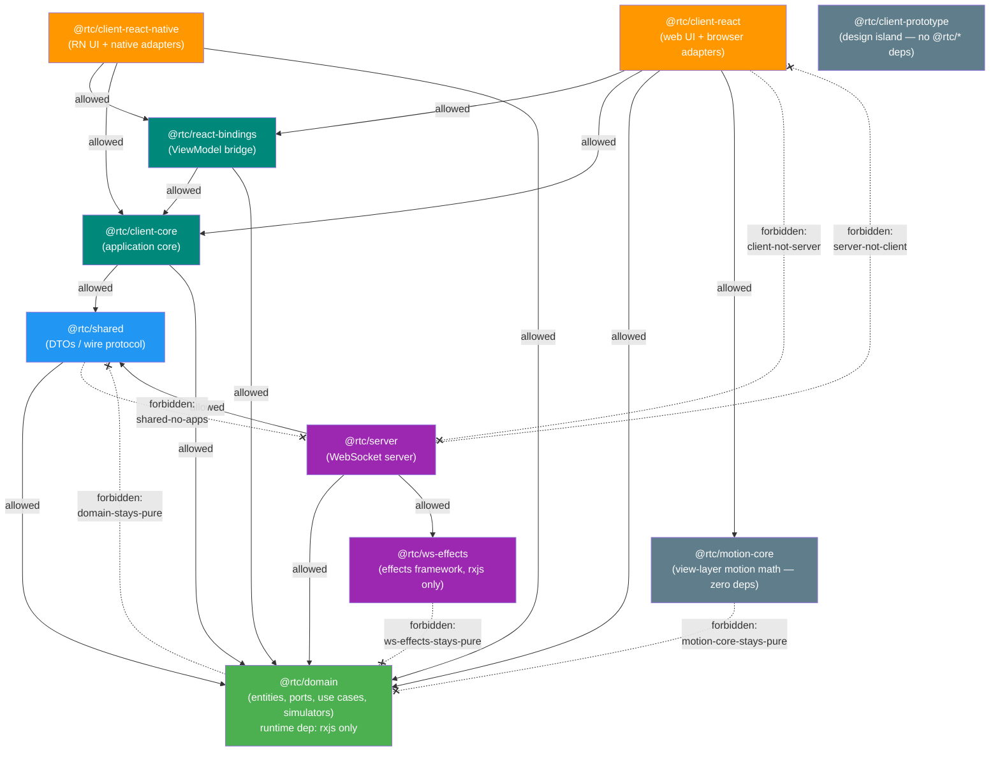

# dependency-cruiser configuration

`.dependency-cruiser.cjs` is the **executable form of the clean-architecture
layering** described in [architecture.md §6](./architecture/06-package-dependencies.md#6-package-dependencies):
"dependencies flow inward only." Where Biome's `noRestrictedImports` only sees a
single literal import string, dependency-cruiser resolves the **whole module
graph** — so it catches a forbidden layer crossing even when it happens
*transitively* through several intermediate modules.

It runs as a blocking gate:

```bash
pnpm check:deps   # depcruise --config .dependency-cruiser.cjs packages tests
```

and is wired into the CI `checks` job alongside the other static-analysis gates.

## The allowed dependency graph

Dependencies may only flow **inward** (toward `domain`). Every other internal
edge is forbidden.



Solid arrows are permitted imports; dashed crossed (`-.-x`) arrows are examples of
the edges the `forbidden` rules reject. `domain-stays-pure` forbids
`domain → shared` (and by extension `domain → client/server`);
`ws-effects-stays-pure` keeps the effects framework domain-blind;
`motion-core-stays-pure` keeps the view-layer motion-math package zero-dependency
-- stricter than the rxjs-only exception, since it forbids `rxjs` too; the apps may
reach inward but never reach across to each other.

## The 20 forbidden rules

All rules are `severity: "error"` — any match fails the gate.

| Rule | `from` (source) | `to` (rejected target) | Protects |
|------|-----------------|------------------------|----------|
| `no-circular` | anything | any module forming a cycle | No import loops (type-only edges excluded) |
| `domain-stays-pure` | `^packages/domain/src` | `^packages/(shared\|client-react\|server)/` | Domain is the innermost layer — no internal deps |
| `domain-no-node-builtins` | `^packages/domain/src` (tests and `__testUtils__` excepted) | Node built-ins (`dependencyTypes: ["core"]`) | Domain runs in any JS environment — browser, RN, Node |
| `shared-no-apps` | `^packages/shared/src` | `^packages/(client-react\|server)/` | Shared may only reach inward to domain |
| `client-not-server` | `^packages/client-react/src` | `^packages/server/` | The two apps never couple |
| `server-not-client` | `^packages/server/src` | `^packages/client-react/` | (mirror of the above) |
| `ws-effects-stays-pure` | `^packages/ws-effects/src` | `^packages/(domain\|shared\|client-react\|server)/` | The effects framework is domain-blind and app-agnostic (rxjs only) |
| `devtools-core-stays-pure` | `^packages/devtools-core/src` | `^packages/(domain\|shared\|client-core\|client-react\|client-react-native\|client-prototype\|react-bindings\|solid-bindings\|client-solid\|motion-core\|ui-contract\|server\|ws-effects\|devtools-app)/` | `@rtc/devtools-core` decorates by structural shape — it imports no other `@rtc/*` package, siblings (incl. `devtools-app`) included |
| `devtools-core-no-node-builtins` | `^packages/devtools-core/src` (tests and `__tests__/` excepted) | Node built-ins (`dependencyTypes: ["core"]`) | `@rtc/devtools-core` must run in any JS environment |
| `devtools-app-protocol-only` | `^packages/devtools-app/src` | `^packages/(domain\|shared\|client-core\|client-react\|client-react-native\|client-prototype\|react-bindings\|solid-bindings\|client-solid\|motion-core\|ui-contract\|server\|ws-effects)/` | `@rtc/devtools-app` understands only the wire protocol — `@rtc/devtools-core` is its sole `@rtc/*` dependency |
| `client-core-stays-inner` | `^packages/client-core/src` | `^packages/(react-bindings\|client-react\|client-react-native\|client-prototype\|server)/` | The shared application core never reaches out to a bindings bridge, a client, or the server |
| `client-core-framework-free` | `^packages/client-core/src` | `react` / `react-dom` / `react-native` (`node_modules`) | `client-core` stays framework-free by contract despite three UI-facing consumers |
| `react-bindings-no-apps` | `^packages/react-bindings/src` | `^packages/(client-react\|client-react-native\|client-prototype\|server)/` | The React↔RxJS bridge depends only inward (core, domain), never on an app or the server |
| `clients-never-import-each-other` | `^packages/(client-react\|client-react-native\|client-prototype)/src` | any of the other two client packages | Peer clients composed from the same core never import one another (CLAUDE.md) |
| `prototype-isolated` | `^packages/client-prototype/src` | `^packages/(domain\|shared\|client-core\|react-bindings\|client-react\|client-react-native\|server\|ws-effects)/` | The design-comprehension island stays `react`/`react-dom` only — zero `@rtc/*` edges |
| `motion-core-stays-pure` | `^packages/motion-core/src` | `^packages/(domain\|shared\|client-core\|react-bindings\|client-react\|client-react-native\|client-prototype\|server\|ws-effects)/` | The view-layer motion-math package stays a zero-dependency pure leaf — no `@rtc/*` edges |

**Asymmetry to note:** each rule matches the *source* against `…/src` but the
*target* against the **bare package path** (e.g. `^packages/server/`). So
importing a server **test** file from the client is rejected too — not only
`server/src`.

**Full coverage:** all 10 workspace packages are now named by at least one
pair rule. `client-core-stays-inner` and `client-core-framework-free` close the
`client-core` gap (inward-only imports, and no `react`/`react-dom`/`react-native`
despite three UI-facing consumers); `react-bindings-no-apps` does the same for
the bridge package; `clients-never-import-each-other` protects the three peer
clients (`client-react`, `client-react-native`, `client-prototype`) from
importing one another; `prototype-isolated` pins the design island to
`react`/`react-dom` only; `motion-core-stays-pure` pins the view-layer
motion-math package to zero `@rtc/*` (and zero runtime) dependencies. Together
with the original seven, every package still gets the `no-circular` and
pnpm-strict-dependencies backstop (a package cannot resolve an undeclared
`@rtc/*` import) *plus* a hand-written pair rule naming it directly.

## The `options` block (how the graph is built)

```js
options: {
  tsPreCompilationDeps: false,
  tsConfig: { fileName: "tsconfig.base.json" },
  doNotFollow: { path: "node_modules" },
  exclude: { path: "(\\.cache|/dist/|/__screenshots__/|\\.turbo)" },
  enhancedResolveOptions: {
    exportsFields: ["exports"],
    conditionNames: ["import", "types", "node", "default"],
  },
}
```

- **`tsPreCompilationDeps: false`** — the most important line. It drops
  `import type` edges, which disappear after compilation. Counting them produces
  *phantom* cycles. Tools that count type edges (`madge`, `dpdm` without `-T`)
  report "4 circular dependencies" here; with type edges excluded the true count
  is **0**. (See the tool comparison in
  [tooling-roadmap.md §4](./tooling-roadmap.md#4-dependency-cruiser---circular-deps--architecture).)
- **`tsConfig: tsconfig.base.json`** — reads the repo's TS path mappings so
  aliased imports resolve to their real files.
- **`doNotFollow: node_modules`** — map first-party code only; don't descend
  into third-party packages.
- **`exclude: (\.cache|/dist/|/__screenshots__/|\.turbo)`** — skip build
  artifacts: compiled `dist/`, Turborepo's `.turbo`, visual-test
  `__screenshots__`, and the Playwright-CT Vite host `.cache`. (The `.cache`
  entry exists because a Vite-bundled host cache produced a false `no-circular`
  during adoption — the cache is generated output, not source.)
- **`enhancedResolveOptions`** — `exportsFields` + `conditionNames` make the
  cruiser honor `package.json` `"exports"`/`"imports"`. This is how the repo's
  `#/` subpath-alias imports resolve to source files.

## Why this is stronger than the Biome ban

The Biome `noRestrictedImports` rule (`../../**`) bans deep relative imports by
inspecting the literal import string in a single file. It cannot see that
`client → shared → server` crosses a layer boundary, because each individual
import looks innocent. dependency-cruiser resolves the transitive graph, so the
layering holds even through indirection. The two are complementary: Biome keeps
import *strings* tidy; dependency-cruiser keeps the dependency *graph* legal.

## See also

- [architecture.md §1.3.1 — Clean Architecture, concretely](./architecture/01-overview.md#131-clean-architecture-concretely----which-package-is-which-ring) (the rings these rules compile, with a green/red enforcement view of this exact config)
- [architecture.md §6 — Package Dependencies](./architecture/06-package-dependencies.md#6-package-dependencies) (the prose rule this config enforces)
- [architecture.md §12 — Architectural Gates](./architecture/12-architectural-gates.md#12-architectural-gates) (the regex-based `grep-gates` that guard import boundaries inside the test suite)
- [tooling-roadmap.md §4 — dependency-cruiser](./tooling-roadmap.md#4-dependency-cruiser---circular-deps--architecture) (adoption rationale and the type-edge cycle finding)
