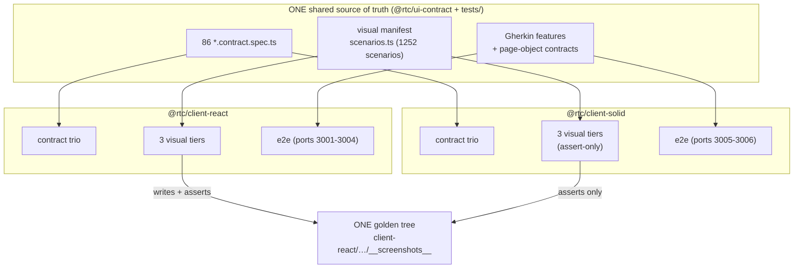
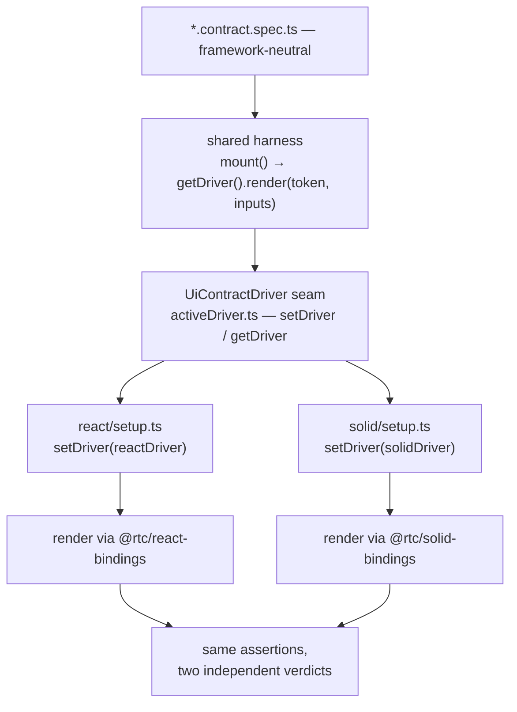
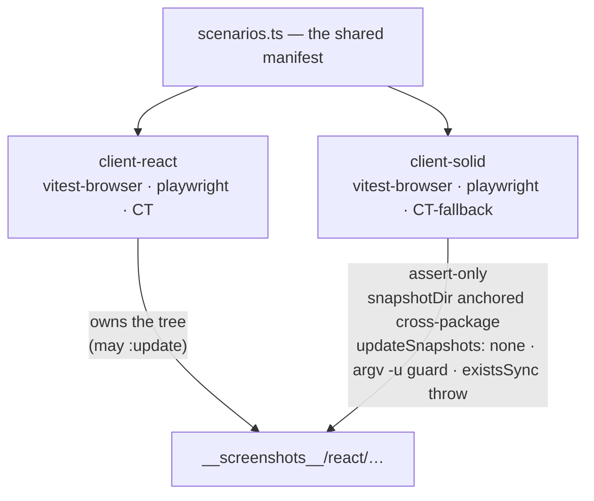
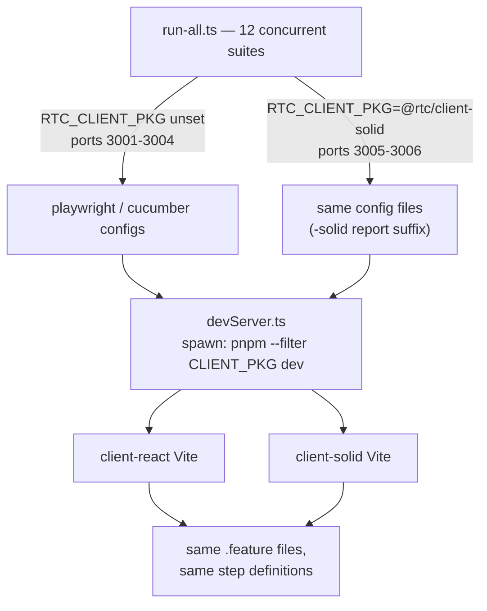

# Cross-Framework Shared-Testing Documentation — Implementation Plan

> **For agentic workers:** REQUIRED SUB-SKILL: Use superpowers:subagent-driven-development (recommended) or superpowers:executing-plans to implement this plan task-by-task. Steps use checkbox (`- [ ]`) syntax for tracking.

**Goal:** Document, end-to-end, how one test suite proves `@rtc/client-react` and `@rtc/client-solid` equivalent three independent ways — a new synthesis chapter (§21) with mermaid diagrams + an animated SVG, a showcase HTML page, and patches closing the audited gaps (the undocumented `RTC_CLIENT_PKG` mechanism, the diagram-less contract tier, the ADR-001 pointer, stale counts).

**Architecture:** Docs + static artifacts only. New chapter `docs/architecture/21-cross-framework-testing.md` synthesizes; per-tier docs stay authoritative. Zero behavioral change anywhere.

**Tech Stack:** Markdown + GitHub-flavored mermaid, hand-authored SMIL SVG (idiom of `docs/architecture/framework-swap.svg`), self-contained HTML (idiom of `docs/showcase/updating-goldens.html`).

**Spec:** `docs/superpowers/specs/2026-07-19-cross-framework-testing-docs-design.md` — read it first; it is the requirements document.

## Global Constraints

- **Docs/static-artifacts only.** No source, test, config, or CI file changes. Exception carve-out explicitly DENIED: do NOT touch the stale comments in `tests/browser/playwright/playwright.config.ts` / `tests/scripts/devServer.ts` (a sibling auth workstream owns them — see `docs/STATUS.md` "Solid `login.spec` e2e" item; our chapter simply states the accurate reason).
- **Verify every number live before writing it** (spec-file counts, test totals, scenario count, ports). Known-stale trap: main's §8.1 says "84 of 86 shared / 607 tests on Solid" — PR #241 enabled the two `shell/auth` specs for Solid (`packages/client-solid/tests/ui/contract/vitest.config.ts` now has `notYetPortedSpecs: string[] = []`), so the live numbers are almost certainly 86/86 and equal test totals. Commands are given in Task 1 Step 1.
- **Mermaid rules** (CLAUDE.md + hard-won): tall not wide, ≤4–5 sibling boxes per rank; edge-less subgraphs tile side-by-side (connect or `~~~`-stack); GitHub IGNORES subgraph `direction TB` when edges cross the subgraph boundary; sequence diagrams ≤6 participants; NO `&lt;`/`&gt;` HTML entities in sequence diagrams — use literal `<x>`; quoted labels for anything with punctuation.
- **Every mermaid block must pass mermaid-cli v10 AND v11 AND be visually inspected as a rendered PNG** (the MCP validator is too lenient). Recipe (run from the worktree; scratchpad = `/private/tmp/claude-501/-Users-csx-workarea-dev-github-com-bettersoftware-io-ReactiveTraderCloudClone/41896996-80a5-43bd-a329-009e8ea88889/scratchpad`):
  ```bash
  # extract each ```mermaid block to $SCRATCH/dNN.mmd, then for each:
  npx -y @mermaid-js/mermaid-cli@11 -i $SCRATCH/d01.mmd -o $SCRATCH/d01-v11.png
  npx -y @mermaid-js/mermaid-cli@10 -i $SCRATCH/d01.mmd -o $SCRATCH/d01-v10.png
  # then Read the PNGs and confirm layout is tall-not-wide and labels are legible
  ```
- **`pnpm check:doc-links` must exit 0** after every task that adds/edits markdown (it gates every relative link + heading anchor, slugged via real `github-slugger`).
- **House voice:** match `docs/architecture/20-devtools.md` register — confident, concrete, code-cited (`path:line`), honest fine print. Code fragments 5–15 lines, quoted VERBATIM from the live files (never paraphrased), elided with `// …` comments.
- **Worktree:** all work in `/Users/csx/workarea/dev/github.com/bettersoftware-io/ReactiveTraderCloudClone/.claude/worktrees/cross-framework-testing-docs` (branch `worktree-cross-framework-testing-docs`). Absolute paths; `git -C <worktree>` for git. NEVER `git stash`; NEVER push/PR/merge/cleanup (controller-only).

---

### Task 1: The §21 chapter

**Files:**
- Create: `docs/architecture/21-cross-framework-testing.md`
- Test: `pnpm check:doc-links` + mermaid-cli/PNG verification (no unit tests — docs)

**Interfaces:**
- Consumes: nothing from other tasks.
- Produces: the chapter's heading anchors, consumed by Task 4's cross-links, and the file Task 2 appends the SVG embed to. Top heading MUST be exactly `# §21 One Test Suite, Two Frameworks — Cross-Framework Testing` and the section headings MUST be exactly the `##`-level titles listed below (Task 4 links `#the-fine-print` etc. — verify final slugs with `pnpm check:doc-links`).

- [ ] **Step 1: Collect live facts** (record actual outputs; they are the chapter's data):

```bash
find packages/ui-contract/src -name "*.contract.spec.ts" | wc -l          # spec files (expect 86)
grep -n "notYetPortedSpecs" packages/client-solid/tests/ui/contract/vitest.config.ts   # expect: string[] = []
pnpm --filter @rtc/client-solid test:ui:contract 2>&1 | tail -3            # solid files/tests
pnpm --filter @rtc/client-react test:ui:contract 2>&1 | tail -3            # react files/tests
node -e "import('./packages/ui-contract/dist/visual/scenarios.js').then(m=>console.log(Object.keys(m.SCENARIOS ?? m.scenarios ?? m).length))" 2>/dev/null || grep -c "componentKey" packages/ui-contract/src/visual/scenarios.ts   # scenario count — cross-check against the number in packages/client-react/tests/ui/visual/README.md ("1252")
grep -n "3005\|3006" tests/scripts/run-all.ts tests/package.json | head    # solid e2e ports
```

If a command's shape doesn't match reality (script renamed, export shaped differently), adapt and record what you actually ran. If the contract suites' totals differ between react and solid, count the difference and name the excluded specs precisely — do not hand-wave.

- [ ] **Step 2: Write the chapter.** Structure (verbatim `##` headings):

```markdown
# §21 One Test Suite, Two Frameworks — Cross-Framework Testing

[← Back to architecture.md](../architecture.md)

## The claim
## The scoreboard
## How the sharing works — three mechanisms
### Mechanism 1 — the contract swap-trio
### Mechanism 2 — assert-only visual tiers
### Mechanism 3 — e2e via RTC_CLIENT_PKG
## The principles that made it possible
## What the net actually caught
## The fine print
## Reading map
```

Content requirements per section (the spec §D1 governs; key data below):

**The claim** — 2 short paragraphs: the replaceability claim from §8.1 ("swap the UI framework by changing only its package") and the three *independent* measurements. Link §8.1 and ADR-001. One sentence on why independence matters: contract tests could both be wrong the same way; pixels and real-browser behavior are different failure planes.

**The scoreboard** — one table, live numbers from Step 1: shared contract spec files (N of N), tests per client, visual scenarios × 3 tiers × 2 clients asserting ONE golden set, e2e suites/ports (react 3001–3004, solid 3005–3006), plus the devtools panel parity row (PR #262) as a one-liner.

**Mechanism 1** — fragments to quote verbatim:
- `packages/ui-contract/src/shared/harness/activeDriver.ts` — the `UiContractDriver` interface + `setDriver`/`getDriver` (~15 lines; elide the `MountedRoot` doc comments).
- The two trios: a side-by-side listing of `packages/client-react/tests/ui/contract/react/` and `packages/client-solid/tests/ui/contract/solid/` — the identical eight filenames (AnimationProbe.tsx, LayoutEngineHost.tsx, PropsHost.tsx, pinnedFixtureLayoutPort.ts, registry.tsx, render.tsx, setup.ts, viewModelFromWorld.ts).
- The single point of divergence: each client's `tests/ui/contract/vitest.config.ts` `setupFiles` entry (quote the 2–3 relevant lines from each).
- One short excerpt from any shared spec showing its imports are framework-free.
Close with diagram D2 (below).

**Mechanism 2** — fragments:
- `packages/client-solid/tests/ui/visual/playwright/playwright.config.ts` — the `REACT_SNAPSHOT_DIR` cross-package anchor (quote the `fileURLToPath(new URL("../../../../../client-react/…"))` block with its CROSS-PACKAGE comment, ~8 lines) and `updateSnapshots: "none"` with its belt-and-suspenders comment (elided).
- The argv guard (same file, the `arg.startsWith("-u")` predicate, ~10 lines) — explain the `-u`/`-u=X`/`-uX` forms it covers.
- The vitest-tier guard: `packages/client-solid/tests/ui/visual/vitest-browser/vitest-browser.config.ts:155` `existsSync` throw — explain WHY (vitest's toMatchScreenshot silently auto-creates missing goldens).
- `packages/ui-contract/src/visual/goldenPath.ts` + `scenarios.ts` as the shared manifest (1–2 fragment lines each suffice).
Key sentence to include verbatim: **"client-solid owns zero goldens — that is what makes a pixel match a proof rather than a coincidence."**
Close with diagram D3.

**Mechanism 3** — fragments:
- `tests/scripts/devServer.ts` — the `CLIENT_PKG` export with its comment block (lines ~26–33) and the spawn call inside `spawnDevServer` (`pnpm --filter CLIENT_PKG dev` — locate the exact line).
- `tests/browser/playwright/playwright.config.ts:10-23` — `isSolid`, `reportSuffix`, and `notYetPortedSpecs = isSolid ? ["login.spec.ts"] : []`. IMPORTANT: the comment above that array claims Solid "has no sign-in/gate UI yet" — that is STALE (predates PR #241). Quote only the code, not the stale comment, and state the accurate reason from `docs/STATUS.md`: LoginScreen/AuthGate shipped for Solid; `login.spec.ts` stays excluded because it drives the `demo`/`demo` credential which only client-react's `VITE_DEV_AUTH` path accepts.
- `tests/scripts/run-all.ts` — the two solid suite entries (lines ~55–56).
Close with diagram D4.

**Principles** — five subsections, each 1 short paragraph tied to a repo artifact (spec D1.6 lists them): dependency inversion (`UiContractDriver`), humble object / dumb UI (ADR-005 + rxjs-machines → framework port = `src/ui`-only rewrite), single source of truth (one spec tree / manifest / golden set / feature tree), contract at the seam (identical ViewModel `use*` member list in both bindings packages; `data-testid` + STRINGS page-object contract), parameterize-don't-fork (`setupFiles`, `snapshotDir`, `RTC_CLIENT_PKG` — each a one-point swap).

**What the net actually caught** — TileNotional double-fire (real Solid bug: React's SyntheticEvent value-tracking dedup has no Solid analogue; real-browser `fill()` fires input+change; the trailing change re-read the comma-formatted display value and `parseNotional` rejected it — only the e2e tier could see it; fix: no-op guard at `packages/client-solid/src/ui/fx/liveRates/tile/TileNotional.tsx`, PR #240). And the classic-skin CI font non-determinism the assert-only tiers surfaced (GH runners resolve `system-ui`/`ui-monospace` non-deterministically; 4 classic CT assertions skipped CI-only; STATUS-tracked). Frame both as the suite catching what its designers didn't anticipate.

**The fine print** — a table of every current asymmetry, each with its STATUS.md link where tracked: e2e `login.spec.ts` Solid-excluded (credential wiring, not missing UI); 4 classic-skin CT assertions CI-skipped in solid's ct-fallback tier; solid's "CT tier" is a full-page playwright host, not true CT (`@playwright/experimental-ct-solid` frozen at 1.48.2 vs repo `^1.60.0` — cite `packages/client-solid/README.md`'s Tier-1 fallback section); `useMachine` eager-disposal divergence (`packages/solid-bindings/README.md`). Verify each is still true before writing it.

**Reading map** — table: per-tier authoritative docs (visual README, UPDATING-GOLDENS, ui-contract README, contract README, tests/STRATEGY.md, ADR-001 at its real path, §8.1, §9) — one line each on what that doc owns.

- [ ] **Step 3: Author the three diagrams** (D2/D3/D4 below; D1-overview goes in too, right after "The claim"). Drafts to adapt — you may adjust layout/labels after render checks, but keep the semantic content:

D1 — overview (after "The claim"):

````

````

(Numbers in labels: substitute Step 1's live values.)

D2 — contract tier (also reused by Task 4c in ui-contract's README — keep it self-contained):

````

````

D3 — visual tier:

````

````

D4 — e2e (flowchart, NOT sequence, to dodge the entity trap):

````

````

- [ ] **Step 4: Verify** — run the mermaid-cli v10+v11 recipe on all four blocks, Read the PNGs; then `pnpm check:doc-links` (expect exit 0 — the chapter is not yet linked FROM anywhere, which is fine; its own outbound links must resolve).

- [ ] **Step 5: Commit**

```bash
git add docs/architecture/21-cross-framework-testing.md
git commit -m "docs(arch): §21 One Test Suite, Two Frameworks — cross-framework testing chapter"
```

---

### Task 2: The animated SVG

**Files:**
- Create: `docs/architecture/one-suite-two-frameworks.svg`
- Modify: `docs/architecture/21-cross-framework-testing.md` (insert the embed)

**Interfaces:**
- Consumes: Task 1's chapter (embed goes immediately after the `## The claim` section's prose, before the D1 mermaid).
- Produces: nothing downstream.

- [ ] **Step 1: Study the precedent** — Read `docs/architecture/framework-swap.svg` fully (it is the idiom: `viewBox="0 0 980 470"`-ish, `#0d1117` bg, `#161b22` boxes, `#3fb950`/`#58a6ff`/`#d29922` strokes, `<title>` accessibility text, SMIL `<animate>` with `keyTimes` phase cycling, monospace font stack).

- [ ] **Step 2: Author the SVG.** Storyboard (spec D2; one ~12s loop, three phases via opacity/`keyTimes` like the precedent):
- Static skeleton: top box "one shared source" (specs · scenarios · features); two lanes (React `#58a6ff` left, Solid `#c678dd` or another distinct hue right); bottom: single golden tree box with badge "solid owns 0 goldens" + a green PASS verdict box.
- Phase A (0–4s): pulse (small circle or dash-offset animation) travels from shared source into BOTH lanes simultaneously — label "same contract specs".
- Phase B (4–8s): each lane emits a screenshot token converging on the ONE golden tree — label "1252 scenarios, pixel-for-pixel".
- Phase C (8–12s): an `RTC_CLIENT_PKG` toggle pill flips an arrow between lanes while the feature-file box pulses "UNCHANGED" (reuse the precedent's pulsing-badge treatment).
- Pure SMIL/CSS only, no `<script>`. Dark self-contained background (theme-independent on GitHub). `<title>` = one-sentence description.
- Substitute live numbers from Task 1's scoreboard (read them from the committed chapter, not this plan).

- [ ] **Step 3: Insert the embed** into the chapter after "The claim" prose:

```markdown

```

- [ ] **Step 4: Verify** — rasterize three frames and inspect each:

```bash
for t in 1000 6000 10000; do
  npx playwright screenshot --viewport-size=1100,600 --wait-for-timeout=$t \
    "file://$PWD/docs/architecture/one-suite-two-frameworks.svg" $SCRATCH/svg-$t.png
done
# Read all three PNGs: layout legible, phases actually differ across the three timestamps
```

Also `pnpm check:doc-links` (the image path must resolve).

- [ ] **Step 5: Commit**

```bash
git add docs/architecture/one-suite-two-frameworks.svg docs/architecture/21-cross-framework-testing.md
git commit -m "docs(arch): animated one-suite-two-frameworks SVG in §21"
```

---

### Task 3: The showcase page

**Files:**
- Create: `docs/showcase/cross-framework-testing.html`
- Modify: `docs/showcase/README.md`

**Interfaces:**
- Consumes: the chapter path `docs/architecture/21-cross-framework-testing.md` as its "authoritative doc" (link target only — no content dependency, so this task can run in parallel with Task 2/4).
- Produces: nothing downstream.

- [ ] **Step 1: Study the precedent** — Read `docs/showcase/updating-goldens.html` head + structure (~first 150 lines + its theme-toggle JS): self-contained, inline CSS/JS, no external requests, `prefers-color-scheme` aware + manual toggle, safe from `file://`.

- [ ] **Step 2: Author the page.** Content = the same three-mechanism story, interactive:
- Hero: animated "one spec → two frameworks → one verdict" (CSS keyframe animation fine here — JS allowed but keep it dependency-free).
- A three-tab or stepper section (Contract / Visual / e2e), each pane: a ~10-line real code fragment (copy the exact fragments the chapter quotes — read them from the live source files) in a styled `<pre>`, plus a compact CSS/SVG diagram of that mechanism.
- A "fine print" footer strip mirroring the chapter's honesty section.
- Both themes styled; respect `prefers-reduced-motion` (pause the hero animation).

- [ ] **Step 3: Update `docs/showcase/README.md`:**
- Add table row: `cross-framework-testing.html` | "The one-suite-two-frameworks story: contract swap-trio, assert-only visual tiers, RTC_CLIENT_PKG e2e — animated" | authoritative doc → `../architecture/21-cross-framework-testing.md`.
- FIX the stale closing note "Nothing here is deployed or built — this directory is outside every CI/deploy glob": since PR #277, `.github/workflows/publish-site.yml` auto-publishes `docs/showcase/` to the project's GitHub Pages site on push to main. Read `publish-site.yml` first and describe what it actually does (trigger, what it publishes, where) in 2–3 lines replacing the stale note.

- [ ] **Step 4: Verify:**

```bash
npx playwright screenshot --viewport-size=1200,900 "file://$PWD/docs/showcase/cross-framework-testing.html" $SCRATCH/showcase-light.png
# then force dark (precedent pages toggle via a data attribute or class — replicate however updating-goldens.html does it, e.g. append ?theme=dark handling or use --color-scheme flag if supported)
npx playwright screenshot --viewport-size=1200,900 --color-scheme=dark "file://$PWD/docs/showcase/cross-framework-testing.html" $SCRATCH/showcase-dark.png
# Read both PNGs; check no unstyled flash content, both themes legible
grep -rn "http" docs/showcase/cross-framework-testing.html | grep -v "https://github.com\|href=\"\.\./\|xmlns" || true   # no external asset requests (links to GitHub pages are fine as <a> hrefs only)
pnpm check:doc-links
```

- [ ] **Step 5: Commit**

```bash
git add docs/showcase/cross-framework-testing.html docs/showcase/README.md
git commit -m "docs(showcase): cross-framework testing interactive page + fix stale deploy note"
```

---

### Task 4: Gap patches + cross-links + stale-count sweep

**Files:**
- Modify: `tests/STRATEGY.md`, `tests/README.md`, `packages/ui-contract/README.md`, `docs/architecture.md`, `docs/architecture/08-replaceability-matrix.md`, `docs/architecture/09-test-strategy.md`, `packages/client-react/README.md`, `packages/client-solid/README.md`
- Create: `docs/adr/ADR-001-visual-diff-tooling.md` (pointer stub)

**Interfaces:**
- Consumes: Task 1's chapter heading anchors (verify slugs via `pnpm check:doc-links`, not by eye) and its live-verified numbers (read them from the committed chapter).
- Produces: nothing downstream.

- [ ] **Step 1: `tests/STRATEGY.md`** — in §6 "Axis A — swap the UI library", after the existing conceptual prose, add a short **"How it actually runs"** block (~10 lines): `RTC_CLIENT_PKG` env var → `tests/scripts/devServer.ts` `CLIENT_PKG` → `spawn("pnpm", ["--filter", CLIENT_PKG, "dev"])`; the two solid suites in `run-all.ts` (ports 3005/3006, `-solid` report suffixes); `testIgnore` currently excluding `login.spec.ts` for Solid (credential wiring — link the STATUS item); deep-dive link → §21 Mechanism 3.

- [ ] **Step 2: `tests/README.md`** — in the suite inventory, add/adjust rows for `test:browser:playwright:solid` + `test:browser:playwright-cucumber:solid` (if not already listed) with one sentence: same configs, same features, `RTC_CLIENT_PKG=@rtc/client-solid`, ports 3005/3006. Link §21.

- [ ] **Step 3: `packages/ui-contract/README.md`** — under "The swap-trio", insert diagram D2 from Task 1 (copy the final, render-verified block from the committed chapter — do not re-draft). One-line link to §21.

- [ ] **Step 4: ADR pointer stub** — create `docs/adr/ADR-001-visual-diff-tooling.md` (~8 lines): title, one-paragraph "This ADR lives with the code it governs:" + relative link to `../../packages/client-react/tests/ui/visual/ADR-001-visual-diff-tooling.md`, one line on WHY it lives there (the golden trees and configs it governs are in that directory). Check whether `docs/adr/` has a README/index listing ADRs — if so, add the 001 row there too.

- [ ] **Step 5: Cross-links** —
- `docs/architecture.md`: ToC entry for §21 (match the exact style/format of the §20 entry, including any deep sub-links pattern).
- `08-replaceability-matrix.md` §8.1: one "Deep dive: §21" pointer line.
- `09-test-strategy.md`: pointer lines in §9.7 (visual) and §9.8 (contract) → the corresponding §21 mechanism anchors.
- `packages/client-react/README.md` + `packages/client-solid/README.md`: one link each from their test-portfolio sections → §21.

- [ ] **Step 6: Stale-count sweep** — main still carries pre-#241 numbers. Find and fix every stale "84 of 86"/"607" claim in MAINTAINED docs (not `docs/superpowers/` historical specs/plans, not `.remember/`):

```bash
grep -rn "84\b\|607" docs/architecture docs/STATUS.md tests/*.md packages/*/README.md packages/*/tests -l 2>/dev/null | grep -v superpowers
```

Update each hit to the live numbers recorded in the chapter's scoreboard (e.g. §8.1's "86 `*.contract.spec.ts` files of which 84 are shared… 607 tests green on Solid, 614 on React" → the current reality: all shared, current totals). Preserve each doc's surrounding phrasing; change only the facts.

- [ ] **Step 7: Verify** — `pnpm check:doc-links` exit 0; re-run the mermaid recipe on the ui-contract README block (it's a copy, but verify the copy); `git diff --stat` shows ONLY the files listed above.

- [ ] **Step 8: Commit**

```bash
git add tests/STRATEGY.md tests/README.md packages/ui-contract/README.md docs/adr/ADR-001-visual-diff-tooling.md docs/architecture.md docs/architecture/08-replaceability-matrix.md docs/architecture/09-test-strategy.md packages/client-react/README.md packages/client-solid/README.md
git commit -m "docs: RTC_CLIENT_PKG e2e prose, contract-tier diagram, ADR-001 pointer, §21 cross-links, stale-count sweep"
```

---

### Closeout (controller, not a dispatched task)

- Full gauntlet on the branch: `pnpm build && pnpm typecheck && pnpm test`, `pnpm lint` + `npx biome ci .`, `pnpm check:doc-links`, `pnpm check:scripts`, `pnpm lint:actions` (untouched but cheap).
- Catch up to `origin/main` if advanced (STATUS.md and §8.1 are high-traffic; expect conflicts — resolve keeping both sides' items).
- Final whole-branch review (most capable model) with the spec + this plan.
- Push, PR, CI loop per shipping-repo-changes; user authorizes merge.
- After merge: GitHub-render spot-check of the chapter (mermaid + SVG animation actually render on github.com) — the final witness beyond mermaid-cli.
