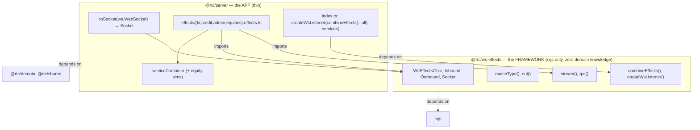
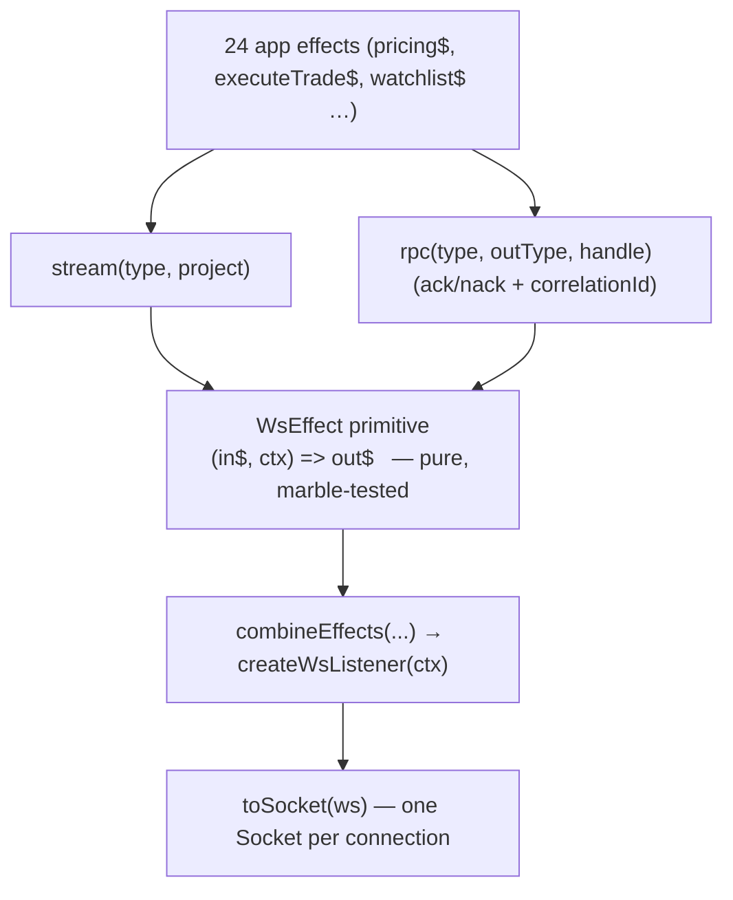

# Design — `@rtc/ws-effects`: a declarative RxJS WebSocket effects micro-framework

- **Status:** Approved design, pending implementation plan
- **Date:** 2026-07-02
- **Supersedes server dispatch in:** `packages/server/src/ws/wsHandler.ts`
- **Related:** [`docs/architecture.md` §7 (Runtime Topology & Communication Patterns)](../../architecture.md#7-communication-patterns), CLAUDE.md "Make choices, defer commitment"

## 1. Context & problem

### 1.1 The marblejs backstory

The original monorepo scaffold (commit `9a495092`) declared `@marblejs/core`, `@marblejs/http`, `@marblejs/websockets`, and `fp-ts` as `@rtc/server` dependencies — matching the "Marble.js + RxJS" plan still written in `CLAUDE.md` and `README.md`. **No source file ever imported them.** When the knip dead-code gate landed (commit `b1f8e5ac`), it flagged all four as *genuinely-unused* runtime deps and removed them (also dropping a now-orphaned `ws@7` override). So: declared, never wired, pruned. The "Marble.js" references in the docs are now stale.

### 1.2 What the server actually is today

A hand-rolled WebSocket server — `ws` + `rxjs`, no framework:

- `index.ts` — `WebSocketServer` with a token `verifyClient` gate + a `/health` probe.
- `ws/wsHandler.ts` — `handleConnection` → an imperative **`switch` statement** (`handleMessage`) routing a `{ type, payload, correlationId }` envelope. Two message families: `subscribe.*` (long-lived streams) and `rpc.*` (request/response matched by `correlationId`). Per-subscription teardown via a `Set<AbortController>`.
- `services/serviceContainer.ts` — instantiates the domain **simulators** (`PricingSimulator`, `ExecutionSimulator`, `CreditRfqSimulator`, …) and exposes them as services.

The simulators (24 classes, ~3,880 LOC in `packages/domain/src/simulators/`) are the real data source. They implement the domain **port interfaces** and are reused on both the server and the browser (see [architecture.md §7](../../architecture.md#7-communication-patterns) — Runtime Topology).

### 1.3 The showcase goal

The server functionally works. This change is **not** about functionality — it is about *demonstrating the declarative RxJS-effects server style* (the thing that made marblejs attractive) to colleagues. The current imperative `switch` is the opposite of that aesthetic.

marblejs-the-package is a poor vehicle for that goal in this repo: it is effectively unmaintained (v4.1.0), deeply `fp-ts@2`-coupled, pins older `rxjs`, and drags a vulnerable `ws` transitively — the very thing that got it removed, and a direct collision with this repo's strict supply-chain gates (prod audit gate, cooldown, Dependabot). The *idea* worth showing, however, is small and dependency-free: **a WebSocket listener is just `(inbound$) => outbound$`, and listeners compose by merging their effect streams.**

### 1.4 The equities asymmetry (in scope to close)

The server's `switch` handles 16 message types — **none of them equities**. `serviceContainer` does not instantiate the equity simulators. Consequently:

- **In-browser simulator mode:** equities fully work (sims run in-process).
- **WS-real mode (deployed):** the client's equities ports send `watchlist`/`candles`/`depth`/`placeOrder`/`positions` messages the server silently ignores → equities panels receive nothing.

Closing this gap is in scope, so the deployed app becomes fully faithful and the declarative pattern is shown scaling across all four domains (FX, Credit, Admin, Equities).

## 2. Goals & non-goals

**Goals**
- Replace the imperative `switch` with a declarative, composable, RxJS-native effects model — a visible before/after.
- Extract that model into a reusable, dependency-light framework package (`@rtc/ws-effects`, `rxjs` only) that knows nothing about trading — realising the repo's "framework replaceable by changing only its package" principle.
- Close the equities gap so WS-real mode serves all domains.
- Keep the wire protocol byte-identical so the client is (almost) untouched.

**Non-goals**
- No HTTP effects (the hand-rolled `/health` route stays).
- No middleware/DI container, no `fp-ts`, no auth-as-effect (keep `verifyClient`).
- No reconnection/backpressure behaviour beyond what exists today.
- No change to the in-browser simulator composition path (`createSimulatorPorts`).
- No new trading domains.

## 3. Decisions

| # | Decision | Rationale |
|---|---|---|
| D1 | Build a **mini in-repo effects framework**, not adopt/fork marblejs. | Showcase goal is the *pattern*, not the package. Avoids unmaintained + `fp-ts` + vulnerable-`ws` collision with supply-chain gates. The homegrown framework *is* the artifact colleagues see. |
| D2 | Framework lives in **its own package `@rtc/ws-effects`** (`rxjs` only), `@rtc/server` is a thin app on top. | Strongest marblejs-style "framework vs app" separation; literally demonstrates the repo's replaceability principle. |
| D3 | **Hybrid API**: a pure `WsEffect` core primitive + `stream()` / `rpc()` sugar built on it. | Pure core is elegant and marble-testable (the showcase centrepiece); sugar absorbs the repeated ack/nack/correlation boilerplate. The complex SoW-marker and place-order effects drop to the raw primitive — justifying its exposure. |
| D4 | **Rewrite the 16 existing handlers *and* close the equities gap** (8 more message types + wire the 3 equity sims into the container). | Makes WS-real mode complete and shows the pattern scaling across all domains. |
| D5 | **Consolidate the wire protocol constants into `@rtc/shared`** as a single source of truth, imported by both server effects and client `portFactory.ts`. | The constants are currently duplicated (server `protocol.ts` has 16; client `portFactory.ts` inlines 24) and have drifted — that drift is *why the equities gap was invisible*. One contract prevents recurrence. |

## 4. The framework — `@rtc/ws-effects`

### 4.1 Package layout & dependency direction



`@rtc/ws-effects` depends on **`rxjs` only** and is generic over a `Ctx` type parameter — it knows nothing about trading, the `ws` library, or DTOs. `@rtc/server` adapts a real `ws.WebSocket` into the framework's transport-agnostic `Socket` and supplies the `ServiceContainer` as `Ctx`.

Keeping the framework `ws`-free is deliberate: it is the transport abstraction marblejs itself has; it makes the framework testable with a fake `Socket` and no real sockets; and it permanently avoids the vulnerable-`ws` problem (the framework bundles no transport).

### 4.2 API surface (the whole thing)

```ts
// Envelope — identical to today's wire, so the client protocol never changes.
interface Inbound  { readonly type: string; readonly payload?: unknown; readonly correlationId?: string }
interface Outbound { readonly type: string; readonly payload?: unknown; readonly correlationId?: string }

// The one primitive. Everything else is built from it.
type WsEffect<Ctx> = (in$: Observable<Inbound>, ctx: Ctx) => Observable<Outbound>

// Operators
function matchType(type: string): MonoTypeOperatorFunction<Inbound>
function out(type: string, payload?: unknown, correlationId?: string): Outbound

// Sugar (each ~15 lines; each returns a WsEffect<Ctx>)
function stream<Ctx>(inType: string, project: (payload: unknown, ctx: Ctx) => Observable<Outbound>): WsEffect<Ctx>
function rpc<Ctx>(inType: string, outType: string, handle: (payload: unknown, ctx: Ctx) => Observable<unknown> | Promise<unknown> | unknown): WsEffect<Ctx>

// Composition + wiring
function combineEffects<Ctx>(...effects: WsEffect<Ctx>[]): WsEffect<Ctx>
interface Socket { readonly messages$: Observable<Inbound>; send(m: Outbound): void; readonly closed$: Observable<void> }
function createWsListener<Ctx>(effect: WsEffect<Ctx>, ctx: Ctx): (socket: Socket) => void
```

- **`stream`** — on each matching inbound, subscribe `project()` and forward its outbounds. Covers 1→N streaming *and* SoW-marker fan-out (project emits `startOfStateOfTheWorld`, N `added`, `endOfStateOfTheWorld`).
- **`rpc`** — on each matching inbound, run `handle()`; success → `out(outType, { type: "ack", payload: result }, correlationId)`; throw/error → `out(outType, { type: "nack" }, correlationId)`. This absorbs the try/ack/catch/nack + correlationId boilerplate repeated ~10× in the current switch.
- **`combineEffects`** — merges every effect's output over the shared inbound stream.
- **`createWsListener`** — pipes `socket.messages$` through the combined effect, subscribes the result to `socket.send`, and tears the whole subscription down on `socket.closed$` (replacing the manual `AbortController` set).

### 4.3 Effect pipeline



### 4.4 Lifecycle & teardown

`createWsListener(effect, ctx)` returns `(socket) => void`. Per connection it subscribes `effect(socket.messages$, ctx)` to `socket.send`, and on `socket.closed$` unsubscribes — tearing down every inner simulator subscription. Streaming/RPC semantics stay identical to the current server: a subscription lives until the socket closes (there is no per-subscription unsubscribe message in the protocol today, and none is added). `ctx` (the `ServiceContainer`) is a shared singleton created once at startup, exactly as today.

## 5. The app — `@rtc/server` effects

### 5.1 The 24 effects

| File | Streams (`stream`) | RPCs (`rpc`) |
|---|---|---|
| `effects/fx.effects.ts` | referenceData, pricing, blotter, analytics | executeTrade, getPriceHistory |
| `effects/credit.effects.ts` | instruments, dealers, workflow *(SoW fan-out)* | createRfq, cancelRfq, quote, pass, accept |
| `effects/admin.effects.ts` | — | getThroughput, setThroughput |
| `effects/equities.effects.ts` *(new)* | watchlist, eqQuotes, depth, orders, positions | getCandles, cancelOrder |

`placeOrder` is the one effect written against the **raw `WsEffect` primitive** (not sugar): it must ack with `{ orderId }` *and* stream `ORDER_LIFECYCLE` updates from the same `orders.place()` observable — the exact case that justifies exposing the pure core:

```ts
const placeOrder$: WsEffect<Ctx> = (in$, ctx) => in$.pipe(
  matchType(PLACE_ORDER),
  mergeMap(({ payload, correlationId }) => {
    const lifecycle$ = ctx.orders.place(payload as PlaceOrderRequest).pipe(shareReplay({ bufferSize: 1, refCount: false }));
    const ack$    = lifecycle$.pipe(take(1), map(o => out(PLACE_ORDER_RESPONSE, { type: "ack", payload: { orderId: o.id } }, correlationId)));
    const stream$ = lifecycle$.pipe(map(o => out(ORDER_LIFECYCLE, o)));
    return merge(ack$, stream$);
  }),
);
```

> **Ordering note.** The client subscribes to `ORDER_LIFECYCLE` only after the ack resolves. Because simulated lifecycle updates arrive over time (not synchronously with the ack), the parity race is not observable in practice — the same ordering the in-browser sim relies on. This is a known parity detail, not a guarantee to harden for a conceptual demo.

### 5.2 `index.ts` after the rewrite

```ts
const services = createServices();
const listen = createWsListener(
  combineEffects(...fxEffects, ...creditEffects, ...adminEffects, ...equitiesEffects),
  services,
);
wss.on("connection", ws => listen(toSocket(ws)));
```

The old `wsHandler.ts` switch + per-stream helpers are deleted. `auth.ts`, the `/health` route, and `ThroughputService` are untouched. `toSocket(ws.WebSocket): Socket` is the small adapter that lifts `ws` message/close events into the framework's `messages$`/`closed$` observables and forwards `send`.

## 6. Closing the equities gap

Three coupled changes, all mirroring what the browser already does in `createSimulatorPorts`:

1. **serviceContainer** gains:
   ```ts
   const marketData = new EquityMarketDataSimulator();
   const positions  = new EquityPositionSimulator(marketData);
   const orders     = new EquityOrderSimulator({
     listener: (fill) => positions.onFill(fill),
     markFor:  (symbol) => marketData.currentPrice(symbol),
   });
   ```
2. **`equities.effects.ts`** fulfils the 8 equity message types over the wire.
3. **Protocol consolidation (D5)** — hoist the wire constants into `@rtc/shared` as the single source of truth; server effects and client `portFactory.ts` both import them. Small client edit: replace the inline constant blocks with an import (no behavioural change).

## 7. Testing strategy

- **`@rtc/ws-effects`** — RxJS `TestScheduler` **marble tests**: `matchType`, `combineEffects`, `stream`, `rpc` (ack + nack paths), `createWsListener` teardown-on-close. This is the showcase test suite — literal marble diagrams testing a marble-style framework.
- **`@rtc/server`** — per-effect tests feeding `Inbound` and asserting `Outbound`, via an in-memory fake `Socket` (reusing the spirit of the existing `FakeWs.testHelpers.ts`).
- **Fullstack e2e** (`tests/fullstack/`) — already drives the real WS path with `VITE_SERVER_URL` set; extend it to assert **equities panels receive data over WS** (the closed gap becomes a regression test).

## 8. Migration & cutover

- **Wire protocol unchanged** → no client behavioural change (only the D5 import edit). No protocol version bump.
- **Server-only behavioural change** → **no visual-golden or UI-contract impact** (UI pixels identical).
- Cutover replaces `wsHandler.ts` dispatch with `createWsListener(combineEffects(...), services)` in `index.ts`; the old switch and per-stream helpers are deleted.
- **Verification:** full local gauntlet + `@rtc/ws-effects` unit tests + fullstack e2e green, then the CI-only gates (dependency-cruiser inward-only rule must accept the new package; knip must see the new package's exports as used). Done on a feature branch with explicit user OK before it touches `main` (main auto-pushes).

## 9. Risks & mitigations

| Risk | Mitigation |
|---|---|
| New package trips CI-only gates (dependency-cruiser, knip, `check:deps`, `check:versions`). | Add `@rtc/ws-effects` to the dependency graph rules and workspace catalogs up front; run the full CI-only gate set, not just the local gauntlet. |
| `placeOrder` ack/lifecycle ordering race under real WS. | Documented parity detail (§5.1); simulated lifecycle is time-spaced. Covered by fullstack e2e. |
| Protocol consolidation touches the client. | Constants-only move; no logic change; client contract tests + fullstack e2e catch regressions. Can be descoped to "add the missing 8 to the server copy" if a client-touch-free change is preferred. |
| Framework abstraction leaks `ws` types. | `@rtc/ws-effects` must not depend on `ws`; the `Socket` seam + `toSocket` adapter keep `ws` inside `@rtc/server`. Enforced by the package's dependency list. |

## 10. Out of scope / YAGNI

No HTTP effects, no middleware/DI container, no `fp-ts`, no auth-as-effect, no reconnection/backpressure changes, no in-browser simulator path changes, no new domains. The framework is intentionally the smallest thing that demonstrates the declarative pattern faithfully.
