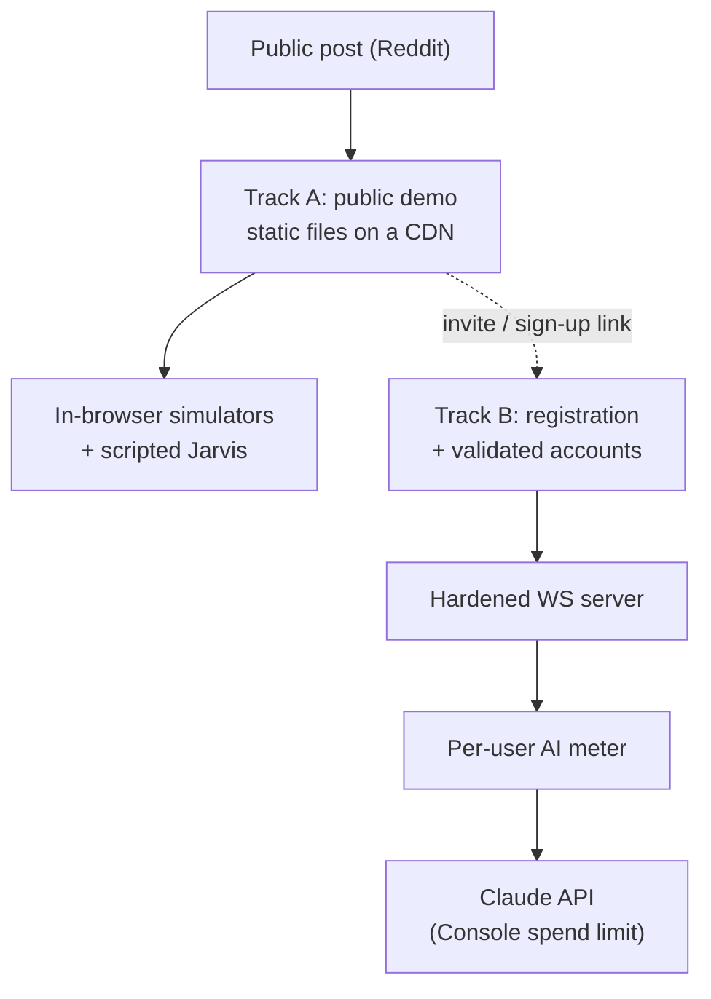

# Public Launch Hardening — Two-Track Design

**Date:** 2026-09-27
**Status:** Revised 2026-10-01. The two-track direction was chosen by the
user on 2026-09-27 and **revised on 2026-09-29**: Track B comes first, and the
two tracks ship as **one hybrid deployment** rather than two sites (§8). §8 is
being built (plan:
[../plans/2026-10-01-hybrid-data-source.md](../plans/2026-10-01-hybrid-data-source.md));
§9 and §10 are recorded findings, not yet built. The remaining open decisions
are in §7.
**Trigger:** the project is about to be posted publicly (Reddit). A security
review of the repository and the deployed server was run on 2026-09-27; this
document records what it found and the plan that follows from it.
**Related:** [authentication.md](../../authentication.md),
[DEPLOY.md](../../DEPLOY.md), [env-files.md](../../env-files.md),
[running-real-jarvis.md](../../running-real-jarvis.md),
[ADR-007 CI security tooling](../../adr/ADR-007-ci-security-tooling.md),
[architecture §18 Jarvis](../../architecture/18-jarvis-ai-agent-surface.md).

## 1. Intent

The maintainer has no time to operate a public service. The goal is therefore
not "a hardened server on the open internet" but **the smallest public surface
that still shows the project off**, with the real backend kept for an audience
that has been let in deliberately.

Two independent deliverables:

- **Track A — the public demo.** A static build with no backend, no real AI,
  and a fixed demo roster. This is the version that gets posted.
- **Track B — the real stack.** Registered, validated users; the real
  WebSocket server; real Claude models behind a per-user meter. Built later,
  opened only once it is hardened.



### Decided scope

| Question | Decision |
|---|---|
| What is posted publicly? | **One hybrid build** (§8): demo accounts run the in-browser simulators, registered accounts run against the real server. A simulator-only build stays available as a fallback (no `VITE_SERVER_URL`). |
| Does the public demo talk to any server? | **Not for demo accounts.** Their credentials are verified in the browser and never leave it (§8.2). |
| Does the public demo use a real model? | **No.** Scripted Jarvis only. |
| How does a visitor sign in to the demo? | The fixed demo roster, shipped in the bundle (`VITE_DEMO_AUTH`). It is a stage prop, not access control. |
| Which track is built first? | **Track B** (user, 2026-09-29: "no need to rush, I'd rather do things properly"). The hybrid composition (§8) is its first slice. |
| Who may reach the real server? | Registered **and validated** accounts only (Track B). |
| Is real AI metered? | **Yes**, per user, with a provider-side spend limit as the backstop. |

## 2. What the review found

Verified on 2026-09-27 against `main` and the deployed server. Findings are
stated as mechanism and remedy. Each is derivable from the public source, so
recording them here discloses nothing new.

### 2.1 Exposure (the two that matter)

| # | Finding | Consequence |
|---|---|---|
| E1 | The deployed server's `AUTH_USERS` includes an account whose password is the committed demo password. | Server authentication is effectively public. Every other finding is reachable by anyone. |
| E2 | The deployed server offers the real Claude brains to that account. | Anyone can spend the maintainer's Anthropic credit. |

### 2.2 Server code

| # | Finding | Where | Remedy | Status |
|---|---|---|---|---|
| S1 | The WebSocket server sets no `maxPayload`; the library default is far larger than the VM's memory. | `packages/server/src/index.ts` | Set a small explicit cap (tens of kilobytes). | **Done** (B1 PR 1) |
| S2 | The `/login` body is read without a size limit. | `index.ts` `readBody` | Cap the body and reject early. | **Done** (B1 PR 2) |
| S3 | The login rate limiter keys on the first `X-Forwarded-For` entry, which a caller can supply. | `index.ts` `clientIp` | Key on the platform's trusted client-IP header. | **Done** (B1 PR 2) |
| S4 | The rate limiter's table never evicts. | `auth/rateLimit.ts` | Evict expired windows; bound the table. | **Done** (B1 PR 2) |
| S5 | Password hashing is synchronous and blocks the event loop. | `auth/AuthService.ts` | Use the async variant; keep S3 tight. | **Done** (B1 PR 2) |
| S6 | `jarvis.chat` `text` has no length cap. History entries are capped; the message itself is not. | `effects/jarvis.effects.ts` | Cap at the parse seam, next to the history caps. | **Done** (B1 PR 1) |
| S7 | The AI budget gate is process memory. It is read when a turn starts and resets when the machine restarts. | `services/UsageMeter.ts`, `jarvisGate.ts` | See Track B3. Treat today's gate as a display, not a limit. | Open — B3 |
| S8 | No cap on concurrent connections, per-connection message rate, or live subscriptions. `stream()` starts one producer per frame. | `ws-effects` `stream.ts`, `index.ts` | Per-IP and total connection caps; a token bucket per socket; a subscription ceiling. | **Done** (B1 PR 1 ceilings, PR 2 caps + token bucket) |
| S9 | Shared simulators grow without bound (trades, RFQs, equity orders). | `packages/domain/src/simulators/` | Bound each store; evict oldest. | **Done** (B1 PR 1) |
| S10 | `SET_THROUGHPUT` changes a process-wide setting and is open to every login. | `effects/admin.effects.ts` | Restrict to an admin role, or make it per-connection. | **Done** (B1 PR 2, per-connection) |
| S11 | RPC payloads are cast, not validated. A malformed frame ends that socket's effect stream. | `effects/*.effects.ts` | Guard at the parse seam, as `jarvis.effects.ts` already does. | **Done** (B1 PR 1) |
| S12 | `/mcp` accepts the same session token and runs `execute_trade` without a confirmation step. | `mcp/mcpHttpHandler.ts` | Acceptable while trades are simulated; revisit with B2 roles. | Open — B2 roles (acceptable while trades are simulated) |
| S13 | The container runs as root. | `packages/server/Dockerfile` | Add an unprivileged `USER`. | **Done** (B1 PR 3) |
| S14 | No `error` listener on accepted sockets. `ws` emits `error` on the server-side socket for any protocol violation (oversized frame, bad UTF-8, reserved bits); unhandled, Node turns it into a process crash — so the S1 cap alone would have made every oversized frame a crash. Found while building S1. | `index.ts` | Attach the listener; log the error code only. | **Done** (B1 PR 1) |

Low-impact notes: the session token travels in the WebSocket URL query, so it
can appear in proxy logs; unknown usernames return faster than known ones.

### 2.3 What is already solid

- No credential was found in the tracked files or in the full git history.
- Secret scanning and push protection are enabled.
- `main` admits changes only through a pull request with four required checks,
  and the ruleset has no bypass actors.
- No workflow uses `pull_request_target`. The default workflow token is
  read-only. Every deploy workflow is manual-dispatch only.
- Password storage and token signing are implemented correctly (salted scrypt,
  HMAC-SHA-256, constant-time comparison, strict upgrade rejection).
- The Anthropic and MCP SDKs are confined to the server by dependency rules,
  so no key-bearing code path can reach a browser bundle.

### 2.4 Not covered by the review

Fly secret values, Vercel project settings, and Anthropic Console limits could
not be read. The React Native app and the way clients render Jarvis output
were not audited. The two dependency advisories Scorecard reports were not
traced.

## 3. Step 0 — lock down before posting

No code. Under an hour. **These come first, independent of both tracks.**

Progress (2026-10-02): item 1's spend limit is **done** (user). Items 2–3 are
the user's next move; with the hybrid merged (§8), **rotating `AUTH_USERS`
(item 3) is the better of the two** — demo logins never reach the server now,
so private server passwords keep the live desk fully featured for the
maintainer while making the public password worthless on the server.
`RTC_JARVIS_FAKE=1` (item 2) is the alternative if real AI should go dark for
everyone until B3. Items 4–6 remain.

1. **Anthropic Console:** set a monthly spend limit on the workspace, and put
   the server on its own key so it can be revoked alone.
2. **Turn real AI off on the server** until Track B3 exists:
   `RTC_JARVIS_FAKE=1`.
3. **Rotate `AUTH_USERS`** to private passwords that appear in no committed
   file.
4. **Rotate `AUTH_SECRET`.** This invalidates every session token already
   issued, including any issued to the demo account.
5. **Check billing ceilings.** Confirm the Vercel plan's overage behaviour and
   enable a pause threshold if the plan bills overages. Keep the Fly app at one
   small machine.
6. **GitHub:** require approval for workflow runs from *all* outside
   contributors, not only first-time ones.

```bash
fly auth login
fly secrets list -a rtc-clone-server
fly secrets set RTC_JARVIS_FAKE=1 -a rtc-clone-server
fly secrets set AUTH_USERS="<user>:<private-password>" -a rtc-clone-server
fly secrets set AUTH_SECRET="$(openssl rand -base64 48)" -a rtc-clone-server
```

**Side effect to expect:** the distributed React Native build defaults to the
deployed endpoint, so rotating `AUTH_USERS` changes which credentials work
there too.

## 4. Track A — the public demo

### 4.1 Shape

A production build of the web client with `VITE_SERVER_URL` empty. The
composition root already branches on that value
(`packages/client-*/src/app/buildBrowserPorts.ts`): empty selects
`createSimulatorPorts`, which wires the in-browser simulators and
`ScriptedJarvisAdapter`. No new architecture is needed. The work is in the
build and deploy path.

### 4.2 What blocks it today

| # | Blocker | Why |
|---|---|---|
| A1 | A production simulator build has **no working login**. | `VITE_DEV_AUTH` lives in `.env.development`, which Vite loads in dev only. `parseDevAuth` then yields an empty roster. |
| A2 | The deploy workflow **refuses** a build without a server URL. | `deploy.yml` has a guard that fails when `VITE_SERVER_URL` is not inlined. It exists because a silent fallback to the simulator once shipped by accident. |
| A3 | A visitor does not know the demo credentials. | The login screen shows none. |

### 4.3 Work items

1. **A demo build mode.** Add a Vite mode (`vite build --mode demo`) with a
   committed `.env.demo` carrying the roster and an explicit empty
   `VITE_SERVER_URL=`. Expose it as its own package script (`build:demo`) so
   Turborepo caches it under a separate key from `build`. Apply identically to
   `client-react` and `client-solid`.
2. **A demo deploy target.** Add a target to `deploy.yml` (or a sibling
   workflow) that builds with `build:demo` and deploys to a **separate Vercel
   project**, so the real project's environment can never leak in.
3. **Invert the guard for the demo target.** Fail the demo build if the bundle
   contains any server origin (`wss://`, the Fly hostname). The existing guard
   stays as it is for the real target. Both directions are then enforced.
4. **Make "no backend" structural.** Serve the demo with a Content Security
   Policy whose `connect-src` is `'self'`. The browser then refuses any
   outbound connection even if a later change wires one by mistake. Add the
   usual static headers alongside (`X-Content-Type-Options`, `frame-ancestors`,
   `Referrer-Policy`).
5. **Show the demo accounts on the login screen**, demo build only. The
   passwords are in the bundle regardless; hiding them protects nothing and
   strands visitors.
6. **Label the demo honestly.** A visible "simulated data, scripted assistant"
   marker, so nobody mistakes scripted Jarvis for a model.
7. **Tests.** A unit test that the demo mode yields a non-empty roster; an e2e
   smoke against the demo build that signs in and asserts no WebSocket or
   cross-origin request is made.
8. **Docs.** Update `authentication.md`, `DEPLOY.md`, `env-files.md` and the
   README to describe the two deployments.

### 4.4 Acceptance

- The demo URL signs in with a roster account and renders every workspace.
- The browser's network panel shows requests to the demo origin only.
- The demo bundle contains no server hostname. The build fails if it does.
- Jarvis answers from the scripted brain.
- Stopping the Fly server has no effect on the demo.

### 4.5 Residual risk

Traffic and volumetric attacks land on the CDN, which is the provider's
problem. The one cost exposure left is bandwidth on a plan that bills
overages. Step 0 item 5 covers it.

## 5. Track B — the real stack

Four phases. **B1 must land before the server is reachable by anyone who was
not hand-provisioned.**

### B1 — server hardening

**Done 2026-10-02** as three stacked pull requests (plan:
[`../plans/2026-10-02-b1-server-hardening.md`](../plans/2026-10-02-b1-server-hardening.md)):
PR 1 *wire bounds* (S1, S6, S8 ceilings, S9, S11, S14, plus `rpc()` nacking a
synchronously throwing handler), PR 2 *edge guards* (S2, S3, S4, S5, S8 caps and
token bucket, S10, the §9.2 ban list), PR 3 *deploy posture* (S13, the Fly
`hard_limit`, two gates that keep both). S7 waits for B3; S12 for B2 roles.

Every finding in §2.2 was shipped with a test a wrong implementation fails
(`pnpm mutation-check`, 48 mutants killed across the three PRs), timer-driven
limits take an injected clock or run under fake timers, and the real-server
smoke (`tests/fullstack/node-smoke.ts`) witnesses the 1009 frame cap, the
413 body cap and the spoof-proof rate limit ending in a ban. Every limit is a
named constant in `packages/server/src/config/limits.ts`; the values are
judgment calls, generous for one real client and tight for a flood.

### B2 — user management

Requirements as stated by the user:

- A visitor can **register** and **choose a password**.
- An account must be **validated** before it can sign in. The intended model
  follows the approach used in the user's Graphlyn project. Its exact rules
  are to be written into this section before B2 is planned.

What this changes structurally:

| Concern | Today | Needed |
|---|---|---|
| Credential store | `AUTH_USERS` env, hashed in memory at boot | Durable storage. The server has none today. |
| Identity | Four fixed roster profiles in `@rtc/domain` | Profiles created at registration |
| Roles | None. Every login is equal. | At least `admin` and `user` (S10, S12 depend on it) |
| Abuse surface | One rate-limited `/login` | Registration, verification and reset endpoints, each rate-limited |
| Personal data | None stored | Email addresses. Needs a privacy notice and a deletion path. |

### B3 — AI metering

- **Per-user budget**, not one process-wide counter.
- **Durable**, so a restart or a scale-to-zero cycle does not reset it.
- **Enforced before the call**, with the input size capped (S6), so a turn
  cannot overshoot by more than one bounded request.
- **Model allowlist per role.** Haiku by default; larger models opt-in.
- **A global kill switch** that needs no deploy (`RTC_JARVIS_FAKE=1` already
  is one).
- **The Anthropic Console spend limit stays on** as the final backstop. The
  in-app meter is a product feature; the Console limit is the safety.

### B4 — open the door

Link the public demo to registration. Do this only after B1 to B3 are merged
and the acceptance checks below pass.

### Acceptance

- A frame over the payload cap closes the socket and allocates nothing large.
- A caller cannot change its rate-limit key by sending a header.
- An unvalidated account cannot open a WebSocket.
- A user at budget gets the scripted brain, and a restart does not reset them.
- A non-admin cannot change a process-wide setting.

## 6. Order of work

Revised 2026-09-29. Nothing is posted until B4.

1. **Step 0** (§3). Immediately, independent of everything else.
2. **Hybrid composition** (§8). **Merged 2026-10-02 (PR #879).**
3. **B1** server hardening (§5), including the in-app abuse layer (§9.2).
   **Done 2026-10-02** (three stacked PRs; see §5 B1).
4. **D9 UI round**: the demo-accounts hint on the login screen (both web
   clients, golden regeneration, user acceptance). **Done 2026-10-03** (see
   §7 D9).
5. **B2** user management (confirmed needed 2026-10-02 — registration,
   self-chosen passwords, validated accounts; nothing exists yet). **Next.**
   Then **B3** metering with bring-your-own keys (§10).
6. **B4** open the door, then post.

Track A survives as the **simulator-only fallback build**: the same code with
`VITE_SERVER_URL` empty. It needs no separate work beyond §4.3 items 2 and 3
if it is ever deployed on its own.

## 7. Open decisions

| # | Decision | Recommendation |
|---|---|---|
| D1 | ~~Which URL becomes the public demo?~~ | **Resolved 2026-09-29: one hybrid deployment on the current alias** (§8). No second site. |
| D2 | ~~Ship the demo for React, Solid, or both?~~ | **Resolved: both** — the hybrid lives in each client's `buildBrowserPorts`, so both get it in the same change. |
| D3 | B2: self-built accounts or a managed identity provider? | For a maintainer with no operations time, a **managed provider plus an approval allowlist** removes password storage, reset flows and most abuse handling. To be weighed against the Graphlyn approach. |
| D4 | B2: what does "validated" mean? | Open. Email verification, manual approval, or both. |
| D5 | B2/B3: where does durable state live? | Open. Depends on D3. |
| D6 | Does `/mcp` stay enabled on the real server? | Keep, behind B2 roles. |
| D7 | Does the React Native app follow Track A or Track B? | Open. It defaults to the deployed endpoint today. The hybrid (§8) is web-only; `buildNativePorts.ts` is untouched. |
| D8 | ~~Should a mode-change reload suppress the boot splash?~~ | **Resolved 2026-10-02: keep the replay.** It happens once per device, reads as "connecting to the live desk", and stands in for the login wait the reload cuts short. Revisit only if someone sees it and dislikes it. |
| D9 | ~~Show the demo accounts on the login screen?~~ | **Resolved 2026-10-02: yes.** A small UI round in both web clients, scheduled right after B1 (§6); it regenerates the login goldens and needs the user's eyeball acceptance before merge. The hint renders only for accounts the page verifies in the browser (hybrid and simulator builds, simulator-mode dev included), never on a plain live build. **Shipped 2026-10-03:** one click-to-fill row per account (username and role) under the form, the password printed once when every account shares it (chosen by the user over password-hidden, text-only and one-click sign-in); picking a row fills both fields and moves focus to AUTHENTICATE; it does not sign in. The list is exactly the accounts the page verifies in the browser — `readDemoAccounts()` in each client's `buildBrowserPorts.ts`, handed to the UI through `ViewModelShell.demoAccounts` / `useDemoAccounts()`, so no application core changed. |

## 8. Hybrid data source (revision 2026-09-29, built 2026-10-01)

### 8.1 Rule

One deployment. The **login decides the data source**:

- Credentials that match the committed **demo roster** are verified in the
  browser, and the app runs on the in-browser simulators with the scripted
  Jarvis. Nothing is sent to any server.
- Any other credentials are posted to the server's `/login`. On success the app
  runs on the real WebSocket transport with real, metered AI.

The criterion is **credential match** (username *and* password equal a demo
entry), not username membership. A demo username with a non-demo password is a
server login. That keeps every existing full-stack dev and e2e flow working,
whose server roster is `demo:demo`, while the bundle's demo entry is
`demo:mcdc2026`.

### 8.2 Composition

The client composes its ports once per page load, before the login screen
(`AppRoot` → `buildBrowserPorts()`). The hybrid therefore chooses the port set
**at load**, from a stored choice, exactly as the load-time core switch does
(ADR-006 Decision 6):

| `VITE_SERVER_URL` | `VITE_DEMO_AUTH` | Composed | Behaviour |
|---|---|---|---|
| empty | any | **sim** | Today's simulator mode. The roster is `VITE_DEV_AUTH` ∪ `VITE_DEMO_AUTH`. This is also the Track A fallback build. |
| set | empty | **live** | Today's WS-real mode, byte for byte. Every `dev:*:fs`, `dev:*:ws:*` and e2e flow lands here, because `.env.development` carries no `VITE_DEMO_AUTH`. |
| set | set | **hybrid** | The stored choice (`localStorage["rtc.dataSource"]`, `"sim"` or `"live"`) decides. Absent choice: `live` when a stored session exists (a pre-hybrid live session), else `sim`. |

`VITE_DEMO_AUTH` is committed in each web client's `.env.production`, so only a
production build with a server URL is hybrid. The deploy workflow asserts the
roster was inlined, next to its existing server-URL guard.

In a hybrid page the `auth` port is a **routing port** (`createRoutingAuthPort`
in `@rtc/client-core`): it tries the demo roster first (synchronously, in the
browser), then the server. The demo roster never leaves the browser because the
server attempt only runs after the local match has failed.

### 8.3 Reload dynamics

A reload happens **only on a mode change**, triggered by a successful login,
never by boot.

1. **Boot.** No stored choice, so the client composes **sim** and shows the
   login screen.
2. **Demo login.** Local match succeeds; the composed mode already matches.
   The routing port writes the choice (`sim`) and emits the outcome. No
   reload. The app renders at once.
3. **Registered login.** Local match fails; `/login` succeeds. The target is
   `live`, the page is composed `sim`, so the routing port **writes the
   session and the choice, calls `relaunch()` (a `location.reload()`), and
   never emits** (a pending observable, not a completed one: the async and
   Effect cores treat "completed without a value" as an error). The login
   screen stays in its "authenticating" state for the few milliseconds until
   the page unloads.
4. **After the reload.** The client reads the stored choice, composes
   **live**, and `AuthPresenter.resume()` restores the session from storage,
   so no login screen is shown; the WebSocket opens with the stored token. The
   boot splash replays on this load (D8).
5. **Next visit on that device.** Stored choice is `live`, so boot composes
   live directly. No reload.
6. **Logout.** Clears the session; the choice stays. The next login decides
   afresh, so a demo login on a live-composed page relaunches back into sim
   (step 3 mirrored).
7. **Unlock (lock screen).** Re-authenticates with the same username. Same
   credentials → same target → no reload.

Two consequences to know about:

- **The cinematic login wait is cut short on a mode change.** The wait
  (`withLoginDelay`) wraps the routing port, so the relaunch fires when the
  outcome is known, before the delay would have delivered it. A mode change
  happens once per device, and the reload plays the splash, which takes the
  wait's place.
- **Why not swap ports without a reload.** Presenters subscribe to their ports
  at construction, and the core contract suites assert construction-time port
  counts (`portDiscipline`). Swapping implementations under running presenters
  would break the equivalence guarantee across all three cores. A reload keeps
  the one composition root honest.

The console line `[data] composed <sim|live> from <reason>` says which rule
won, mirroring `[core] booted …`.

### 8.4 Invariants the tests pin

- Demo credentials produce **no request** to the server origin.
- A hybrid page without a stored choice composes **sim**.
- A hybrid page with a stored `live` choice, or a stored session and no
  choice, composes **live**.
- A server URL without a demo roster composes **live** and uses the plain
  HTTP auth adapter (today's behaviour).
- A mode change writes the session **before** calling `relaunch()`, and
  never emits (nor completes).
- An erroring demo leg falls through to the server; an erroring live leg
  reads as `unavailable`.
- Same-mode logins emit the outcome and never relaunch.

### 8.5 Not in this slice

- Reserving the demo usernames on the server (B2).
- A demo-accounts hint on the login screen (D9 — shipped 2026-10-03, §7).
- Splash suppression on the mode-change reload (D8).
- The React Native client (D7).

## 9. Abuse and denial-of-service detection (findings, 2026-09-30)

### 9.1 What the platform gives

Fly's proxy sheds load through **per-app concurrency limits** (`soft_limit`,
`hard_limit` on connections or requests in `fly.toml`), and that is its only
knob. Fly **does not offer DDoS protection**, and it has **no per-IP rules,
bans or rate limits at the edge**; the community answer to "can I block IPs" is
to do it in the app or put a proxy in front. The trusted client address is the
`Fly-Client-IP` header; the first `X-Forwarded-For` entry is caller-supplied
(S3).

### 9.2 The layers, cheapest first

| Layer | What it does | What it does not do | Where |
|---|---|---|---|
| **Fly concurrency `hard_limit`** | Stops handing connections to the machine past the limit, so a flood becomes refused connections instead of an out-of-memory crash. | Nothing about fairness between callers. | `fly.toml` |
| **In-app ban list** | Counts failed logins, oversized frames and message bursts per `Fly-Client-IP`; puts offenders in an expiring ban table checked **first**, before the password hash and before the WebSocket upgrade, so a banned caller costs almost nothing. In-memory; a restart clears it, acceptable for temporary bans. This is the "temporarily ban unusual traffic" requirement. | Stop the packets from reaching the machine. | `packages/server/src/auth/rateLimit.ts` and `index.ts`, part of B1 |
| **Cloudflare in front** (free plan) | Volumetric DDoS absorption, WAF rules, rate-limiting rules and IP bans at the edge, before traffic reaches Fly. WebSockets pass through. | Protect the original Fly hostname, which stays reachable: the server must reject traffic that did not come through Cloudflare (Cloudflare's published address ranges, or a shared header secret). Needs a custom domain proxied through Cloudflare and a certificate on Fly. | DNS + a small server check |

Recommendation: all three, in that order. The first two are small changes in
this repo and belong to B1. Cloudflare is the only layer that handles a real
attack, and the only one that stops the traffic before it is paid for.

### 9.3 Sources

- [Setting Hard and Soft Concurrency Limits on Fly.io](https://fly.io/docs/blueprints/setting-concurrency-limits/)
- [Guidelines for concurrency settings](https://fly.io/docs/apps/concurrency/)
- [DDoS Protection (Fly community)](https://community.fly.io/t/ddos-protection/21136)
- [Is it possible to block IPs if they send too many requests? (Fly community)](https://community.fly.io/t/is-it-possible-to-block-ips-if-they-send-to-many-requests/11576)
- [How does Fly Proxy handle DOS attacks? (Fly community)](https://community.fly.io/t/how-does-fly-proxy-handle-dos-attacks/18130)

## 10. Bring-your-own model keys (findings, 2026-09-29, for B3)

Feasible because the Jarvis tools are plain JSON Schema (`@rtc/agent-tools`)
and the agent loop is already an interface (`AgentLoop`). Rules:

- **Never persist a user's key on the server.** Hold it in memory for the
  connection's lifetime; keep it out of every log.
- **Allow a fixed list of provider hosts only.** A free-form endpoint field
  turns the server into a relay to arbitrary addresses.
- **Start with two integrations.** Anthropic plus one OpenAI-compatible loop
  covers most popular models, including the aggregators.
- **Widen the brain model.** `JarvisBrain` is a closed list of four today; it
  becomes a provider plus a model identifier. The display price table applies
  to the house key only.
- **Keep rate limits on.** Turns on a user's own key bypass the house budget
  but still use the server's CPU and bandwidth.
- **Say what happens to the key**, in the UI, before the field.
