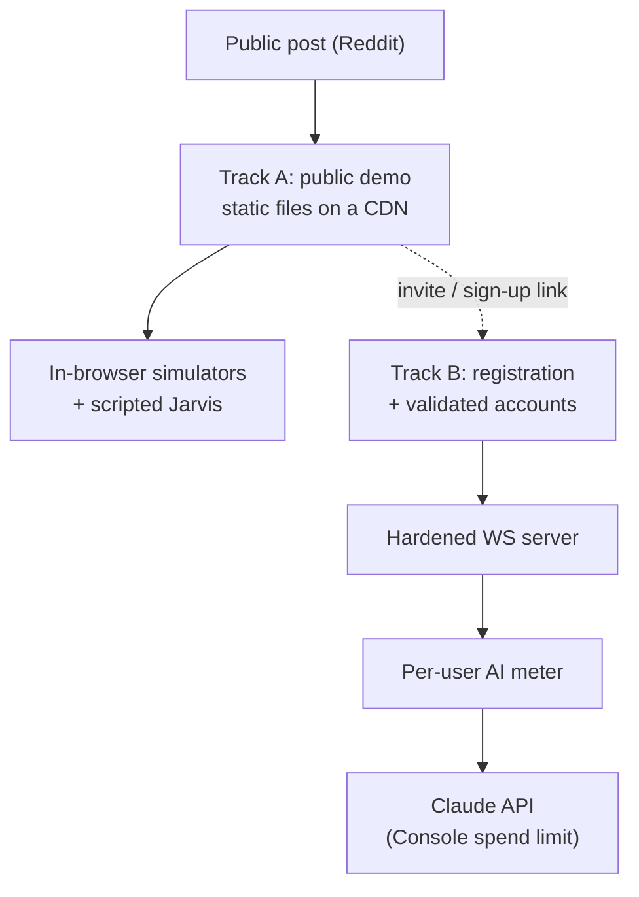

# Public Launch Hardening — Two-Track Design

**Date:** 2026-09-27
**Status:** Proposed. The two-track direction was chosen by the user on
2026-09-27; every item under "Open decisions" is still open. Nothing here is
built.
**Trigger:** the project is about to be posted publicly (Reddit). A security
review of the repository and the deployed server was run on 2026-09-27; this
document records what it found and the plan that follows from it.
**Related:** [authentication.md](../../authentication.md),
[DEPLOY.md](../../DEPLOY.md), [env-files.md](../../env-files.md),
[running-real-jarvis.md](../../running-real-jarvis.md),
[ADR-007 CI security tooling](../../adr/ADR-007-ci-security-tooling.md),
[architecture §18 Jarvis](../../architecture/18-jarvis-ai-agent-surface.md).

## 1. Intent

The maintainer has no time to operate a public service. The goal is therefore
not "a hardened server on the open internet" but **the smallest public surface
that still shows the project off**, with the real backend kept for an audience
that has been let in deliberately.

Two independent deliverables:

- **Track A — the public demo.** A static build with no backend, no real AI,
  and a fixed demo roster. This is the version that gets posted.
- **Track B — the real stack.** Registered, validated users; the real
  WebSocket server; real Claude models behind a per-user meter. Built later,
  opened only once it is hardened.



### Decided scope

| Question | Decision |
|---|---|
| What is posted publicly? | **Track A only.** A simulator-only build. |
| Does the public demo talk to any server? | **No.** Static files only. |
| Does the public demo use a real model? | **No.** Scripted Jarvis only. |
| How does a visitor sign in to the demo? | The fixed demo roster, shipped in the bundle. It is a stage prop, not access control. |
| Who may reach the real server? | Registered **and validated** accounts only (Track B). |
| Is real AI metered? | **Yes**, per user, with a provider-side spend limit as the backstop. |

## 2. What the review found

Verified on 2026-09-27 against `main` and the deployed server. Findings are
stated as mechanism and remedy. Each is derivable from the public source, so
recording them here discloses nothing new.

### 2.1 Exposure (the two that matter)

| # | Finding | Consequence |
|---|---|---|
| E1 | The deployed server's `AUTH_USERS` includes an account whose password is the committed demo password. | Server authentication is effectively public. Every other finding is reachable by anyone. |
| E2 | The deployed server offers the real Claude brains to that account. | Anyone can spend the maintainer's Anthropic credit. |

### 2.2 Server code

| # | Finding | Where | Remedy |
|---|---|---|---|
| S1 | The WebSocket server sets no `maxPayload`; the library default is far larger than the VM's memory. | `packages/server/src/index.ts` | Set a small explicit cap (tens of kilobytes). |
| S2 | The `/login` body is read without a size limit. | `index.ts` `readBody` | Cap the body and reject early. |
| S3 | The login rate limiter keys on the first `X-Forwarded-For` entry, which a caller can supply. | `index.ts` `clientIp` | Key on the platform's trusted client-IP header. |
| S4 | The rate limiter's table never evicts. | `auth/rateLimit.ts` | Evict expired windows; bound the table. |
| S5 | Password hashing is synchronous and blocks the event loop. | `auth/AuthService.ts` | Use the async variant; keep S3 tight. |
| S6 | `jarvis.chat` `text` has no length cap. History entries are capped; the message itself is not. | `effects/jarvis.effects.ts` | Cap at the parse seam, next to the history caps. |
| S7 | The AI budget gate is process memory. It is read when a turn starts and resets when the machine restarts. | `services/UsageMeter.ts`, `jarvisGate.ts` | See Track B3. Treat today's gate as a display, not a limit. |
| S8 | No cap on concurrent connections, per-connection message rate, or live subscriptions. `stream()` starts one producer per frame. | `ws-effects` `stream.ts`, `index.ts` | Per-IP and total connection caps; a token bucket per socket; a subscription ceiling. |
| S9 | Shared simulators grow without bound (trades, RFQs, equity orders). | `packages/domain/src/simulators/` | Bound each store; evict oldest. |
| S10 | `SET_THROUGHPUT` changes a process-wide setting and is open to every login. | `effects/admin.effects.ts` | Restrict to an admin role, or make it per-connection. |
| S11 | RPC payloads are cast, not validated. A malformed frame ends that socket's effect stream. | `effects/*.effects.ts` | Guard at the parse seam, as `jarvis.effects.ts` already does. |
| S12 | `/mcp` accepts the same session token and runs `execute_trade` without a confirmation step. | `mcp/mcpHttpHandler.ts` | Acceptable while trades are simulated; revisit with B2 roles. |
| S13 | The container runs as root. | `packages/server/Dockerfile` | Add an unprivileged `USER`. |

Low-impact notes: the session token travels in the WebSocket URL query, so it
can appear in proxy logs; unknown usernames return faster than known ones.

### 2.3 What is already solid

- No credential was found in the tracked files or in the full git history.
- Secret scanning and push protection are enabled.
- `main` admits changes only through a pull request with four required checks,
  and the ruleset has no bypass actors.
- No workflow uses `pull_request_target`. The default workflow token is
  read-only. Every deploy workflow is manual-dispatch only.
- Password storage and token signing are implemented correctly (salted scrypt,
  HMAC-SHA-256, constant-time comparison, strict upgrade rejection).
- The Anthropic and MCP SDKs are confined to the server by dependency rules,
  so no key-bearing code path can reach a browser bundle.

### 2.4 Not covered by the review

Fly secret values, Vercel project settings, and Anthropic Console limits could
not be read. The React Native app and the way clients render Jarvis output
were not audited. The two dependency advisories Scorecard reports were not
traced.

## 3. Step 0 — lock down before posting

No code. Under an hour. **These come first, independent of both tracks.**

1. **Anthropic Console:** set a monthly spend limit on the workspace, and put
   the server on its own key so it can be revoked alone.
2. **Turn real AI off on the server** until Track B3 exists:
   `RTC_JARVIS_FAKE=1`.
3. **Rotate `AUTH_USERS`** to private passwords that appear in no committed
   file.
4. **Rotate `AUTH_SECRET`.** This invalidates every session token already
   issued, including any issued to the demo account.
5. **Check billing ceilings.** Confirm the Vercel plan's overage behaviour and
   enable a pause threshold if the plan bills overages. Keep the Fly app at one
   small machine.
6. **GitHub:** require approval for workflow runs from *all* outside
   contributors, not only first-time ones.

```bash
fly auth login
fly secrets list -a rtc-clone-server
fly secrets set RTC_JARVIS_FAKE=1 -a rtc-clone-server
fly secrets set AUTH_USERS="<user>:<private-password>" -a rtc-clone-server
fly secrets set AUTH_SECRET="$(openssl rand -base64 48)" -a rtc-clone-server
```

**Side effect to expect:** the distributed React Native build defaults to the
deployed endpoint, so rotating `AUTH_USERS` changes which credentials work
there too.

## 4. Track A — the public demo

### 4.1 Shape

A production build of the web client with `VITE_SERVER_URL` empty. The
composition root already branches on that value
(`packages/client-*/src/app/buildBrowserPorts.ts`): empty selects
`createSimulatorPorts`, which wires the in-browser simulators and
`ScriptedJarvisAdapter`. No new architecture is needed. The work is in the
build and deploy path.

### 4.2 What blocks it today

| # | Blocker | Why |
|---|---|---|
| A1 | A production simulator build has **no working login**. | `VITE_DEV_AUTH` lives in `.env.development`, which Vite loads in dev only. `parseDevAuth` then yields an empty roster. |
| A2 | The deploy workflow **refuses** a build without a server URL. | `deploy.yml` has a guard that fails when `VITE_SERVER_URL` is not inlined. It exists because a silent fallback to the simulator once shipped by accident. |
| A3 | A visitor does not know the demo credentials. | The login screen shows none. |

### 4.3 Work items

1. **A demo build mode.** Add a Vite mode (`vite build --mode demo`) with a
   committed `.env.demo` carrying the roster and an explicit empty
   `VITE_SERVER_URL=`. Expose it as its own package script (`build:demo`) so
   Turborepo caches it under a separate key from `build`. Apply identically to
   `client-react` and `client-solid`.
2. **A demo deploy target.** Add a target to `deploy.yml` (or a sibling
   workflow) that builds with `build:demo` and deploys to a **separate Vercel
   project**, so the real project's environment can never leak in.
3. **Invert the guard for the demo target.** Fail the demo build if the bundle
   contains any server origin (`wss://`, the Fly hostname). The existing guard
   stays as it is for the real target. Both directions are then enforced.
4. **Make "no backend" structural.** Serve the demo with a Content Security
   Policy whose `connect-src` is `'self'`. The browser then refuses any
   outbound connection even if a later change wires one by mistake. Add the
   usual static headers alongside (`X-Content-Type-Options`, `frame-ancestors`,
   `Referrer-Policy`).
5. **Show the demo accounts on the login screen**, demo build only. The
   passwords are in the bundle regardless; hiding them protects nothing and
   strands visitors.
6. **Label the demo honestly.** A visible "simulated data, scripted assistant"
   marker, so nobody mistakes scripted Jarvis for a model.
7. **Tests.** A unit test that the demo mode yields a non-empty roster; an e2e
   smoke against the demo build that signs in and asserts no WebSocket or
   cross-origin request is made.
8. **Docs.** Update `authentication.md`, `DEPLOY.md`, `env-files.md` and the
   README to describe the two deployments.

### 4.4 Acceptance

- The demo URL signs in with a roster account and renders every workspace.
- The browser's network panel shows requests to the demo origin only.
- The demo bundle contains no server hostname. The build fails if it does.
- Jarvis answers from the scripted brain.
- Stopping the Fly server has no effect on the demo.

### 4.5 Residual risk

Traffic and volumetric attacks land on the CDN, which is the provider's
problem. The one cost exposure left is bandwidth on a plan that bills
overages. Step 0 item 5 covers it.

## 5. Track B — the real stack

Four phases. **B1 must land before the server is reachable by anyone who was
not hand-provisioned.**

### B1 — server hardening

Every finding in §2.2, shipped as small pull requests. Suggested order by
impact per line changed: S1, S2, S6, S3 + S4, S8, S9, S10, S11, S5, S13.

Each fix ships with a test that a wrong implementation fails
(`pnpm mutation-check`), and timer-driven limits are tested under fake timers.

### B2 — user management

Requirements as stated by the user:

- A visitor can **register** and **choose a password**.
- An account must be **validated** before it can sign in. The intended model
  follows the approach used in the user's Graphlyn project. Its exact rules
  are to be written into this section before B2 is planned.

What this changes structurally:

| Concern | Today | Needed |
|---|---|---|
| Credential store | `AUTH_USERS` env, hashed in memory at boot | Durable storage. The server has none today. |
| Identity | Four fixed roster profiles in `@rtc/domain` | Profiles created at registration |
| Roles | None. Every login is equal. | At least `admin` and `user` (S10, S12 depend on it) |
| Abuse surface | One rate-limited `/login` | Registration, verification and reset endpoints, each rate-limited |
| Personal data | None stored | Email addresses. Needs a privacy notice and a deletion path. |

### B3 — AI metering

- **Per-user budget**, not one process-wide counter.
- **Durable**, so a restart or a scale-to-zero cycle does not reset it.
- **Enforced before the call**, with the input size capped (S6), so a turn
  cannot overshoot by more than one bounded request.
- **Model allowlist per role.** Haiku by default; larger models opt-in.
- **A global kill switch** that needs no deploy (`RTC_JARVIS_FAKE=1` already
  is one).
- **The Anthropic Console spend limit stays on** as the final backstop. The
  in-app meter is a product feature; the Console limit is the safety.

### B4 — open the door

Link the public demo to registration. Do this only after B1 to B3 are merged
and the acceptance checks below pass.

### Acceptance

- A frame over the payload cap closes the socket and allocates nothing large.
- A caller cannot change its rate-limit key by sending a header.
- An unvalidated account cannot open a WebSocket.
- A user at budget gets the scripted brain, and a restart does not reset them.
- A non-admin cannot change a process-wide setting.

## 6. Order of work

1. **Step 0** (§3). Today, before anything is posted.
2. **Track A** (§4). Then post.
3. **B1**, then **B2**, then **B3**, then **B4**.

Track A and Track B share no code path beyond the composition-root branch that
already exists, so they can proceed independently.

## 7. Open decisions

| # | Decision | Recommendation |
|---|---|---|
| D1 | Which URL becomes the public demo: the current production alias, or a new one? | Make the **current alias** the demo and move the real stack to a new, unadvertised one. Links already shared keep working and stay safe. |
| D2 | Ship the demo for React, Solid, or both? | **Both.** The side-by-side is a selling point and costs one more deploy target. |
| D3 | B2: self-built accounts or a managed identity provider? | For a maintainer with no operations time, a **managed provider plus an approval allowlist** removes password storage, reset flows and most abuse handling. To be weighed against the Graphlyn approach. |
| D4 | B2: what does "validated" mean? | Open. Email verification, manual approval, or both. |
| D5 | B2/B3: where does durable state live? | Open. Depends on D3. |
| D6 | Does `/mcp` stay enabled on the real server? | Keep, behind B2 roles. |
| D7 | Does the React Native app follow Track A or Track B? | Open. It defaults to the deployed endpoint today. |
