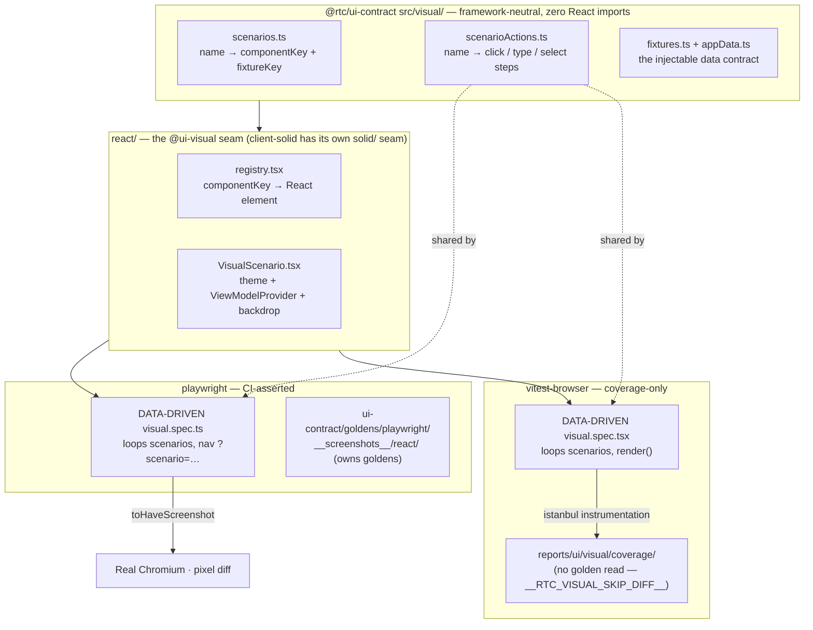

# Visual tests

Screenshots of the UI layer rendered against injected fake data. No server,
no presenters, no live streams — the dependency graph stops at `ViewModelProvider`.

> **Just need to update a golden after a UI change?** Jump to the operational
> runbook: [**UPDATING-GOLDENS.md**](./UPDATING-GOLDENS.md) — the two sets, the
> three routes, and which command to run for a regression vs. a deliberate change
> vs. a brand-new scenario. This README is the *layout & rationale*; that file is
> the *how-to*.

## Coverage

- **Shell** — connection status bar, offline overlay, header/footer/tabs, theme.
- **FX** — Tile (price up/down/flat, loading, and chart down/empty sparkline;
  plus the execution-confirmation overlay for every outcome — started, taking
  too long, timeout, done, rejected, credit-exceeded, finished-timeout; the RFQ
  tile body — requested / received / received-low / rejected, exercising the
  countdown's green **and** amber low-time arms; and the stale "Reconnecting…"
  overlay),
  LiveRatesPanel (chart **and** price view), AnalyticsPanel (populated,
  loading, negative-PnL, empty, all-flat positions), FxBlotter (populated,
  sorted, filtered, no-match, and each filter-type popover — date / number /
  set), and the full App on the FX tab (dark **and** light theme).
- **Credit** — RfqTilesPanel (populated + empty + the "All" filter tab), the
  RfqCard terminal states (done / expired / cancelled / accepted / passed),
  NewRfqForm (default, search-open, instrument-selected, filled, invalid),
  CreditBlotter (populated + empty), SellSidePanel (active / responded / empty),
  the CreditWorkspace sub-views (new-RFQ + sell-side tabs), and the full App on
  the Credit tab.
- **Admin** — the loaded AdminPanel slider (`admin/panel-loaded`) and the full
  App on the Admin tab. The throughput fetch is stubbed (`page.route` for the
  playwright tier, `window.fetch` for the vitest-browser coverage instrument),
  since `AdminPanel` reads its own hook outside the `ViewModelProvider` seam.

### Interaction-driven goldens

The blotter sort/filter states, the RFQ "All" filter tab, and the new-RFQ form
states are reached by clicking/typing into controls keyed by **`data-testid`**.
The user authorized **`data-testid`-only** production additions for these (pure
attribute additions — no logic/markup/styling change), so the runner-neutral
`scenarioActions` table can drive multi-step interactions (its `steps` array:
`click` / `type` / `select` by testid). Each has a golden from the surviving
`playwright` runner.

### Excluded by design

These states have **no golden** on purpose (see
[`COVERAGE-GAPS.md`](./COVERAGE-GAPS.md) for the full per-file inventory):

- **Runtime-only** — blotter-row hover and the system-preference theme arm.
  These render only on a real hover or after a runtime media-query resolves, so a
  static screenshot can't pin them. (The RFQ-active tile states — countdown,
  awaiting, confirmation — and the stale "Reconnecting…" overlay were **closed by
  Phase 9**: their app-layer machine state is now injectable per-symbol through
  the seam, so each is a deterministic golden.)
- **Remaining testid-gated arms** — the filter `inRange` two-input arm, the set
  filter checkbox toggle, `DealerSelection` checkboxes, `QuickFilter`, and the
  tile execution/notional handlers were out of this batch's scope (their controls
  still have no `data-testid`). The sociable **contract** tier drives these
  handlers directly, so the behaviour is covered — only the pixel is not.

## Layout

The framework-neutral core — scenario manifest, interaction table, and fixture
data — lives one package over, in `@rtc/ui-contract`'s `src/visual/`
(`scenarios.ts`, `scenarioActions.ts`, `fixtures.ts`, `appData.ts`,
`goldenPath.ts`, `freezeClock.ts`), aliased here as `@ui-visual-shared`. It was
extracted out of this package's former `tests/ui/visual/shared/` folder so a
second framework's visual suite (`@rtc/client-solid`'s) could depend on it as
a devDependency without depending on `@rtc/client-react`. Nothing under
`tests/ui/visual/` in this package is framework-neutral any more — everything
below is React-specific or runner glue:

```
tests/ui/visual/
  react/             — React render target (the @ui-visual alias barrel)
    buildFakeViewModel.ts — AppData → ViewModel adapter
    registry.tsx      — componentKey → React element map
    VisualScenario.tsx — theme + provider + backdrop wrapper
    index.ts          — barrel export (the @ui-visual alias target)
  playwright/        — The CI-asserted visual tier: plain Playwright over a Vite host
    playwright.config.ts — in-suite runner config
    host/            — Tiny Vite app served at /?scenario=<name>
      index.html
      main.tsx
      vite.config.ts
    visual.spec.ts   — Framework-agnostic URL-navigation spec
  vitest-browser/    — Coverage-only instrument: Vitest browser mode
    vitest-browser.config.ts — in-suite runner config (asserts, __RTC_VISUAL_SKIP_DIFF__=false)
    vitest-browser.coverage.config.ts — coverage config (skips the assert, __RTC_VISUAL_SKIP_DIFF__=true)
    visual.spec.tsx  — Data-driven spec (shares scenarioActions with the playwright tier)
  run-all.ts         — Orchestrator (reads package.json scripts; discovers the one runner)
  ADR-001-visual-diff-tooling.md
  README.md          — this file

packages/ui-contract/goldens/   — the committed golden tree for the surviving
                                   tier, generated only from these React renders
                                   (a sibling package — see "Goldens" below)
  playwright/__screenshots__/react/       (+ react-local/<platform>-<arch>/)
```

**Retired 2026-07-20** (see [ADR-001's Outcome section](./ADR-001-visual-diff-tooling.md)):
`playwright-ct/` (Playwright Component Testing, Tier 1) and its
`ui-contract/goldens/playwright-ct/` and `ui-contract/goldens/vitest-browser/`
golden trees were deleted outright. `vitest-browser/` survives only as the
istanbul coverage gap-finder — its pixel assert is compiled out via
`__RTC_VISUAL_SKIP_DIFF__`, so it renders and interacts through every scenario
without ever reading a golden.

`@rtc/ui-contract`'s `src/visual/` is what `@rtc/client-solid` reuses
verbatim as a devDependency — it has zero React imports. The contract is the
data (`src/visual/`) and the goldens (`packages/ui-contract/goldens/`) — not
the React-shaped `ViewModel` interface, which each framework adapts to its own
model. `client-solid`'s visual tier points its `snapshotDir` at
*this same* `ui-contract/goldens/playwright/__screenshots__/react/` (and
`react-local/<arch>/`) tree — generated only from this package's renders —
and asserts against it; `client-solid` owns no golden images of its own.

### Goldens: two committed sets (CI vs local)

Screenshot pixels depend on OS/arch font rasterization, so one golden set is not
portable across machines. The config routes `snapshotPathTemplate` by
environment, into the committed tree at
`packages/ui-contract/goldens/playwright/__screenshots__/`:

- **`react/`** — rendered by CI on x86 Linux in the pinned
  Playwright container. This is the **canonical, enforced** set and the
  cross-framework contract. Regenerate it via the `update-visual-goldens`
  GitHub workflow (it runs in that container); never hand-edit it locally.
- **`react-local/<platform>-<arch>/`** — written by a local
  `:update` run for a fast inner loop on your own machine (e.g.
  `react-local/linux-arm64/`). Committed and reviewed, but **not** re-rendered
  by CI, so it's your responsibility to regenerate it when the UI changes.

A non-CI run (no `CI` env var) reads/writes the `react-local/<plat>-<arch>` set;
CI reads/writes `react/`. An intentional UI change therefore means updating
**both** sets. See ADR-001 → "Cross-platform pixel drift" for the rationale —
including *why we keep the per-platform sets* rather than collapse to one
container-canonical set (that was tried and reverted: it destroyed the instant,
Docker-free native feedback loop). Before the 2026-07-20 retirement this
per-*platform* split was orthogonal to a per-*tier* split (each runner kept its
own set too, because they rendered different pixels); with only one tier
CI-asserted now, the per-platform split is the one axis that remains — see
ADR-001's Outcome section for how the two axes played out.

## The visual tier and its coverage instrument

**Updated 2026-07-20.** This package used to run a "defence-in-depth triangle"
of three independent rasterizers (Playwright Component Testing, plain
Playwright over a Vite host, Vitest browser mode) diffing against three
separate golden sets. A dedicated test-tooling bake-off retired two of them —
see [ADR-001's Outcome section](./ADR-001-visual-diff-tooling.md) for the
full verdict and the measured numbers that drove it. What survives:

| | **`playwright/` — the CI-asserted visual tier** | **`vitest-browser/` — coverage-only instrument** |
|---|---|---|
| **How it mounts** | Vite app serves `/?scenario=x`; Playwright navigates to it | `vitest-browser-react`'s `render()` in a real Chromium |
| **Test source** | Auto-derived from the shared manifest (`visual.spec.ts`) | Auto-derived from the shared manifest (`visual.spec.tsx`) |
| **Asserts a golden?** | **Yes — the only CI-enforced tier** | **No** — `toMatchScreenshot` is compiled out via `__RTC_VISUAL_SKIP_DIFF__` (`true` in the coverage config); the render + every scripted interaction still run |
| **Framework coupling** | **Lowest** — the spec only knows URLs; the host is the only React bit | Medium — needs a render shim, but no lagging CT adapter to track |
| **Why it's the one that asserts** | Framework-agnostic, reused **verbatim** by `client-solid`; production-like (`page.route`, real navigation); no CT-adapter version lag to track | Runs under Vitest → uniquely produces the **istanbul coverage report** (`reports/ui/visual/coverage/`) — the gap-finder |
| **Command** | `test:ui:visual:playwright:react` | `test:ui:visual:vitest-browser:react:coverage` |

**Retired outright** (config + goldens both deleted): `playwright-ct/`
(Playwright Component Testing). Its central promise — "closest to mounting
one component in isolation" — never extended cleanly to `client-solid`: the
official `@playwright/experimental-ct-solid` adapter was frozen ~1.5 years
behind this repo's pinned `@playwright/test`, so Solid's own "Tier 1" was
always a second URL-navigation config wearing a CT-shaped name, never a real
CT mount. A tier whose flagship justification doesn't survive the
framework-swap goal it exists to serve doesn't earn a place in the CI budget.

### Architecture at a glance



### `playwright/` — plain Playwright over a Vite host

Config: `playwright/playwright.config.ts`. Serves a tiny Vite page (`playwright/host/`)
that reads `?scenario=<name>` from the URL, looks up the scenario in `registry`,
and mounts `VisualScenario`. Playwright then navigates to `/?scenario=<name>`,
applies any per-scenario interactions from `scenarioActions.ts`, and calls
`toHaveScreenshot(...)`. Goldens live in
`packages/ui-contract/goldens/playwright/__screenshots__/react/`.

`playwright/visual.spec.ts` is **fully framework-agnostic** — it only
navigates URLs and takes screenshots. `client-solid` reuses this spec verbatim;
only the host at `playwright/host/` needs a new `main.tsx` (or `main.tsx`
replaced by a Solid equivalent) that mounts the Solid `VisualScenario`.

### `vitest-browser/` — coverage-only instrument (Vitest browser mode)

Config: `vitest-browser/vitest-browser.config.ts` (asserts;
`__RTC_VISUAL_SKIP_DIFF__: "false"`) and
`vitest-browser/vitest-browser.coverage.config.ts` (the one actually run —
`mergeConfig`s the base and flips the flag to `"true"`). Uses
`vitest-browser-react`'s `render(...)` to mount `VisualScenario` in a real
Chromium via the `@vitest/browser-playwright` provider. `visual.spec.tsx`
checks `__RTC_VISUAL_SKIP_DIFF__` (a compile-time `define`, not a runtime
env read) before ever calling
`expect.element(...).toMatchScreenshot(...)`, so under the coverage config
the render and every scripted interaction still execute — istanbul sees every
branch — but no golden is ever read or compared. `vitest-browser/visual.spec.tsx`
is data-driven and **shares the `scenarioActions.ts` table with the
`playwright` tier**, so the two stay behaviourally in lock-step.

This tier was originally blocked on the Vitest 3→4 upgrade (its matcher is
v4-only) and was deferred; once Plan A upgraded the repo to Vitest 4 — and the
unit suite's `WebSocket` stub was migrated to a real class — it was built as a
third assert-only tier. A 2026-07-20 bake-off retired that assert role (see
above) but kept the tier as the coverage gap-finder — it was already the
fastest of the three at the full scenario count (83s vs. 241–258s for the
other two, per "Measured durations" below), so running it for coverage alone
costs little. A few v4-API specifics worth knowing (the provider is a factory
from `@vitest/browser-playwright`; the golden path is set via a custom
`resolveScreenshotPath`; full-bleed `App` shots target `document.body` since
they have no `scenario-root`; the admin fetch is stubbed via `window.fetch`)
are documented in [`ADR-001-visual-diff-tooling.md`](./ADR-001-visual-diff-tooling.md)
under "Vitest browser mode — implemented (Tier 3)".

## Commands

### Run everything

```
pnpm test:ui:visual              # runs the implemented runner, prints summary
pnpm test:ui:visual:react        # same (today the one runner is :react — identical)
```

### Per-runner

```
pnpm test:ui:visual:playwright:react             # the CI-asserted tier: URL-driven runner
pnpm test:ui:visual:playwright:react:update      # regenerate its goldens
pnpm test:ui:visual:playwright:react:ui          # Playwright UI for this tier

pnpm test:ui:visual:vitest-browser:react:coverage  # coverage-only instrument — no golden read
```

### Regenerate / verify the canonical `react/` set in the container (any architecture)

The `:update` script above writes the **local** `react-local/<arch>` set (see
"two committed sets" below), which never matches the CI `react/` baseline on a
non-x86 machine. To produce or check the **canonical `react/` set** — CI-exact,
byte-for-byte — on *any* architecture, run it inside the pinned Playwright
container instead (requires Docker):

```
pnpm goldens:verify   # assert the committed react/ set (the local CI-exact gate)
pnpm goldens:regen    # rewrite react/ into the working tree, ready to commit
```

Both run the `playwright` tier with `CI=1` inside `mcr.microsoft.com/playwright`
via `--platform linux/amd64`; the emulated container reproduces CI's x86 pixels
byte-for-byte (measured 2026-07-18), so an arm64 dev can regenerate and commit
the canonical goldens locally — no `update-visual-goldens` workflow round-trip.
This is **Route 2** in the update runbook; for the full picture (the CI workflow,
the native fast loop, and when to reach for each) see
[**UPDATING-GOLDENS.md**](./UPDATING-GOLDENS.md).

> The byte-identity of the emulated container to CI once motivated a proposal to
> **collapse to a single container-canonical set** and retire `react-local/<arch>`
> (spec: [2026-07-18-single-container-golden-set-design.md](../../../../../docs/superpowers/specs/2026-07-18-single-container-golden-set-design.md)).
> That collapse was **tried and reverted** — it destroyed the instant, Docker-free
> native loop. The per-platform sets stay by design; the container path is a
> *convenience for producing `react/` locally*, not a replacement for the local
> set. See [ADR-001](./ADR-001-visual-diff-tooling.md) for the decision.

`test:ui:visual` and `test:ui:visual:react` are wired to
`tsx tests/ui/visual/run-all.ts`. The orchestrator reads `package.json`
scripts and discovers every entry matching
`test:ui:visual:<runner>:<framework>` (exactly five colon-delimited parts) —
today that resolves to exactly one runner (`playwright`) per framework, since
`playwright-ct` was deleted and `vitest-browser`'s `:coverage` variant is six
parts, excluded from discovery by design (it's a coverage instrument, not
another assert-able runner).

**Perf caveat (historical):** back when three tiers ran, `test:ui:visual`
ran them concurrently for fast feedback and concurrent runs contended for
CPU/GPU, so wall-clock time was NOT a fair per-runner benchmark. With one
runner discovered today the caveat no longer applies in practice, but the
"measure a single runner in isolation" method below is unchanged.

### Measured durations (isolated, local — 2026-07-19)

Per the caveat above, these were measured by running **each runner on its own**,
sequentially — not via the concurrent `test:ui:visual` orchestrator — so they are
fair per-tier figures. All three render the **same 1282 scenarios** (≈130 base ×
the 5-skin × dark/light theme matrix) and diff against the local
`react-local/darwin-arm64/` golden set.

> **Bench box:** Apple M2 Max (12 cores), macOS (Darwin 25.5.0), Node 26.0.0,
> pnpm 11.7.0 · single run each · **2026-07-19** · all tiers PASS. Wall-clock
> includes runner/host boot; treat as indicative (±a few seconds of variance),
> not a micro-benchmark.

| Tier | Runner | Scenarios | Duration |
|---|---|---:|---:|
| **Tier 1** | `playwright-ct` (CT mount) | 1282 | **241s** |
| **Tier 2** | `playwright` (URL host) | 1282 | **258s** |
| **Tier 3** | `vitest-browser` | 1282 | **83s** |

**The ranking inverted since the 2026-06-21 measurement** (back then, at 88
scenarios, Tier 1 led at 4.9s and Tiers 2/3 trailed around 11.6–11.7s). At the
full 1282-scenario matrix, `vitest-browser` (Tier 3) was fastest: the CT
runner's **per-mount** overhead (Tier 1 spun up a fresh component mount for
every scenario) scaled worse than `vitest-browser`'s **in-page** renders (Tier
3 reuses one browser page and re-renders in place), so the gap that favoured
CT at 88 scenarios flipped once the scenario count grew ~15×. For context, these
visual tiers are still cheaper than the **behavioural** browser e2e suites
(~133–203s per browser suite on CI — see the e2e
[`STRATEGY.md`](../../../../../tests/STRATEGY.md) → §5.5): a visual shot renders
one injected-data scenario and diffs a PNG; an e2e scenario drives a live app
through multi-step interactions.

**Verdict (2026-07-20 — this table is the evidence, not the decision).** Speed
alone did not pick a winner — `vitest-browser` was fastest but is not the
portability contract, and the 17s gap between `playwright-ct` and `playwright`
was not decisive either way. `playwright` won the CI-asserted role on the
non-speed properties argued in
["The visual tier and its coverage instrument"](#the-visual-tier-and-its-coverage-instrument)
above and in [ADR-001's Outcome section](./ADR-001-visual-diff-tooling.md):
no CT-adapter version lag, verbatim reuse by `client-solid`, production-like
navigation. `playwright-ct` was retired outright; `vitest-browser` was retired
from asserting but kept for coverage, since it was already the tier paying
the least CI time for the most signal.

To reproduce: `pnpm --filter @rtc/client-react test:ui:visual:playwright:react` and time it
(the other two rows are now historical — their scripts and configs are deleted).

## Type-checking

The harness is type-checked by `pnpm typecheck` via `tsconfig.ui-visual.json`.
The main `tsconfig.json` restricts `rootDir` to `src`; without the separate
visual project, drift between `buildFakeViewModel` and the `ViewModel` interface
would go unnoticed. The ui-visual tsconfig covers both `src` and `tests` (the
whole visual suite, including `run-all.ts`) with no exclusions — the
`playwright-ct.config.ts` exclude (needed for the now-deleted CT tier's vite
6/8 plugin type skew) was removed along with that tier.

## Porting to another UI framework — executed once, for SolidJS

**Historical record — read with the 2026-07-20 retirement in mind.** This
section describes how the Solid port actually landed at the time, across all
three tiers that then existed. Two of those tiers (`playwright-ct` and
`vitest-browser`'s assert role) were later retired — see
[ADR-001's Outcome section](./ADR-001-visual-diff-tooling.md) — so the "Tier
1"/"Tier 3" porting-effort narrative below is preserved for its lessons (the
CT-adapter-lag risk it predicted and hit is exactly why Tier 1 was retired
outright), not as a description of what runs today. Today only the `playwright`
tier's porting story is live; see "The visual tier and its coverage
instrument" above for the current state.

The goal was always: run the **same** scenarios and match the **same**
goldens. The plan below was written before the port started; `@rtc/client-solid`
then executed it, and shipped it **assert-only** — `client-solid` owns none of
its own golden images, it pointed all three tiers' `snapshotDir` at the
`packages/ui-contract/goldens/<tier>/__screenshots__/` trees generated only
from this package's renders, so a passing Solid run was a direct pixel
match against React, not a self-comparison (the surviving `playwright` tier
still works exactly this way today). The one place reality deviated
from the original plan is Tier 1 (below): the predicted CT-adapter blocker
did materialize, but the resolution was a fallback tier, not a stalled port —
and that same blocker is why Tier 1 was retired rather than fixed.

**What was reused verbatim:**

- `@rtc/ui-contract`'s `src/visual/` (by then already extracted from this
  package's `shared/`) — consumed as a devDependency, unmodified
- `playwright/visual.spec.ts` — URL-driven, zero framework assumptions;
  `client-solid`'s Tier 2 is this file, copied without a behavioural change,
  and remains so today as the sole surviving tier
- `ui-contract/goldens/playwright-ct/__screenshots__/react/` (since deleted)
  and `ui-contract/goldens/playwright/__screenshots__/react/` (the one that
  survives) — the canonical (CI-enforced) golden contract (see "Goldens: two
  committed sets" above; the per-arch `react-local/` sets are local-feedback
  only)

**What was implemented for Solid:**

1. A new `solid/` folder (under `packages/client-solid/tests/ui/visual/`) with
   `buildFakeViewModel.ts`, `registry.tsx`, `VisualScenario.tsx`, and an
   `index.ts` barrel — the `@ui-visual` alias target, same shape as this
   package's `react/`.
2. `playwright/` and `vitest-browser/` tiers, built as planned below.
3. A `playwright-ct/` tier that is a **URL-navigation fallback**, not a real
   CT mount — see Tier 1 below for why.

### Per-tier porting effort (as planned, and as it actually landed)

Building the `<framework>/` seam above was a one-time cost that **all three
tiers consume** — not a per-tier cost. Each tier needed a different amount of
glue, and the ranking held: **Tier 2 was the easiest, Tier 3 a close second,
Tier 1 the one that didn't go as planned.**

**Tier 2 — plain Playwright (smallest, as planned):**

- `visual.spec.ts`: **zero changes** — it only navigates `/?scenario=…` and
  screenshots, so the framework lives entirely behind the host boundary. This
  is the only spec that is genuinely framework-agnostic, and `client-solid`
  reused it unmodified.
- `playwright/host/main.tsx`: React's `createRoot(...).render(<VisualScenario/>)`
  swapped for Solid's `render(() => <VisualScenario name={name}/>, root)`.
- `playwright/host/vite.config.ts`: `@vitejs/plugin-react` swapped for
  `vite-plugin-solid`, `@ui-visual` re-pointed at `solid/`.

**Tier 3 — vitest-browser (low, as planned):**

- `visual.spec.tsx`: render shim swapped (`vitest-browser-react` →
  `@solidjs/testing-library`'s `render`). The scenario/`scenarioActions` loop
  body carried over unchanged.
- `vitest-browser.config.ts`: plugin swap + alias + golden routing.
- No version-tracking adapter needed — as predicted, this made Tier 3 the
  straightforward second tier.

**Tier 1 — playwright-ct (the blocker materialized; the fix was a fallback, not a rewrite):**

- The predicted hard blocker was real: `@playwright/experimental-ct-solid` was
  stuck several minor versions behind this repo's pinned `@playwright/test` at
  port time (see the decision header in
  `packages/client-solid/tests/ui/visual/playwright-ct/playwright-ct.config.ts`).
  Forcing the mismatched adapter in was rejected.
- The resolution: Tier 1 for Solid is a **second URL-navigation config**,
  structurally identical to Tier 2, asserting against the
  `ui-contract/goldens/playwright-ct/__screenshots__/` tree (generated only
  from react's renders) by matching its `{testFileName}`
  golden-path segment — not a real `mount()`-based CT test. It is data-driven
  over the same manifest (matching this package's own `matrix.spec.tsx`, not
  the old hand-written per-file specs the original plan below still
  described), just navigated instead of mounted.
- This also means the "rewrite ~88 hand-written tests" cost the original plan
  predicted never had to be paid on either side: this package's own Tier 1
  became data-driven (`matrix.spec.tsx`) before the Solid port needed to touch
  it, so there were no hand-written specs left to re-author.
- **Revisit condition — superseded.** The original follow-up ("once a
  version-matched `@playwright/experimental-ct-solid` ships, swap in a real
  CT mount") no longer applies: the 2026-07-20 bake-off retired the tier
  outright rather than waiting for the adapter to catch up, so there is
  nothing left to revisit.

For the full rationale, the adapter-status table (historical), and the
2026-07-20 retirement verdict, see
[`ADR-001-visual-diff-tooling.md`](./ADR-001-visual-diff-tooling.md).

## Coverage gaps

`test:ui:visual:vitest-browser:react:coverage` instruments `src/ui` (istanbul)
while the vitest-browser tier renders every scenario and drives every scripted
interaction — with the pixel assert compiled out via `__RTC_VISUAL_SKIP_DIFF__`,
so this run never reads a golden and can't fail on a pixel mismatch — so
uncovered branches are visual states with no golden. The report (HTML +
`lcov.info`) lands at `reports/ui/visual/coverage/` (open
`reports/ui/visual/coverage/index.html`); it is report-only, with no threshold
gate. See [`COVERAGE-GAPS.md`](./COVERAGE-GAPS.md) (snapshot 2026-06-16) for
the current inventory. Red = definitely no snapshot; green = rendered into
some frame (not a guarantee of a dedicated scenario). The denominator is
`src/ui/**/*.tsx` only — pure `.ts` logic/hook files belong to the
unit/contract tiers.

> **CI golden caveat.** The canonical x86 `react/` goldens are generated by the
> `update-visual-goldens` GitHub workflow (it runs in the pinned x86 Playwright
> container); they **cannot** be produced in the aarch64 dev container, which
> writes only the `react-local/linux-arm64/` set. When a PR adds or changes
> scenarios, the local set is committed here but the CI `react/` set lags until
> the workflow runs — so the **visual CI job stays red until that workflow
> regenerates `react/`**. That is expected on such a PR, not a regression.
