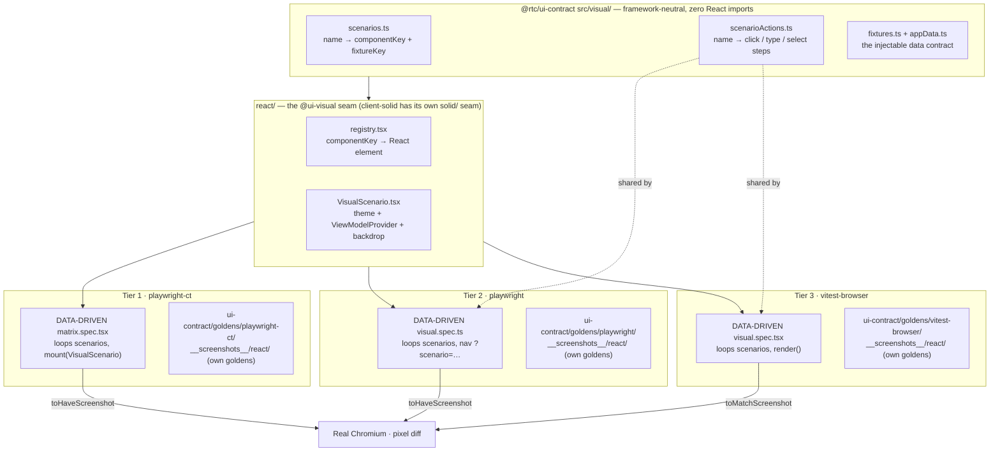

# Visual tests

Screenshots of the UI layer rendered against injected fake data. No server,
no presenters, no live streams — the dependency graph stops at `ViewModelProvider`.

> **Just need to update a golden after a UI change?** Jump to the operational
> runbook: [**UPDATING-GOLDENS.md**](./UPDATING-GOLDENS.md) — the two sets, the
> three routes, and which command to run for a regression vs. a deliberate change
> vs. a brand-new scenario. This README is the *layout & rationale*; that file is
> the *how-to*.

## Coverage

- **Shell** — connection status bar, offline overlay, header/footer/tabs, theme.
- **FX** — Tile (price up/down/flat, loading, and chart down/empty sparkline;
  plus the execution-confirmation overlay for every outcome — started, taking
  too long, timeout, done, rejected, credit-exceeded, finished-timeout; the RFQ
  tile body — requested / received / received-low / rejected, exercising the
  countdown's green **and** amber low-time arms; and the stale "Reconnecting…"
  overlay),
  LiveRatesPanel (chart **and** price view), AnalyticsPanel (populated,
  loading, negative-PnL, empty, all-flat positions), FxBlotter (populated,
  sorted, filtered, no-match, and each filter-type popover — date / number /
  set), and the full App on the FX tab (dark **and** light theme).
- **Credit** — RfqTilesPanel (populated + empty + the "All" filter tab), the
  RfqCard terminal states (done / expired / cancelled / accepted / passed),
  NewRfqForm (default, search-open, instrument-selected, filled, invalid),
  CreditBlotter (populated + empty), SellSidePanel (active / responded / empty),
  the CreditWorkspace sub-views (new-RFQ + sell-side tabs), and the full App on
  the Credit tab.
- **Admin** — the loaded AdminPanel slider (`admin/panel-loaded`) and the full
  App on the Admin tab. The throughput fetch is stubbed (`page.route` for the
  Playwright tiers, `window.fetch` for vitest-browser), since `AdminPanel` reads
  its own hook outside the `ViewModelProvider` seam.

### Interaction-driven goldens

The blotter sort/filter states, the RFQ "All" filter tab, and the new-RFQ form
states are reached by clicking/typing into controls keyed by **`data-testid`**.
The user authorized **`data-testid`-only** production additions for these (pure
attribute additions — no logic/markup/styling change), so the runner-neutral
`scenarioActions` table can drive multi-step interactions (its `steps` array:
`click` / `type` / `select` by testid). Each has a golden across all three runners.

### Excluded by design

These states have **no golden** on purpose (see
[`COVERAGE-GAPS.md`](./COVERAGE-GAPS.md) for the full per-file inventory):

- **Runtime-only** — blotter-row hover and the system-preference theme arm.
  These render only on a real hover or after a runtime media-query resolves, so a
  static screenshot can't pin them. (The RFQ-active tile states — countdown,
  awaiting, confirmation — and the stale "Reconnecting…" overlay were **closed by
  Phase 9**: their app-layer machine state is now injectable per-symbol through
  the seam, so each is a deterministic golden.)
- **Remaining testid-gated arms** — the filter `inRange` two-input arm, the set
  filter checkbox toggle, `DealerSelection` checkboxes, `QuickFilter`, and the
  tile execution/notional handlers were out of this batch's scope (their controls
  still have no `data-testid`). The sociable **contract** tier drives these
  handlers directly, so the behaviour is covered — only the pixel is not.

## Layout

The framework-neutral core — scenario manifest, interaction table, and fixture
data — lives one package over, in `@rtc/ui-contract`'s `src/visual/`
(`scenarios.ts`, `scenarioActions.ts`, `fixtures.ts`, `appData.ts`,
`goldenPath.ts`, `freezeClock.ts`), aliased here as `@ui-visual-shared`. It was
extracted out of this package's former `tests/ui/visual/shared/` folder so a
second framework's visual suite (`@rtc/client-solid`'s) could depend on it as
a devDependency without depending on `@rtc/client-react`. Nothing under
`tests/ui/visual/` in this package is framework-neutral any more — everything
below is React-specific or runner glue:

```
tests/ui/visual/
  react/             — React render target (the @ui-visual alias barrel)
    buildFakeViewModel.ts — AppData → ViewModel adapter
    registry.tsx      — componentKey → React element map
    VisualScenario.tsx — theme + provider + backdrop wrapper
    index.ts          — barrel export (the @ui-visual alias target)
  playwright-ct/     — Tier 1: Playwright Component Testing specs
    playwright-ct.config.ts — in-suite runner config
    *.spec.tsx
    host/            — CT bootstrap template (generated .cache/ is gitignored)
      index.html
      index.tsx
  playwright/        — Tier 2: plain Playwright over a Vite host
    playwright.config.ts — in-suite runner config
    host/            — Tiny Vite app served at /?scenario=<name>
      index.html
      main.tsx
      vite.config.ts
    visual.spec.ts   — Framework-agnostic URL-navigation spec
  vitest-browser/    — Tier 3: Vitest browser mode (toMatchScreenshot)
    vitest-browser.config.ts — in-suite runner config
    visual.spec.tsx  — Data-driven spec (shares scenarioActions with Tier 2)
  run-all.ts         — Parallel orchestrator (reads package.json scripts)
  ADR-001-visual-diff-tooling.md
  README.md          — this file

packages/ui-contract/goldens/   — the committed golden trees for all 3 tiers,
                                   generated only from these React renders
                                   (a sibling package — see "Goldens" below)
  playwright-ct/__screenshots__/react/    (+ react-local/<platform>-<arch>/)
  playwright/__screenshots__/react/       (+ react-local/<platform>-<arch>/)
  vitest-browser/__screenshots__/react/   (+ react-local/<platform>-<arch>/)
```

`@rtc/ui-contract`'s `src/visual/` is what `@rtc/client-solid` reuses
verbatim as a devDependency — it has zero React imports. The contract is the
data (`src/visual/`) and the goldens (`packages/ui-contract/goldens/`) — not
the React-shaped `ViewModel` interface, which each framework adapts to its own
model. `client-solid`'s three visual tiers point their `snapshotDir` at
*these same* `ui-contract/goldens/<tier>/__screenshots__/react/` (and
`react-local/<arch>/`) trees — generated only from this package's renders —
and assert against them; `client-solid` owns no golden images of its own.

### Goldens: two committed sets (CI vs local)

Screenshot pixels depend on OS/arch font rasterization, so one golden set is not
portable across machines. Both configs route `snapshotPathTemplate` by
environment, into the committed tree at
`packages/ui-contract/goldens/<tier>/__screenshots__/`:

- **`react/`** — rendered by CI on x86 Linux in the pinned
  Playwright container. This is the **canonical, enforced** set and the
  cross-framework contract. Regenerate it via the `update-visual-goldens`
  GitHub workflow (it runs in that container); never hand-edit it locally.
- **`react-local/<platform>-<arch>/`** — written by a local
  `:update` run for a fast inner loop on your own machine (e.g.
  `react-local/linux-arm64/`). Committed and reviewed, but **not** re-rendered
  by CI, so it's your responsibility to regenerate it when the UI changes.

A non-CI run (no `CI` env var) reads/writes the `react-local/<plat>-<arch>` set;
CI reads/writes `react/`. An intentional UI change therefore means updating
**both** sets. See ADR-001 → "Cross-platform pixel drift" for the rationale —
including *why we keep the per-platform sets* rather than collapse to one
container-canonical set (that was tried and reverted: it destroyed the instant,
Docker-free native feedback loop). Note this per-*platform* split is orthogonal
to the per-*tier* split (each runner keeps its own set too, because they render
different pixels) — ADR-001 spells out both axes.

## The three implemented runners

### Do the three runners share the same tests?

**Partly — and knowing _which_ layer is shared is the whole mental model.** There
are three layers, and "sharing" happens at one of them but not the others:

| Layer | Shared across all 3? | What it is |
|---|---|---|
| **Scenario manifest** (`@rtc/ui-contract`'s `src/visual/scenarios.ts` + `scenarioActions.ts`) | ✅ **Yes** — one source of truth | "What to render and what to click" — the named scenarios, with zero React/runner code |
| **Test bodies** (the `*.spec` files) | ✅ **Yes** | All three tiers now _auto-derive_ their tests by looping over the manifest (Tier 1's `matrix.spec.tsx` joined Tiers 2/3 on this — see below) |
| **Goldens** (`__screenshots__/`) | ❌ **No — each tier owns its own set** | Three separate PNG directories, one per runner |

So when we say the runners "share tests," what's actually shared is the
**scenario list and the interaction steps** — not the spec files, and not the
golden images:

- **All three tiers are data-driven.** Each spec is a
  `for (const [name, scenario] of Object.entries(scenarios))` loop that also
  reads `scenarioActionFor(name)`. Add a scenario to the manifest → all three
  tiers get the test for free, in lock-step. (Tier 1's `matrix.spec.tsx`
  replaced the original hand-written per-file specs — `tile.spec.tsx` et
  al. — precisely to close this drift risk: a new manifest entry no longer
  needs a matching hand-authored CT test.)
- **Goldens are physically separate per tier** because each runner rasterizes
  differently (CT mounts the component in isolation; Tier 2 navigates a URL and
  shoots `scenario-root`; Tier 3 renders via `vitest-browser-react`). They encode
  the _same intent_ but are not byte-identical, so each tier diffs against its own
  `ui-contract/goldens/<tier>/__screenshots__/react/` (+ `react-local/<arch>/`) set.

### Architecture at a glance



### How they differ, and the trade-offs

| | **Tier 1 — playwright-ct** | **Tier 2 — playwright (URL host)** | **Tier 3 — vitest-browser** |
|---|---|---|---|
| **How it mounts** | Playwright CT adapter mounts the component directly | Vite app serves `/?scenario=x`; Playwright navigates to it | `vitest-browser-react`'s `render()` |
| **Test source** | Data-driven (`matrix.spec.tsx` loops the manifest) | Auto-derived from the manifest | Auto-derived from the manifest |
| **Matcher** | `toHaveScreenshot` (AA-tolerant) | `toHaveScreenshot` (AA-tolerant) | `toMatchScreenshot` (Vitest 4; needs the AA cushion set in its config) |
| **Framework coupling** | High — needs a CT adapter that tracks Playwright versions | **Lowest** — the spec only knows URLs; the host is the only React bit | Medium — needs a render shim, but no lagging adapter to track |
| **Strength** | Closest to "mount one component in isolation"; explicit and readable | Most portable; production-like (real navigation, routing, `page.route` stubs) | Runs under Vitest → produces the **istanbul coverage report** (the gap-finder); shares Tier 2's actions for free |
| **Weakness** | CT-adapter version lag can block a real CT mount for a new framework (`client-solid`'s Tier 1 ships as a URL-navigation fallback for exactly this reason — see `packages/client-solid`) | Needs a Vite host app to maintain | Newest matcher (experimental); zero-tolerance by default (hence the AA cushion) |
| **Best for** | Component-level intent on today's React | The framework-swap contract | Coverage + behavioural lock-step with Tier 2 |

### Why keep all three

They are a defence-in-depth triangle, not redundancy:

- **Tier 2** is the _portability contract_ — it proves the goldens can be
  reproduced by something that knows nothing about React, which is exactly why
  `client-solid`'s Tier 2 reuses `visual.spec.ts` verbatim.
- **Tier 3** is the _coverage instrument_ — only it runs under Vitest, so it is
  what produces `reports/ui/visual/coverage/` and reveals which component states
  still lack a golden.
- **Tier 1** is the _isolation / readability_ check and a hedge: if a stable CT
  adapter becomes the cleanest mount path, it is already wired, and its explicit
  specs are the easiest to read when debugging a single component.

The cost of the triangle: an intentional UI change means regenerating up to three
golden sets × two arch sets (`react/` on CI + `react-local/<arch>/` locally) — the
dual-golden dance described above.

### Tier 1 — Playwright Component Testing (`playwright-ct/`)

Config: `playwright-ct/playwright-ct.config.ts`. Uses `@playwright/experimental-ct-react`
to mount `VisualScenario` directly inside a Chromium process via the CT adapter.
Each spec imports `@ui-visual` (the alias pointing at `react/`) and
calls `mount(...)` + `expect(component).toHaveScreenshot(...)`. Goldens live in
`packages/ui-contract/goldens/playwright-ct/__screenshots__/react/`.

For a framework port, the `@ui-visual` alias in `playwright-ct.config.ts`'s
`ctViteConfig` is the single re-point: swap `react/` for `solid/`
and point to a matching CT adapter. (Note: the official Solid CT adapter lags the
core Playwright version — see ADR-001 for the adapter-status table and the
recommended alternative.)

### Tier 2 — Plain Playwright over a Vite host (`playwright/`)

Config: `playwright/playwright.config.ts`. Serves a tiny Vite page (`playwright/host/`)
that reads `?scenario=<name>` from the URL, looks up the scenario in `registry`,
and mounts `VisualScenario`. Playwright then navigates to `/?scenario=<name>`,
applies any per-scenario interactions from `scenarioActions.ts`, and calls
`toHaveScreenshot(...)`. Goldens live in
`packages/ui-contract/goldens/playwright/__screenshots__/react/`.

`playwright/visual.spec.ts` is **fully framework-agnostic** — it only
navigates URLs and takes screenshots. A SolidJS port reuses this spec verbatim;
only the host at `playwright/host/` needs a new `main.tsx` (or `main.tsx`
replaced by a Solid equivalent) that mounts the Solid `VisualScenario`.

### Tier 3 — Vitest browser mode (`vitest-browser/`)

Config: `vitest-browser/vitest-browser.config.ts`. Uses `vitest-browser-react`'s `render(...)`
to mount `VisualScenario` in a real Chromium via the `@vitest/browser-playwright`
provider, then diffs with Vitest 4's experimental
`expect.element(...).toMatchScreenshot(...)`. `vitest-browser/visual.spec.tsx`
is data-driven and **shares the `scenarioActions.ts` table with Tier 2**, so the
two stay behaviourally in lock-step. Goldens live in
`packages/ui-contract/goldens/vitest-browser/__screenshots__/react/`.

This tier was originally blocked on the Vitest 3→4 upgrade (its matcher is
v4-only) and was deferred; once Plan A upgraded the repo to Vitest 4 — and the
unit suite's `WebSocket` stub was migrated to a real class — it was built. A few
v4-API specifics worth knowing (the provider is a factory from
`@vitest/browser-playwright`; the golden path is set via a custom
`resolveScreenshotPath`; full-bleed `App` shots target `document.body` since they
have no `scenario-root`; the admin fetch is stubbed via `window.fetch`) are
documented in [`ADR-001-visual-diff-tooling.md`](./ADR-001-visual-diff-tooling.md)
under "Vitest browser mode — implemented (Tier 3)".

For a Solid port, swap the `@ui-visual` alias and `vitest-browser-react` for the
framework's render shim — there's no lagging CT adapter to track, which is why
this tier is the recommended Solid driver.

## Commands

### Run everything

```
pnpm test:ui:visual              # runs all implemented runners concurrently, prints summary
pnpm test:ui:visual:react        # same (today every runner is :react — identical)
```

### Per-runner

```
pnpm test:ui:visual:playwright-ct:react          # Tier 1: CT runner
pnpm test:ui:visual:playwright-ct:react:update   # regenerate Tier 1 goldens
pnpm test:ui:visual:playwright-ct:react:ui       # Playwright UI for Tier 1

pnpm test:ui:visual:playwright:react             # Tier 2: URL-driven runner
pnpm test:ui:visual:playwright:react:update      # regenerate Tier 2 goldens
pnpm test:ui:visual:playwright:react:ui          # Playwright UI for Tier 2

pnpm test:ui:visual:vitest-browser:react         # Tier 3: Vitest browser mode
pnpm test:ui:visual:vitest-browser:react:update  # regenerate Tier 3 goldens
```

### Regenerate / verify the canonical `react/` set in the container (any architecture)

The `:update` scripts above write the **local** `react-local/<arch>` set (see
"two committed sets" below), which never matches the CI `react/` baseline on a
non-x86 machine. To produce or check the **canonical `react/` set** — CI-exact,
byte-for-byte — on *any* architecture, run it inside the pinned Playwright
container instead (requires Docker):

```
pnpm goldens:verify   # assert the committed react/ set (the local CI-exact gate)
pnpm goldens:regen    # rewrite react/ into the working tree, ready to commit
```

Both run all three tiers with `CI=1` inside `mcr.microsoft.com/playwright` via
`--platform linux/amd64`; the emulated container reproduces CI's x86 pixels
byte-for-byte (measured 2026-07-18), so an arm64 dev can regenerate and commit
the canonical goldens locally — no `update-visual-goldens` workflow round-trip.
This is **Route 2** in the update runbook; for the full picture (the CI workflow,
the native fast loop, and when to reach for each) see
[**UPDATING-GOLDENS.md**](./UPDATING-GOLDENS.md).

> The byte-identity of the emulated container to CI once motivated a proposal to
> **collapse to a single container-canonical set** and retire `react-local/<arch>`
> (spec: [2026-07-18-single-container-golden-set-design.md](../../../../../docs/superpowers/specs/2026-07-18-single-container-golden-set-design.md)).
> That collapse was **tried and reverted** — it destroyed the instant, Docker-free
> native loop. The per-platform sets stay by design; the container path is a
> *convenience for producing `react/` locally*, not a replacement for the local
> set. See [ADR-001](./ADR-001-visual-diff-tooling.md) for the decision.

`test:ui:visual` and `test:ui:visual:react` are wired to
`tsx tests/ui/visual/run-all.ts`. The orchestrator reads `package.json`
scripts and discovers every entry matching
`test:ui:visual:<runner>:<framework>` (exactly five colon-delimited parts). When a
`:solid` framework set lands (with its own runner scripts), it is auto-discovered
with no edit to `run-all.ts`.

**Perf caveat:** `test:ui:visual` runs runners concurrently for fast feedback.
Concurrent runs contend for CPU/GPU, so the wall-clock time is NOT a fair
per-runner benchmark. Run a single runner in isolation to measure actual speed.

### Measured durations (isolated, local — 2026-07-19)

Per the caveat above, these were measured by running **each runner on its own**,
sequentially — not via the concurrent `test:ui:visual` orchestrator — so they are
fair per-tier figures. All three render the **same 1282 scenarios** (≈130 base ×
the 5-skin × dark/light theme matrix) and diff against the local
`react-local/darwin-arm64/` golden set.

> **Bench box:** Apple M2 Max (12 cores), macOS (Darwin 25.5.0), Node 26.0.0,
> pnpm 11.7.0 · single run each · **2026-07-19** · all tiers PASS. Wall-clock
> includes runner/host boot; treat as indicative (±a few seconds of variance),
> not a micro-benchmark.

| Tier | Runner | Scenarios | Duration |
|---|---|---:|---:|
| **Tier 1** | `playwright-ct` (CT mount) | 1282 | **241s** |
| **Tier 2** | `playwright` (URL host) | 1282 | **258s** |
| **Tier 3** | `vitest-browser` | 1282 | **83s** |

**The ranking inverted since the 2026-06-21 measurement** (back then, at 88
scenarios, Tier 1 led at 4.9s and Tiers 2/3 trailed around 11.6–11.7s). At the
full 1282-scenario matrix, `vitest-browser` (Tier 3) is now fastest: the CT
runner's **per-mount** overhead (Tier 1 spins up a fresh component mount for
every scenario) scales worse than `vitest-browser`'s **in-page** renders (Tier
3 reuses one browser page and re-renders in place), so the gap that favoured
CT at 88 scenarios flips once the scenario count grows ~15×. For context, these
visual tiers are still cheaper than the **behavioural** browser e2e suites
(~133–203s per browser suite on CI — see the e2e
[`STRATEGY.md`](../../../../../tests/STRATEGY.md) → §5.5): a visual shot renders
one injected-data scenario and diffs a PNG; an e2e scenario drives a live app
through multi-step interactions.

To reproduce: `pnpm --filter @rtc/client-react test:ui:visual:<runner>:react` for any
single runner and time it.

## Type-checking

The harness is type-checked by `pnpm typecheck` via `tsconfig.ui-visual.json`.
The main `tsconfig.json` restricts `rootDir` to `src`; without the separate
visual project, drift between `buildFakeViewModel` and the `ViewModel` interface
would go unnoticed (the Playwright CT bundle strips types without checking
them). The ui-visual tsconfig covers both `src` and `tests` (the whole
visual suite, including `run-all.ts` — minus
`playwright-ct/playwright-ct.config.ts`, see the comment in the tsconfig).

## Porting to another UI framework — executed once, for SolidJS

The goal was always: run the **same** scenarios and match the **same**
goldens. The plan below was written before the port started; `@rtc/client-solid`
then executed it, and shipped it **assert-only** — `client-solid` owns none of
its own golden images, it points all three tiers' `snapshotDir` at the
`packages/ui-contract/goldens/<tier>/__screenshots__/` trees generated only
from this package's renders, so a passing Solid run is a direct pixel
match against React, not a self-comparison. The one place reality deviated
from the original plan is Tier 1 (below): the predicted CT-adapter blocker
did materialize, but the resolution was a fallback tier, not a stalled port.

**What was reused verbatim:**

- `@rtc/ui-contract`'s `src/visual/` (by then already extracted from this
  package's `shared/`) — consumed as a devDependency, unmodified
- `playwright/visual.spec.ts` — URL-driven, zero framework assumptions;
  `client-solid`'s Tier 2 is this file, copied without a behavioural change
- `ui-contract/goldens/playwright-ct/__screenshots__/react/` and
  `ui-contract/goldens/playwright/__screenshots__/react/` — the canonical
  (CI-enforced) golden contract (see "Goldens: two committed sets" above;
  the per-arch `react-local/` sets are local-feedback only)

**What was implemented for Solid:**

1. A new `solid/` folder (under `packages/client-solid/tests/ui/visual/`) with
   `buildFakeViewModel.ts`, `registry.tsx`, `VisualScenario.tsx`, and an
   `index.ts` barrel — the `@ui-visual` alias target, same shape as this
   package's `react/`.
2. `playwright/` and `vitest-browser/` tiers, built as planned below.
3. A `playwright-ct/` tier that is a **URL-navigation fallback**, not a real
   CT mount — see Tier 1 below for why.

### Per-tier porting effort (as planned, and as it actually landed)

Building the `<framework>/` seam above was a one-time cost that **all three
tiers consume** — not a per-tier cost. Each tier needed a different amount of
glue, and the ranking held: **Tier 2 was the easiest, Tier 3 a close second,
Tier 1 the one that didn't go as planned.**

**Tier 2 — plain Playwright (smallest, as planned):**

- `visual.spec.ts`: **zero changes** — it only navigates `/?scenario=…` and
  screenshots, so the framework lives entirely behind the host boundary. This
  is the only spec that is genuinely framework-agnostic, and `client-solid`
  reused it unmodified.
- `playwright/host/main.tsx`: React's `createRoot(...).render(<VisualScenario/>)`
  swapped for Solid's `render(() => <VisualScenario name={name}/>, root)`.
- `playwright/host/vite.config.ts`: `@vitejs/plugin-react` swapped for
  `vite-plugin-solid`, `@ui-visual` re-pointed at `solid/`.

**Tier 3 — vitest-browser (low, as planned):**

- `visual.spec.tsx`: render shim swapped (`vitest-browser-react` →
  `@solidjs/testing-library`'s `render`). The scenario/`scenarioActions` loop
  body carried over unchanged.
- `vitest-browser.config.ts`: plugin swap + alias + golden routing.
- No version-tracking adapter needed — as predicted, this made Tier 3 the
  straightforward second tier.

**Tier 1 — playwright-ct (the blocker materialized; the fix was a fallback, not a rewrite):**

- The predicted hard blocker was real: `@playwright/experimental-ct-solid` was
  stuck several minor versions behind this repo's pinned `@playwright/test` at
  port time (see the decision header in
  `packages/client-solid/tests/ui/visual/playwright-ct/playwright-ct.config.ts`).
  Forcing the mismatched adapter in was rejected.
- The resolution: Tier 1 for Solid is a **second URL-navigation config**,
  structurally identical to Tier 2, asserting against the
  `ui-contract/goldens/playwright-ct/__screenshots__/` tree (generated only
  from react's renders) by matching its `{testFileName}`
  golden-path segment — not a real `mount()`-based CT test. It is data-driven
  over the same manifest (matching this package's own `matrix.spec.tsx`, not
  the old hand-written per-file specs the original plan below still
  described), just navigated instead of mounted.
- This also means the "rewrite ~88 hand-written tests" cost the original plan
  predicted never had to be paid on either side: this package's own Tier 1
  became data-driven (`matrix.spec.tsx`) before the Solid port needed to touch
  it, so there were no hand-written specs left to re-author.
- **Revisit condition**: once a version-matched `@playwright/experimental-ct-solid`
  ships, swapping in a real CT mount (matching this package's Tier 1
  approach) is the documented follow-up — not a blocker on anything today.

For the full rationale, the adapter-status table, and guidance on choosing a
driver per target (CT adapter vs. vitest-browser vs. plain Playwright), see
[`ADR-001-visual-diff-tooling.md`](./ADR-001-visual-diff-tooling.md).

## Coverage gaps

`test:ui:visual:vitest-browser:react:coverage` instruments `src/ui` (istanbul)
while the vitest-browser tier renders every scenario, so uncovered branches are
visual states with no golden. The report (HTML + `lcov.info`) lands at
`reports/ui/visual/coverage/` (open `reports/ui/visual/coverage/index.html`); it
is report-only, with no threshold gate. See [`COVERAGE-GAPS.md`](./COVERAGE-GAPS.md)
(snapshot 2026-06-16) for the current inventory. Red = definitely no snapshot;
green = rendered into some frame (not a guarantee of a dedicated scenario). The
denominator is `src/ui/**/*.tsx` only — pure `.ts` logic/hook files belong to the
unit/contract tiers.

> **CI golden caveat.** The canonical x86 `react/` goldens are generated by the
> `update-visual-goldens` GitHub workflow (it runs in the pinned x86 Playwright
> container); they **cannot** be produced in the aarch64 dev container, which
> writes only the `react-local/linux-arm64/` set. When a PR adds or changes
> scenarios, the local set is committed here but the CI `react/` set lags until
> the workflow runs — so the **visual CI job stays red until that workflow
> regenerates `react/`**. That is expected on such a PR, not a regression.
