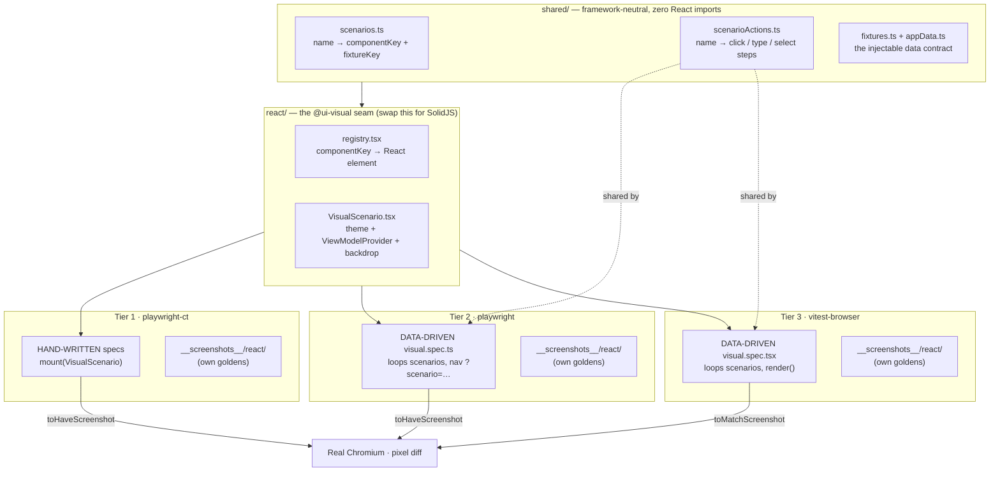

# Visual tests

Screenshots of the UI layer rendered against injected fake data. No server,
no presenters, no live streams — the dependency graph stops at `ViewModelProvider`.

## Coverage

- **Shell** — connection status bar, offline overlay, header/footer/tabs, theme.
- **FX** — Tile (price up/down/flat, loading, and chart down/empty sparkline;
  plus the execution-confirmation overlay for every outcome — started, taking
  too long, timeout, done, rejected, credit-exceeded, finished-timeout; the RFQ
  tile body — requested / received / received-low / rejected, exercising the
  countdown's green **and** amber low-time arms; and the stale "Reconnecting…"
  overlay),
  LiveRatesPanel (chart **and** price view), AnalyticsPanel (populated,
  loading, negative-PnL, empty, all-flat positions), FxBlotter (populated,
  sorted, filtered, no-match, and each filter-type popover — date / number /
  set), and the full App on the FX tab (dark **and** light theme).
- **Credit** — RfqTilesPanel (populated + empty + the "All" filter tab), the
  RfqCard terminal states (done / expired / cancelled / accepted / passed),
  NewRfqForm (default, search-open, instrument-selected, filled, invalid),
  CreditBlotter (populated + empty), SellSidePanel (active / responded / empty),
  the CreditWorkspace sub-views (new-RFQ + sell-side tabs), and the full App on
  the Credit tab.
- **Admin** — the loaded AdminPanel slider (`admin/panel-loaded`) and the full
  App on the Admin tab. The throughput fetch is stubbed (`page.route` for the
  Playwright tiers, `window.fetch` for vitest-browser), since `AdminPanel` reads
  its own hook outside the `ViewModelProvider` seam.

### Interaction-driven goldens

The blotter sort/filter states, the RFQ "All" filter tab, and the new-RFQ form
states are reached by clicking/typing into controls keyed by **`data-testid`**.
The user authorized **`data-testid`-only** production additions for these (pure
attribute additions — no logic/markup/styling change), so the runner-neutral
`scenarioActions` table can drive multi-step interactions (its `steps` array:
`click` / `type` / `select` by testid). Each has a golden across all three runners.

### Excluded by design

These states have **no golden** on purpose (see
[`COVERAGE-GAPS.md`](./COVERAGE-GAPS.md) for the full per-file inventory):

- **Runtime-only** — blotter-row hover and the system-preference theme arm.
  These render only on a real hover or after a runtime media-query resolves, so a
  static screenshot can't pin them. (The RFQ-active tile states — countdown,
  awaiting, confirmation — and the stale "Reconnecting…" overlay were **closed by
  Phase 9**: their app-layer machine state is now injectable per-symbol through
  the seam, so each is a deterministic golden.)
- **Remaining testid-gated arms** — the filter `inRange` two-input arm, the set
  filter checkbox toggle, `DealerSelection` checkboxes, `QuickFilter`, and the
  tile execution/notional handlers were out of this batch's scope (their controls
  still have no `data-testid`). The sociable **contract** tier drives these
  handlers directly, so the behaviour is covered — only the pixel is not.

## Layout

```
tests/ui/visual/
  shared/            — Framework-neutral core (no React imports)
    appData.ts       — AppData type: the injectable data contract
    fixtures.ts      — Named fixture data sets
    scenarios.ts     — scenario name → { componentKey, fixture } manifest
  react/             — React render target (the @ui-visual alias barrel)
    buildFakeViewModel.ts — AppData → ViewModel adapter
    registry.tsx      — componentKey → React element map
    VisualScenario.tsx — theme + provider + backdrop wrapper
    index.ts          — barrel export (the @ui-visual alias target)
  scenarioActions.ts — Runner-neutral per-scenario interaction table (used by
                       URL-driven runners to click/hover before screenshotting)
  playwright-ct/     — Tier 1: Playwright Component Testing specs + goldens
    playwright-ct.config.ts — in-suite runner config
    __screenshots__/react/
    *.spec.tsx
    host/            — CT bootstrap template (generated .cache/ is gitignored)
      index.html
      index.tsx
  playwright/        — Tier 2: plain Playwright over a Vite host + goldens
    playwright.config.ts — in-suite runner config
    __screenshots__/react/
    host/            — Tiny Vite app served at /?scenario=<name>
      index.html
      main.tsx
      vite.config.ts
    visual.spec.ts   — Framework-agnostic URL-navigation spec
  vitest-browser/    — Tier 3: Vitest browser mode (toMatchScreenshot) + goldens
    vitest-browser.config.ts — in-suite runner config
    __screenshots__/react/
    visual.spec.tsx  — Data-driven spec (shares scenarioActions with Tier 2)
  run-all.ts         — Parallel orchestrator (reads package.json scripts)
  ADR-001-visual-diff-tooling.md
  README.md          — this file
```

`shared/` is what a SolidJS UI reuses verbatim — it has zero React imports.
The contract is the data (`shared/`) and the goldens (`__screenshots__/`) — not
the React-shaped `ViewModel` interface, which each framework adapts to its own
model.

### Goldens: two committed sets (CI vs local)

Screenshot pixels depend on OS/arch font rasterization, so one golden set is not
portable across machines. Both configs route `snapshotPathTemplate` by
environment:

- **`__screenshots__/react/`** — rendered by CI on x86 Linux in the pinned
  Playwright container. This is the **canonical, enforced** set and the
  cross-framework contract. Regenerate it via the `update-visual-goldens`
  GitHub workflow (it runs in that container); never hand-edit it locally.
- **`__screenshots__/react-local/<platform>-<arch>/`** — written by a local
  `:update` run for a fast inner loop on your own machine (e.g.
  `react-local/linux-arm64/`). Committed and reviewed, but **not** re-rendered
  by CI, so it's your responsibility to regenerate it when the UI changes.

A non-CI run (no `CI` env var) reads/writes the `react-local/<plat>-<arch>` set;
CI reads/writes `react/`. An intentional UI change therefore means updating
**both** sets. See ADR-001 → "Cross-platform pixel drift" for the rationale.

## The three implemented runners

### Do the three runners share the same tests?

**Partly — and knowing _which_ layer is shared is the whole mental model.** There
are three layers, and "sharing" happens at one of them but not the others:

| Layer | Shared across all 3? | What it is |
|---|---|---|
| **Scenario manifest** (`shared/scenarios.ts` + `scenarioActions.ts`) | ✅ **Yes** — one source of truth | "What to render and what to click" — the named scenarios, with zero React/runner code |
| **Test bodies** (the `*.spec` files) | ⚠️ **Two of three** | Tier 2 + Tier 3 _auto-derive_ their tests by looping over the manifest. Tier 1 is _hand-written_ |
| **Goldens** (`__screenshots__/`) | ❌ **No — each tier owns its own set** | Three separate PNG directories, one per runner |

So when we say the runners "share tests," what's actually shared is the
**scenario list and the interaction steps** — not the spec files, and not the
golden images:

- **Tier 2 & 3 are data-driven.** Each spec is a ~50-line
  `for (const name of Object.keys(scenarios))` loop that also reads
  `scenarioActions[name]`. Add a scenario to the manifest → both tiers get the
  test for free, in lock-step.
- **Tier 1 is hand-written.** `tile.spec.tsx` et al. each call
  `mount(<VisualScenario name="…"/>)` literally, one `test()` per scenario. It
  uses the _same scenario names_ but nothing forces it to stay complete — a new
  manifest entry does **not** automatically get a CT test. That is the drift risk
  Tier 1 carries and the data-driven tiers don't.
- **Goldens are physically separate per tier** because each runner rasterizes
  differently (CT mounts the component in isolation; Tier 2 navigates a URL and
  shoots `scenario-root`; Tier 3 renders via `vitest-browser-react`). They encode
  the _same intent_ but are not byte-identical, so each tier diffs against its own
  `__screenshots__/react/` (+ `react-local/<arch>/`) set.

### Architecture at a glance



### How they differ, and the trade-offs

| | **Tier 1 — playwright-ct** | **Tier 2 — playwright (URL host)** | **Tier 3 — vitest-browser** |
|---|---|---|---|
| **How it mounts** | Playwright CT adapter mounts the component directly | Vite app serves `/?scenario=x`; Playwright navigates to it | `vitest-browser-react`'s `render()` |
| **Test source** | Hand-written, one `test()` per scenario | Auto-derived from the manifest | Auto-derived from the manifest |
| **Matcher** | `toHaveScreenshot` (AA-tolerant) | `toHaveScreenshot` (AA-tolerant) | `toMatchScreenshot` (Vitest 4; needs the AA cushion set in its config) |
| **Framework coupling** | High — needs a CT adapter that tracks Playwright versions | **Lowest** — the spec only knows URLs; the host is the only React bit | Medium — needs a render shim, but no lagging adapter to track |
| **Strength** | Closest to "mount one component in isolation"; explicit and readable | Most portable; production-like (real navigation, routing, `page.route` stubs) | Runs under Vitest → produces the **istanbul coverage report** (the gap-finder); shares Tier 2's actions for free |
| **Weakness** | Can silently drift from the manifest; CT-adapter lag is the documented Solid-port blocker | Needs a Vite host app to maintain | Newest matcher (experimental); zero-tolerance by default (hence the AA cushion) |
| **Best for** | Component-level intent on today's React | The framework-swap contract | Coverage + behavioural lock-step with Tier 2 |

### Why keep all three

They are a defence-in-depth triangle, not redundancy:

- **Tier 2** is the _portability contract_ — it proves the goldens can be
  reproduced by something that knows nothing about React, so a SolidJS port reuses
  its URL spec verbatim.
- **Tier 3** is the _coverage instrument_ — only it runs under Vitest, so it is
  what produces `reports/ui/visual/coverage/` and reveals which component states
  still lack a golden.
- **Tier 1** is the _isolation / readability_ check and a hedge: if a stable CT
  adapter becomes the cleanest mount path, it is already wired, and its explicit
  specs are the easiest to read when debugging a single component.

The cost of the triangle: an intentional UI change means regenerating up to three
golden sets × two arch sets (`react/` on CI + `react-local/<arch>/` locally) — the
dual-golden dance described above.

### Tier 1 — Playwright Component Testing (`playwright-ct/`)

Config: `playwright-ct/playwright-ct.config.ts`. Uses `@playwright/experimental-ct-react`
to mount `VisualScenario` directly inside a Chromium process via the CT adapter.
Each spec imports `@ui-visual` (the alias pointing at `react/`) and
calls `mount(...)` + `expect(component).toHaveScreenshot(...)`. Goldens live in
`playwright-ct/__screenshots__/react/`.

For a framework port, the `@ui-visual` alias in `playwright-ct.config.ts`'s
`ctViteConfig` is the single re-point: swap `react/` for `solid/`
and point to a matching CT adapter. (Note: the official Solid CT adapter lags the
core Playwright version — see ADR-001 for the adapter-status table and the
recommended alternative.)

### Tier 2 — Plain Playwright over a Vite host (`playwright/`)

Config: `playwright/playwright.config.ts`. Serves a tiny Vite page (`playwright/host/`)
that reads `?scenario=<name>` from the URL, looks up the scenario in `registry`,
and mounts `VisualScenario`. Playwright then navigates to `/?scenario=<name>`,
applies any per-scenario interactions from `scenarioActions.ts`, and calls
`toHaveScreenshot(...)`. Goldens live in `playwright/__screenshots__/react/`.

`playwright/visual.spec.ts` is **fully framework-agnostic** — it only
navigates URLs and takes screenshots. A SolidJS port reuses this spec verbatim;
only the host at `playwright/host/` needs a new `main.tsx` (or `main.tsx`
replaced by a Solid equivalent) that mounts the Solid `VisualScenario`.

### Tier 3 — Vitest browser mode (`vitest-browser/`)

Config: `vitest-browser/vitest-browser.config.ts`. Uses `vitest-browser-react`'s `render(...)`
to mount `VisualScenario` in a real Chromium via the `@vitest/browser-playwright`
provider, then diffs with Vitest 4's experimental
`expect.element(...).toMatchScreenshot(...)`. `vitest-browser/visual.spec.tsx`
is data-driven and **shares the `scenarioActions.ts` table with Tier 2**, so the
two stay behaviourally in lock-step. Goldens live in
`vitest-browser/__screenshots__/react/`.

This tier was originally blocked on the Vitest 3→4 upgrade (its matcher is
v4-only) and was deferred; once Plan A upgraded the repo to Vitest 4 — and the
unit suite's `WebSocket` stub was migrated to a real class — it was built. A few
v4-API specifics worth knowing (the provider is a factory from
`@vitest/browser-playwright`; the golden path is set via a custom
`resolveScreenshotPath`; full-bleed `App` shots target `document.body` since they
have no `scenario-root`; the admin fetch is stubbed via `window.fetch`) are
documented in [`ADR-001-visual-diff-tooling.md`](./ADR-001-visual-diff-tooling.md)
under "Vitest browser mode — implemented (Tier 3)".

For a Solid port, swap the `@ui-visual` alias and `vitest-browser-react` for the
framework's render shim — there's no lagging CT adapter to track, which is why
this tier is the recommended Solid driver.

## Commands

### Run everything

```
pnpm test:ui:visual              # runs all implemented runners concurrently, prints summary
pnpm test:ui:visual:react        # same (today every runner is :react — identical)
```

### Per-runner

```
pnpm test:ui:visual:playwright-ct:react          # Tier 1: CT runner
pnpm test:ui:visual:playwright-ct:react:update   # regenerate Tier 1 goldens
pnpm test:ui:visual:playwright-ct:react:ui       # Playwright UI for Tier 1

pnpm test:ui:visual:playwright:react             # Tier 2: URL-driven runner
pnpm test:ui:visual:playwright:react:update      # regenerate Tier 2 goldens
pnpm test:ui:visual:playwright:react:ui          # Playwright UI for Tier 2

pnpm test:ui:visual:vitest-browser:react         # Tier 3: Vitest browser mode
pnpm test:ui:visual:vitest-browser:react:update  # regenerate Tier 3 goldens
```

`test:ui:visual` and `test:ui:visual:react` are wired to
`tsx tests/ui/visual/run-all.ts`. The orchestrator reads `package.json`
scripts and discovers every entry matching
`test:ui:visual:<runner>:<framework>` (exactly five colon-delimited parts). When a
`:solid` framework set lands (with its own runner scripts), it is auto-discovered
with no edit to `run-all.ts`.

**Perf caveat:** `test:ui:visual` runs runners concurrently for fast feedback.
Concurrent runs contend for CPU/GPU, so the wall-clock time is NOT a fair
per-runner benchmark. Run a single runner in isolation to measure actual speed.

### Measured durations (isolated, local)

Per the caveat above, these were measured by running **each runner on its own**,
sequentially — not via the concurrent `test:ui:visual` orchestrator — so they are
fair per-tier figures. All three render the **same 88 scenarios** and diff
against the local `react-local/darwin-arm64/` golden set.

> **Bench box:** Apple M2 Max (12 cores), macOS (Darwin 25.5.0), Node 26.0.0,
> pnpm 11.7.0 · single run each · **2026-06-21** · all tiers PASS. Wall-clock
> includes runner/host boot; treat as indicative (±a second or two of variance),
> not a micro-benchmark.

| Tier | Runner | Scenarios | Duration |
|---|---|---:|---:|
| **Tier 1** | `playwright-ct` (CT mount) | 88 | **4.9s** |
| **Tier 2** | `playwright` (URL host) | 88 | **11.6s** |
| **Tier 3** | `vitest-browser` | 88 | **11.7s** |

Tier 1 is fastest here because the CT runner mounts components directly, while
Tiers 2 and 3 each stand up a real host/provider (a Vite host server; the
`@vitest/browser-playwright` provider) before the first shot. For context, these
visual tiers are far cheaper than the **behavioural** browser e2e suites
(~50–107s for 48 scenarios — see the e2e
[`STRATEGY.md`](../../../../../tests/STRATEGY.md) → §5.5): a visual shot renders
one injected-data scenario and diffs a PNG; an e2e scenario drives a live app
through multi-step interactions.

To reproduce: `pnpm --filter @rtc/client-react test:ui:visual:<runner>:react` for any
single runner and time it.

## Type-checking

The harness is type-checked by `pnpm typecheck` via `tsconfig.ui-visual.json`.
The main `tsconfig.json` restricts `rootDir` to `src`; without the separate
visual project, drift between `buildFakeViewModel` and the `ViewModel` interface
would go unnoticed (the Playwright CT bundle strips types without checking
them). The ui-visual tsconfig covers both `src` and `tests` (the whole
visual suite, including `run-all.ts` — minus
`playwright-ct/playwright-ct.config.ts`, see the comment in the tsconfig).

## Porting to another UI framework (e.g. SolidJS)

The goal: run the **same** scenarios and match the **same** goldens.

**What to reuse verbatim:**

- `shared/` — untouched (or extracted to a shared package)
- `playwright/visual.spec.ts` — URL-driven, zero framework assumptions
- `playwright-ct/__screenshots__/react/` and
  `playwright/__screenshots__/react/` — the canonical (CI-enforced)
  golden contract (see "Goldens: two committed sets" above; the per-arch
  `react-local/` sets are local-feedback only)

**What to implement for the new framework:**

1. A new `<framework>/` folder with:
   - `buildFakeViewModel.ts` (or equivalent) — AppData fed into that framework's
     context/store model
   - `registry` — same `componentKey`s mapped to the new components
   - `VisualScenario` wrapper (theme + provider + backdrop)
   - `index.ts` barrel (the `@ui-visual` alias target)
2. A new `playwright-ct/` CT config if a stable CT adapter exists for
   the framework; otherwise use the plain-Playwright host (Tier 2).
3. New scripts `test:ui:visual:playwright-ct:<framework>` /
   `test:ui:visual:playwright:<framework>` in `package.json`. They are discovered
   automatically by `run-all.ts`.

**The single framework seam:**

The `@ui-visual` alias is declared in each runner's Vite config and in
`tsconfig.ui-visual.json`'s `paths`. Pointing it at
`tests/ui/visual/<new-framework>` is
the only structural change. The plain-Playwright `visual.spec.ts` needs **no
change at all** — it only navigates URLs.

### Per-tier porting effort

Building the `<framework>/` seam above is a one-time cost that **all three tiers
consume** — it is not per-tier. On top of it, each tier needs a different amount
of glue, and they rank clearly. **Tier 2 is the easiest, Tier 3 a close second,
Tier 1 materially more work _and_ subject to an external blocker.**

**Tier 2 — plain Playwright (smallest):**

- `visual.spec.ts`: **zero changes** — it only navigates `/?scenario=…` and
  screenshots, so the framework lives entirely behind the host boundary. This is
  the only spec that is genuinely framework-agnostic.
- `playwright/host/main.tsx`: swap React's
  `createRoot(...).render(<VisualScenario/>)` for the framework's mount (e.g.
  Solid's `render(() => <VisualScenario name={name}/>, root)`) — ~10 lines.
- `playwright/host/vite.config.ts`: swap `@vitejs/plugin-react` for the
  framework's Vite plugin and re-point the `@ui-visual` alias.
- Add the `test:ui:visual:playwright:<framework>` script; regenerate goldens.

**Tier 3 — vitest-browser (low; one extra spec edit vs Tier 2):**

- `visual.spec.tsx`: swap the render shim import (`vitest-browser-react` → the
  framework's `render`). The JSX and the scenario/`scenarioActions` loop body are
  unchanged (the framework's Vite plugin compiles the JSX).
- `vitest-browser.config.ts`: plugin swap + alias + golden routing.
- Add the script; regenerate goldens.
- **No version-tracking adapter** — this is why it is the recommended driver for a
  new framework.

**Tier 1 — playwright-ct (high, two parts + a hard dependency):**

- _Structural:_ swap `@playwright/experimental-ct-<framework>` in the config
  **and in every spec file** (each spec imports `test`/`expect` from the CT
  adapter), swap the Vite plugin + alias in `ctViteConfig`, add scripts.
- _Hand-written test bodies:_ unlike Tiers 2/3, the CT specs do **not** read
  `scenarios.ts`/`scenarioActions.ts` — every test and every interaction is typed
  out by hand. Today that is ~10 spec files, ~88 `test()` blocks, and ~38 manual
  interaction calls (e.g. `fxBlotter.spec.tsx` alone hand-codes the
  filter/sort click-fill-apply sequences). Porting Tier 1 means re-authoring all
  of them against the new component tree.
- _Hard blocker:_ Tier 1 needs a stable CT adapter that **matches the Playwright
  version**. The official Solid CT adapter lags core Playwright (see ADR-001), so
  Tier 1 may be **unportable without forking/pinning the adapter** — whereas
  Tiers 2/3 depend only on a (mature) Vite plugin for the framework.

| Tier | Spec changes | Glue changes | External risk | Effort |
|---|---|---|---|---|
| **Tier 2** (playwright) | none | host main (~10 lines) + vite config + script | none | **lowest** |
| **Tier 3** (vitest-browser) | 1-line render-shim swap | config + script | none | **low** |
| **Tier 1** (playwright-ct) | rewrite ~88 tests (~38 interactions) across ~10 files | CT adapter + config + scripts | **CT adapter must exist & version-match** | **high / may be blocked** |

**Recommended port order:** do **Tier 2 first** (proves the goldens reproduce
with zero spec changes), **add Tier 3** for the coverage report, and treat
**Tier 1 as optional** — bring it along only once a compatible CT adapter exists.

For the full rationale, the adapter-status table, and guidance on choosing a
driver per target (CT adapter vs. vitest-browser vs. plain Playwright), see
[`ADR-001-visual-diff-tooling.md`](./ADR-001-visual-diff-tooling.md).

## Coverage gaps

`test:ui:visual:vitest-browser:react:coverage` instruments `src/ui` (istanbul)
while the vitest-browser tier renders every scenario, so uncovered branches are
visual states with no golden. The report (HTML + `lcov.info`) lands at
`reports/ui/visual/coverage/` (open `reports/ui/visual/coverage/index.html`); it
is report-only, with no threshold gate. See [`COVERAGE-GAPS.md`](./COVERAGE-GAPS.md)
(snapshot 2026-06-16) for the current inventory. Red = definitely no snapshot;
green = rendered into some frame (not a guarantee of a dedicated scenario). The
denominator is `src/ui/**/*.tsx` only — pure `.ts` logic/hook files belong to the
unit/contract tiers.

> **CI golden caveat.** The canonical x86 `react/` goldens are generated by the
> `update-visual-goldens` GitHub workflow (it runs in the pinned x86 Playwright
> container); they **cannot** be produced in the aarch64 dev container, which
> writes only the `react-local/linux-arm64/` set. When a PR adds or changes
> scenarios, the local set is committed here but the CI `react/` set lags until
> the workflow runs — so the **visual CI job stays red until that workflow
> regenerates `react/`**. That is expected on such a PR, not a regression.
