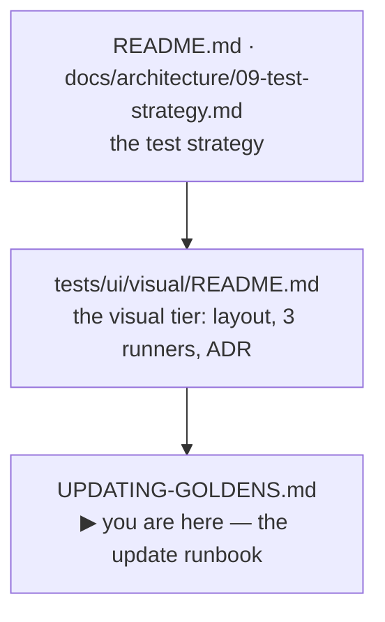

[◀ Visual tests README](./README.md) · [ADR-001 — why two sets](./ADR-001-visual-diff-tooling.md) · [Test strategy §9.7](../../../../../docs/architecture/09-test-strategy.md#97-visual-golden-tiers) · [Repo root](../../../../../README.md)

# Updating the visual goldens

The operational runbook: which command to run when a screenshot test goes red or
you add a new one. If you only remember one thing:

> There are **two golden sets** (not one), and **three routes** to update them.
> A deliberate UI change usually means refreshing **both** sets — via two routes.

For *why* two sets exist (and why we did **not** collapse to one), see
[ADR-001 → "Cross-platform pixel drift"](./ADR-001-visual-diff-tooling.md). This
file is the *how*.

---

## Where you are



## The two sets

They render the same scenarios but live in different worlds. Font rasterization
drifts ~30% across CPU architectures, so an arm64 Mac cannot reproduce x86
pixels natively — hence one set per world.

| Set | What it is | Gates? | Rendered where | Baseline when |
|---|---|---|---|---|
| **`__screenshots__/react/`** | The canonical **x86** baseline. The cross-framework contract `@rtc/client-solid` also asserts against. | ✅ **`visual.yml` on push to `main`** | pinned Playwright container (`v1.61.0-noble`) | `CI=1` |
| **`__screenshots__/react-local/<arch>/`** | Your machine's **native** pixels (`darwin-arm64`, `linux-arm64`). Powers the instant local loop. | ❌ never — feedback only | your machine, no Docker | `CI` unset |

A plain local run (no `CI`) reads/writes `react-local/<arch>`; CI reads/writes
`react/`. **A deliberate UI change therefore invalidates both.**

## The three routes

| # | Route | Updates | Selective? | Who commits |
|---|---|---|---|---|
| **1** | **CI workflow** — dispatch `update-visual-goldens.yml` | `react/` | ✅ `scenario_pattern` | **CI auto-commits & pushes** to your branch |
| **2** | **Local Docker** — `pnpm goldens:regen` / `goldens:verify` | `react/` | ❌ full-set only *(today — see gaps)* | **you** (writes to working tree) |
| **3** | **Local native** — `pnpm test:ui:visual:<tier>:react:update` | `react-local/<arch>` | ✅ `SCENARIO_PATTERN` env | **you** — no Docker, instant |

Routes **1 and 2 produce the byte-identical `react/` set** — pick 1 to let CI do
the compute and push for you, or 2 to do it locally with no round-trip. Route 3
is separate: it keeps *your machine's* fast-feedback set in sync.

### Route 1 — selective CI refresh (and it commits for you)

The lever that killed the old "regenerate everything for one changed pixel"
bottleneck. An empty pattern does a full wipe + re-render (~all scenarios × 3
tiers, ~30 min); a pattern re-renders **only matching scenarios, no wipe**
(~1 min), then CI commits the result back to your branch with `[skip ci]`.

```bash
# From the Actions tab: "Update visual goldens" → Run workflow → set scenario_pattern.
# Or from the CLI:
gh workflow run "Update visual goldens" --ref my-branch -f scenario_pattern=aurora
```

The pattern is a test-title regex (Playwright `-g` / Vitest `-t`) — a component
name usually matches several scenarios at once (e.g. `credit` matches every
Credit scenario). The auto-commit stages the whole `…/__screenshots__/react`
tree, so **new** golden files are committed too, not just changed ones.

### Route 2 — local Docker regen / verify

The same pinned image under `--platform linux/amd64` reproduces CI's x86 pixels
byte-for-byte, so any machine with Docker can produce or check `react/` locally.

```bash
pnpm goldens:regen    # rewrite react/ into the working tree — review & commit
pnpm goldens:verify   # assert the committed react/ set passes (a CI-exact gate)
```

Use `goldens:verify` to reproduce CI's visual gate on your own machine **before**
pushing — it's the only local way to prove `react/` is green without waiting for
`visual.yml`. Requires the Docker daemon; first run is slower (image pull +
amd64 install under emulation), later runs reuse the layer + a persistent pnpm
store. **Full-set only today** (~20–30 min) — see [gaps](#known-gaps).

### Route 3 — local native (fast inner loop)

Plain Playwright / Vitest on your host, writing your native `react-local/<arch>`
set. Instant, no container. Run it after a deliberate UI change so
`pnpm test:ui:visual` goes green again locally.

```bash
# one tier:
pnpm --filter @rtc/client-react test:ui:visual:playwright:react:update
# tiers: playwright · playwright-ct · vitest-browser

# narrow to matching scenarios (already supported — same env the CI workflow uses):
SCENARIO_PATTERN=aurora \
  pnpm --filter @rtc/client-react test:ui:visual:playwright:react:update
```

---

## Your three everyday situations

### A · A snapshot went red and it caught a real regression

Your change broke the UI; the golden did its job. **Fix the bug. Touch no
goldens.** No route needed — the red is correct, and it should go green once the
bug is fixed.

### B · You made a deliberate UI change, so some snapshots *should* change

This is Route 1's home turf — with one wrinkle: `visual.yml` runs **post-merge
on `main`, not on PRs**, so you find out *which* scenarios moved from your own
machine, not from a PR check.

1. **Learn what changed** — run Route 3 native locally. The diff names the
   affected scenarios.
2. **Refresh your local set** — the same Route 3 `:update` run writes
   `react-local/<arch>`. Commit it.
3. **Refresh the canonical set** — dispatch **Route 1** with a `scenario_pattern`
   covering those scenarios (CI renders + commits `react/`), **or** run **Route 2**
   `pnpm goldens:regen` locally.
4. **(Optional) prove it** — `pnpm goldens:verify` reproduces CI's exact gate
   before you push.

### C · You added a brand-new component / scenario (no golden exists yet)

**Route 1's pattern handles new snapshots — you do *not* need the slow local
Docker.** `--update` *writes missing* goldens, and the auto-commit stages a
directory, so new files are picked up. The one prerequisite: the new scenario
must be **registered on your branch first** — the `scenarios.ts` /
`scenarioActions.ts` / registry edits (see the "add a scenario" recipe in
[ADR-001](./ADR-001-visual-diff-tooling.md)). CI renders what the code defines.

```bash
# after pushing the scenario definition to your branch:
gh workflow run "Update visual goldens" --ref my-branch -f scenario_pattern=my-new-scenario
```

Then run Route 3 native locally to add the same new scenario to your
`react-local/<arch>` set.

---

## Which do I run?

| Situation | Route |
|---|---|
| Red snapshot caught a real bug | **none** — fix the bug (situation A) |
| Local `pnpm test:ui:visual` is red, nothing to push yet | **3** (native, instant) |
| Deliberate UI change — refresh both sets | **3** + (**1** or **2**) |
| A few scenarios changed; let CI regen & commit `react/` | **1** (selective) |
| Refresh `react/` locally / reproduce a CI visual failure | **2** (`goldens:regen` / `goldens:verify`) |
| New scenario, no golden yet | **1** (pattern; register the scenario first) + **3** for local |

> **The trap:** updating only `react-local` (Route 3) and assuming CI is happy.
> CI checks `react/`, which Route 3 never touches — refresh it via Route 1 or 2,
> or `visual.yml` reddens on the next push to `main`.

---

## Known gaps

- **Route 2 is not selective yet.** `goldens-in-container.mjs` doesn't forward
  `SCENARIO_PATTERN` into the container, so `pnpm goldens:regen` always renders
  the full set (~20–30 min) — exactly where selectivity would help most.
  Tracked in [docs/STATUS.md](../../../../../docs/STATUS.md).
- **Route 3 selectivity is undocumented, not unbuilt.** All three native configs
  already read `SCENARIO_PATTERN` (shown above); the only possible addition is a
  friendlier wrapper script. Also tracked in STATUS.md.

## Reference

| File | Role |
|---|---|
| [`.github/workflows/update-visual-goldens.yml`](../../../../../.github/workflows/update-visual-goldens.yml) | Route 1 — dispatch, filter, auto-commit |
| [`scripts/goldens-in-container.mjs`](../../../../../scripts/goldens-in-container.mjs) | Route 2 — regen / verify wrapper |
| `packages/client-react/package.json` → `test:ui:visual:*` | Route 3 — native `:update` scripts |
| `tests/ui/visual/*/​*.config.ts` | baseline routing · `SCENARIO_PATTERN` filter |
| [`ADR-001-visual-diff-tooling.md`](./ADR-001-visual-diff-tooling.md) | why two sets exist; the collapse that was reverted |
| [`.github/workflows/visual.yml`](../../../../../.github/workflows/visual.yml) | the gate — checks `react/` on push to `main` |

Container image is pinned to `mcr.microsoft.com/playwright:v1.61.0-noble`;
tolerance is `maxDiffPixelRatio: 0.06`; three tiers: `playwright`,
`playwright-ct`, `vitest-browser`. Keep the image tag identical across
`ci.yml`, `visual.yml`, `update-visual-goldens.yml`, and
`scripts/goldens-in-container.mjs` (the `check:image-tag-drift` gate enforces
this).
