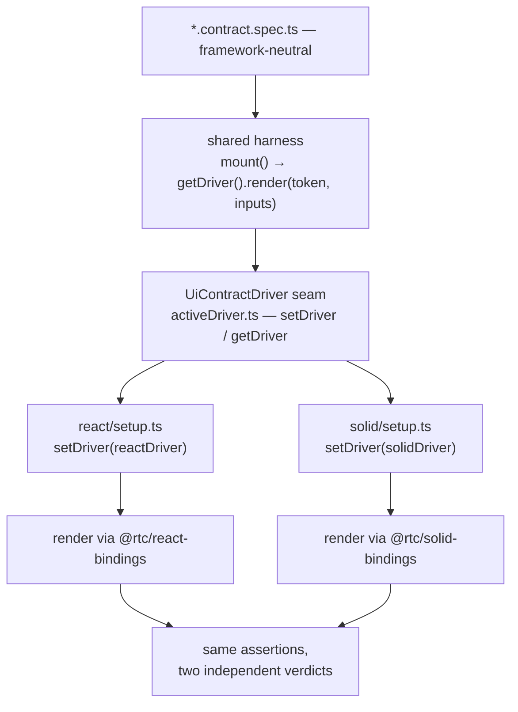

# @rtc/ui-contract

The framework-neutral UI test contract: the shared sociable-RTL harness, the `*.contract.spec.ts` specs, and the visual scenario/fixture manifest — extracted from `client-react`'s test tree so a second UI framework's test suites (`client-solid`'s) can depend on them without depending on `client-react`. This package is the second framework-swap portability pillar, alongside the visual goldens: passing the *same* spec files against a *different* render target is what a framework-swap proof actually looks like, not a diagram claiming it.

| | |
|---|---|
| **Ring** | ④ Frameworks & Drivers — a test-only leaf, not part of either client's runtime bundle |
| **Runtime deps** | `@rtc/client-core`, `@rtc/domain`, `@rtc/motion-core`, `rxjs` |
| **Consumed by** | `client-react`, `client-solid` — both as a **devDependency only**; it never appears in either client's `src/`, only in `tests/` |
| **Must never import** | `client-react`, `client-solid`, or any other client/server package — dependencies flow the other way, from each client's test tree into this package |

## Folder map

| Path | What lives here |
|---|---|
| `src/specs/fx/`, `src/specs/credit/`, `src/specs/equities/`, `src/specs/admin/`, `src/specs/shell/` | 86 shared `*.contract.spec.ts` files / 622 tests (2026-07-19) — sociable React Testing Library specs that assert text, roles, structure, recorded command inputs, and dynamic re-renders, written once against a render-target-neutral `ComponentToken` |
| `src/shared/harness/activeDriver.ts` | The framework seam: `UiContractDriver` interface + `setDriver`/`getDriver` — each client's swap-trio registers its own driver (`render()` into the DOM, plus optional `flushSync`/`flushAsync` hooks for frameworks that batch updates, e.g. React's `act()`) |
| `src/shared/harness/component.ts` | `ComponentToken`/`MountedComponent`/`PageContext` — the types a spec mounts against, independent of any framework |
| `src/shared/harness/world.ts` | `createWorld`/`World` — the controllable fake-hook state a mounted component reads, driven by the spec via `PageContext` setters |
| `src/shared/mount.ts` | `mount()`/`mountWith()`/`cleanupMounted()` — the entry points every spec calls; builds a `World`, calls the active driver's `render()`, and returns a `Page` object built from `PageContext` |
| `src/shared/pages/fx/`, `.../credit/`, `.../equities/`, `.../admin/`, `.../shell/` | Page-Object-ish query helpers per domain, layered over `MountedComponent` |
| `src/shared/components.ts` | The full `ComponentToken` registry every spec imports tokens from |
| `src/visual/scenarios.ts` | The visual scenario manifest: `name → { componentKey, fixtureKey }` — the single source of truth the surviving `playwright` tier, in both clients, loops over |
| `src/visual/scenarioActions.ts` | Per-scenario interaction table (click/type/select steps) — pairs with `scenarios.ts` for the data-driven tiers (`playwright`, and the `vitest-browser` coverage instrument) |
| `src/visual/fixtures.ts`, `src/visual/appData.ts` | Named fixture data sets + the `AppData` injectable-data contract |
| `src/visual/goldenPath.ts` | The shared golden-path resolver both clients' Playwright configs route `snapshotPathTemplate` through |
| `src/visual/freezeClock.ts` | Deterministic clock freezing for time-sensitive scenarios |
| `goldens/` | The committed golden PNG tree the `playwright` tier diffs against — see [Goldens](#goldens) below |

## Goldens

`goldens/playwright/__screenshots__/{react,react-local/<platform>-<arch>}/…`
is where the pixel-contract *artifact* lives, right beside the pixel-contract
*specification* above it (`scenarios.ts`, `goldenPath.ts`). It moved here from
`packages/client-react/tests/ui/visual/` (2026-07-19, pure `git mv`, byte-identical)
so both clients resolve into it symmetrically instead of one client's tree
reaching into another's. A 2026-07-20 test-tooling bake-off then retired the
sibling `playwright-ct/` and `vitest-browser/` golden trees along with the
tiers that wrote them — see
[ADR-001's Outcome section](../client-react/tests/ui/visual/ADR-001-visual-diff-tooling.md)
and [§9.7](../../docs/architecture/09-test-strategy.md#97-visual-golden-tiers).

**Who writes it:** `client-react`'s `:update` script and the
`update-visual-goldens.yml` workflow are the only writers — goldens are
generated exclusively from `client-react` renders. `client-solid` is
**assert-only**: its visual config anchors `snapshotDir` into
this tree, refuses `--update`/`-u` at the argv level, and throws rather than
auto-creating a missing golden — see
[§21 Mechanism 2 — assert-only visual tiers](../../docs/architecture/21-cross-framework-testing.md#mechanism-2--assert-only-visual-tiers)
for the enforcement layers. `client-solid` owns zero goldens of its own.

`goldens/` sits outside `src/` — it is not compiled, not exported, and not a
package entry point; it carries no effect on this package's `tsconfig`/knip/biome
surface (PNG-only directories). Regeneration, the two-set (CI vs local) split,
and the update routes are documented in
[`packages/client-react/tests/ui/visual/UPDATING-GOLDENS.md`](../client-react/tests/ui/visual/UPDATING-GOLDENS.md) —
that runbook, and the configs that point here, stay with `client-react`; only
the PNGs moved.

## Where to start reading

1. `src/shared/harness/activeDriver.ts` — the whole framework seam in one file: a driver knows only how to `render()` a token into a DOM node and, optionally, how to flush its framework's batched updates. Everything else in this package is framework-neutral by construction.
2. `src/shared/mount.ts` — `mount()` is what every contract spec calls: build a `World`, hand it and the props stream to the active driver, wrap the result in a `Page`. Read `buildContext()` to see the full set of `PageContext` setters (`setPrice`, `emit`, `setWatchlist`, ...) a spec can drive.
3. `src/visual/scenarios.ts` — the visual-tier equivalent of the contract harness: one named entry per rendered state, referenced by the surviving `playwright` tier (plus the `vitest-browser` coverage instrument) in both clients.
4. Any file under `src/specs/` — pick one and see the pattern: import a `ComponentToken` from `src/shared/components.ts`, `mount()` it, assert through the returned `Page`. Nothing in the spec file itself is React- or Solid-specific.

## The swap-trio

Neither client keeps its render-target adapter in this package — each owns its own **swap-trio**, a small parallel folder registering the active driver for that framework:

- `client-react/tests/ui/contract/react/` — `setup.ts` (registers the React `UiContractDriver`), `registry.tsx` (`ComponentToken` → React element), `render.tsx`, plus a few shared test doubles (`AnimationProbe.tsx`, `LayoutEngineHost.tsx`, `PropsHost.tsx`, `pinnedFixtureLayoutPort.ts`, `viewModelFromWorld.ts`).
- `client-solid/tests/ui/contract/solid/` — the identical eight files, Solid-flavored: same names, same roles, `ComponentToken` → Solid component instead of React element.

A spec under `src/specs/` never imports either trio directly — it only sees `ComponentToken`s and the `Page` interface `mount()` returns. Running the same spec file against both trios (via each client's own `vitest.config.ts`, which points at its own swap-trio's `setup.ts`) *is* the contract-parity proof: 86 shared spec files / 622 tests (2026-07-19), unmodified, pass against two structurally different render targets.



Full write-up of this seam, plus the other two cross-framework mechanisms (assert-only visual tiers, `RTC_CLIENT_PKG` e2e): [§21 Mechanism 1 — the contract swap-trio](../../docs/architecture/21-cross-framework-testing.md#mechanism-1--the-contract-swap-trio).

## How it's used

```ts
// packages/ui-contract/src/specs/fx/tile.contract.spec.ts (shape, trimmed)
import { TilePage } from "#/shared/pages/fx/TilePage";
import { mount, cleanupMounted } from "#/shared/mount";
import { TILE_TOKEN } from "#/shared/components";

afterEach(cleanupMounted);

test("shows the live price", () => {
  const page = mount(TILE_TOKEN, { parametric: { EURUSD: { bid: 1.1, ask: 1.1002 } } });
  expect(page.price()).toBe("1.1000 / 1.1002");
});
```

The same spec file runs unmodified under `client-react` (`pnpm --filter @rtc/client-react test:ui:contract`) and `client-solid` (`pnpm --filter @rtc/client-solid test:ui:contract`) — each client's `vitest.config.ts` `setupFiles` entry is the only thing that differs, and that entry lives in the client's own swap-trio, not here.

## How to run

```bash
pnpm --filter @rtc/ui-contract build       # tsc --build && tsc-alias
pnpm --filter @rtc/ui-contract typecheck
pnpm --filter @rtc/ui-contract test        # vitest run --passWithNoTests (this package ships no specs of its own)
```

This package's own `test` script is a no-op by design (`--passWithNoTests`) — the specs it hosts only run when a consuming client's swap-trio registers a driver. Its own `dev` script (`tsc-alias -w` + `tsc --build --watch`) exists so an edit here hot-rebuilds for whichever client is running `pnpm dev:watch` alongside it.

## See also

- [Its §13 card](../../docs/architecture/13-codebase-map.md#132-l1----the-package-line-map)
- [`packages/client-react/tests/ui/contract/README.md`](../client-react/tests/ui/contract/README.md) — the contract tier's full design, from the client side
- [`packages/client-react/tests/ui/visual/README.md`](../client-react/tests/ui/visual/README.md) — the visual tier's full design, including how goldens are shared across clients
- [§8.1 The Multi-Client Proof & the SolidJS Port](../../docs/architecture/08-replaceability-matrix.md#81-the-multi-client-proof--the-solidjs-port)
