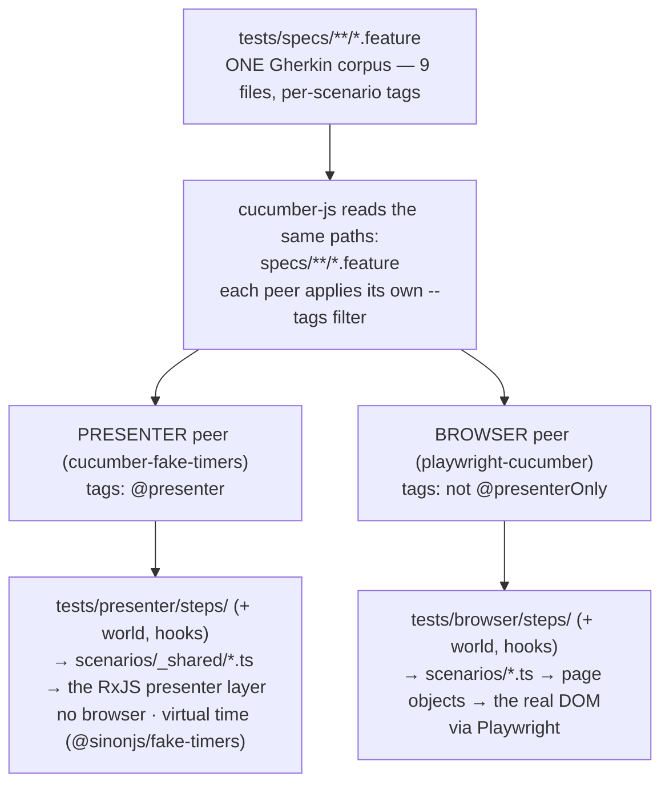

# One Gherkin corpus, driven at two layers

> **The detail that's easy to miss:** there is **one** set of `.feature` files in
> the whole repo — `tests/specs/**/*.feature`. They are **not** duplicated per
> test peer. Each peer points at the *same* corpus and runs a **tag-selected
> subset** of it, binding those scenarios to a different layer of the app
> through its own thin step tree. That's why the step-definition folders look so
> small: the behaviour lives in the shared `.feature` files, and a step tree is
> just the glue from Gherkin phrasing to one layer's API.

For the runner/time-model verdicts (which peer gates, which is parked), see
[`STRATEGY.md` §5.2](./STRATEGY.md#52-presenter-suites-runner--time). This doc is
only about **where the `.feature` files are and how one corpus feeds two layers.**

## The corpus

```
tests/specs/                      ← the ONE Gherkin corpus (9 files)
  admin/incident.feature
  analytics.feature
  blotter.feature
  connection.feature
  creditRfq.feature
  fxLiveRates.feature
  fxRfq.feature
  fxTrading.feature
  theme.feature
```

Nothing under `tests/presenter/` or `tests/browser/` contains a `.feature`
file. Both trees hold only **step definitions + a world/hooks harness**:

```
tests/presenter/                  tests/browser/
  cucumber-fake-timers/             playwright-cucumber/
    cucumber.js  world  hooks         cucumber.js  world  hooks
  steps/                            steps/
    *.steps.ts  (bind → presenters)   *.steps.ts  (bind → the DOM)
  scenarios/_shared/*.ts            scenarios/*.ts
    (RxJS presenter scenario fns)     (page-object scenario fns)
```

## How one corpus feeds two layers



The two peers share **only** the `.feature` text. Everything below the tag
filter is per-layer: a different step tree, a different scenario-helper layer,
a different target (RxJS presenters vs. the rendered DOM). Neither imports the
other.

## Tag routing — the precise rules

Tags are **per-scenario** (not per-feature). Two tags decide where a scenario
runs:

| Scenario tags | Presenter peer<br/>(`--tags @presenter`) | Browser peer<br/>(`--tags "not @presenterOnly"`) | Example scenario |
|---|:---:|:---:|---|
| `@presenter` | ✅ runs | ✅ runs | `fxTrading` → "execute a buy trade and see confirmation" |
| `@presenter` **+** `@presenterOnly` | ✅ runs | ❌ skipped | `admin/incident` → "Injecting a service-down incident…" |
| *(no `@presenter`)* | ❌ skipped | ✅ runs | `theme` → "clicking theme toggle changes the theme" |

Read it as two independent filters over the same corpus:

- **`@presenter`** = "this scenario maps cleanly to the application layer" → the
  presenter peer opts **in** to exactly these.
- **`@presenterOnly`** = "this behaviour is *only* observable at the presenter
  layer" (e.g. injecting a service-down incident that has no clean UI gesture) →
  the browser peer opts **out** of these via `not @presenterOnly`.
- **Untagged** scenarios are UI-only (theme, hover, tabs, dismissing a
  confirmation panel) — browser-only by construction.

So a scenario can be **both-layers**, **presenter-only**, or **browser-only**,
purely from its tags. The presenter peer runs 21 scenarios today — every
`@presenter`-tagged scenario across the 9 files, including the one
`@presenterOnly` incident.

## Consequences worth knowing

- **A peer loads every step definition but only runs its tag-selected
  scenarios.** So the presenter step tree defines steps for phrases that only
  appear in browser-only scenarios (e.g. "the trader dismisses the trade
  confirmation"). Those bindings are deliberate **no-ops** at the presenter tier
  — the peer never executes them, but the step must exist so the file
  type-checks and the vocabulary stays shared. (See the no-op steps in
  `tests/presenter/steps/common.steps.ts` and `fxTrading.steps.ts`.)
- **`@presenter` is kept *last* in a scenario's tag list.** Grep gate 21 counts
  `@presenter` scenarios per feature with a regex that keys off the last tag
  line; keep the ordering when adding scenarios.
- **Adding a scenario:** write it once in the right `tests/specs/*.feature`
  file, tag it (`@presenter` if it belongs at the app layer; add
  `@presenterOnly` if it has no UI gesture; leave untagged for UI-only), then
  add/point step definitions in whichever step tree(s) will run it. Gate 21
  enforces that the presenter peer's scenario count stays in parity with the
  `@presenter` tag count per feature.

## Which peers actually run this corpus

| Layer | Peer | Gating? | Notes |
|---|---|---|---|
| Presenter | `cucumber-fake-timers` | Parked (weekly) | The BDD showcase. The **gating** presenter runner is `vitest-fake-timers`, which binds the *same* `_shared/*.ts` scenarios with hand-written `describe/it` instead of Gherkin. |
| Browser | `playwright-cucumber` (react + solid) | Parked (weekly) | The **gating** browser runner is native `@playwright/test`, authored programmatically. |

Both Gherkin peers are parked off the PR gate and exercised weekly by
[`.github/workflows/e2e-gherkin-weekly.yml`](../.github/workflows/e2e-gherkin-weekly.yml)
so the shared corpus + step trees can't silently rot. See
[`STRATEGY.md` §5.2](./STRATEGY.md#52-presenter-suites-runner--time) for why the
gating winners are the non-Gherkin runners, and
[`docs/architecture/09-test-strategy.md` §9.5](../docs/architecture/09-test-strategy.md#95-seven-suite-e2e-stack-4-browser-peers--1-presenter-peer--2-fullstack-smokes)
for how these suites sit in the CI gauntlet.
