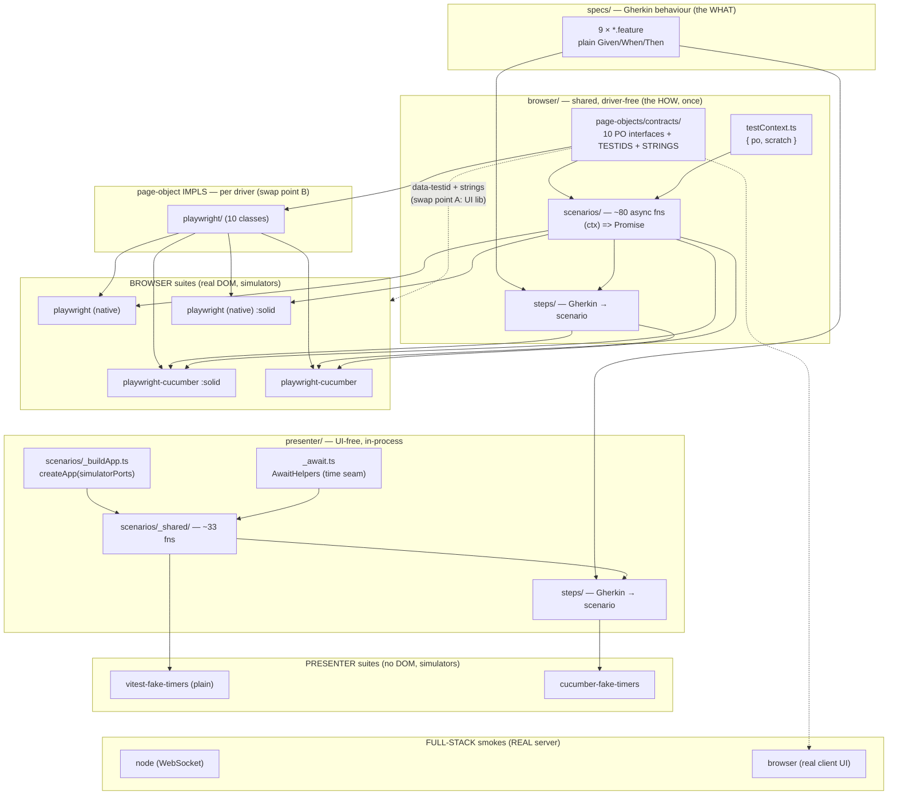

# E2E test strategy — sharing, trade-offs, and migration

This is the **decision and migration companion** to [`README.md`](./README.md).
`README.md` tells you *how to run* the suites (scripts, reports,
orchestration). This document explains *why there are so many*,
*what they share*, and — most importantly — **which one to keep when this
becomes a real production project, and how to migrate when the UI library or the
test framework is replaced.**

It is the e2e analogue of
[`packages/client-react/tests/ui/visual/README.md`](../packages/client-react/tests/ui/visual/README.md):
same shape (diagram, sharing table, pros/cons, porting guide), but the e2e world
has **two migration axes** instead of one, so the porting section is the centre
of gravity here.

> This repo is a **conceptual reference**: it deliberately ships *every* viable
> e2e approach side by side so we can compare them honestly. A concrete product
> would pick **one** lane per need — see [§7 Decision guide](#7-decision-guide-picking-one-for-production).

---

## 1. How deep each family reaches (the dependency ladder)

The visual tier's defining sentence is *"the dependency graph stops at
`HooksProvider`."* The e2e suites are defined the same way — by **how far down
the real stack each one drives.** There are three families, reaching three
different depths:

```
                         browser   →  React DOM  →  presenters  →  ports  →  domain  →  wire  →  server
 ──────────────────────────────────────────────────────────────────────────────────────────────────────
 Browser   (4 suites)       ●━━━━━━━━━━━━●━━━━━━━━━━━━━━●━━━━━━━━━━━━●━━━━━━━━━●                        [ports = simulators]
 Presenter (1 suite)                                    ●━━━━━━━━━━━━●━━━━━━━━━●                        [ports = simulators]
 Full-stack node                                                     ●━━━━━━━━━●━━━━━━━━━━●━━━━━━━━●    [REAL server]
 Full-stack browser         ●━━━━━━━━━━━━●━━━━━━━━━━━━━━●━━━━━━━━━━━━●━━━━━━━━━●━━━━━━━━━━●━━━━━━━━●    [REAL server]
```

- **Browser** suites drive the real DOM in a real browser, but the client's
  composition root is wired to **in-process simulators** (no server, no wire).
  They answer *"does the whole client behave, pixels-to-presenters?"*
- **Presenter** suites skip the browser/React entirely and drive
  `createApp(createSimulatorPorts())` — the RxJS presenter layer — in plain
  Node. They answer *"does the application layer behave?"* — fast, and with
  optional **virtual time**.
- **Full-stack** smokes are the only tests that cross the wire to the **real
  server**: `node` drives it over a raw WebSocket (no browser); `browser` drives
  it through the real client UI. They answer *"do the real adapters, wire, and
  server actually talk?"*

(Code-coverage is **not** produced here — these suites run the app in a separate
process from the runner. Coverage lives in the in-process tiers; see
`README.md` → "Reports".)

---

## 2. The suite map: 7 suites, 3 families, 1 variation axis

```
FAMILY        SUITE                                          varies by…
────────────  ─────────────────────────────────────────────  ─────────────────────────────────────────────
Browser       test:browser:playwright                        style=native            client=React
(4)           test:browser:playwright-cucumber               style=Gherkin           client=React
              test:browser:playwright:solid                  style=native            client=Solid
              test:browser:playwright-cucumber:solid         style=Gherkin           client=Solid

Presenter     test:presenter:vitest-fake-timers              runner=vitest(plain it) time=virtual
(1)

Full-stack    test:fullstack:node                            transport=WebSocket,    no browser
(2)           test:fullstack:browser                         transport=real          client UI
```

The browser family still *intentionally over-covers* (browser ×4), varying
along **two axes**:

- **Browser** = `{native, Gherkin}` (the **authoring style**) ×
  `{React, Solid}` (the **client**). (A third axis — the **driver** —
  existed through 2026-07-19: Cypress ran alongside Playwright as a second
  driver × style pair. Both Cypress suites were deleted 2026-07-20 after a
  bake-off; see [§5.1](#51-browser-suites-driver--style) and
  [§5.4](#54-why-keep-them-all-in-this-repo) for the verdict.)

The **presenter** family used to over-cover the same way — `{cucumber-js,
vitest}` (the **runner**) × `{real, virtual}` (the **time model**), 4 peers —
until a 2026-07-20 bake-off named `vitest-fake-timers` the single **gating**
peer above and kept `cucumber-fake-timers` parked as a presenter BDD showcase
(the twin of the parked `playwright-cucumber` browser peer); the real-timer
`cucumber` and `vitest-quickpickle-fake-timers` peers were deleted. See
[§5.2](#52-presenter-suites-runner--time) for the verdict.

This 2×2-per-family shape is exactly what makes the migration story rich: each
axis is a *different seam*, and a real migration moves along *one* axis at a
time. Keep that in mind — it is the whole reason the porting section ([§6](#6-migration-the-two-axes-you-asked-about))
splits into two independent halves.

---

## 3. Do the suites share tests?

**Partly — and, exactly as in the visual tier, knowing *which layer* is shared
is the whole mental model.** Sharing happens at the spec/scenario/contract
layers, never at the driver-glue layer. The two families have their own sharing
tables.

### 3.1 Browser family

| Layer | Path | Shared across the 4 browser suites? |
|---|---|---|
| **Behaviour specs** (Gherkin) | `specs/*.feature` (8 files) | ⚠️ **2 of 4** — both `-cucumber` suites; native suites mirror them in code |
| **Page-object contracts** + `TESTIDS` + `STRINGS` | `browser/page-objects/contracts/` (10 + 2) | ✅ **Yes — one source of truth** |
| **Scenario layer** (async, `Promise`-shaped) | `browser/scenarios/` (~80 fns) | ✅ **Yes — all 4** |
| **Step definitions** (Gherkin → scenario) | `browser/steps/` | ⚠️ **2 of 4** — both `-cucumber` suites |
| **Test context** `{ po, scratch }` | `browser/testContext.ts` | ✅ **Yes — all 4** |
| **Page-object impls** (driver code) | `browser/page-objects/playwright/` | ✅ **Yes — all 4** (10 classes + factory; the two Solid suites reuse the same classes — same driver, different `RTC_CLIENT_PKG`) |
| **Runner glue** (config, world/hooks, fixture) | each suite's own folder | ❌ per-suite |

**Historical note (through 2026-07-19):** a second driver, Cypress, ran
alongside Playwright as a native suite and a Cucumber-driven suite. Cypress's
command-queue model and `Chainable`-vs-`Promise` thenable semantics made the
`Promise`-shaped scenario contract unusable in a raw `it()` body (four
combinations were tried and rejected — see
`docs/architecture/09-test-strategy.md` §9.5 and the
`feedback_cypress_async_incompat` history), so it carried a **forked scenario
layer** (`browser/cypress/scenarios/`) that mirrored the shared one fn-for-fn
but used `cy` queue idioms. That fork was the price tag that proved the
boundary of the async-scenario contract, and its ongoing cost — plus the
arm64/Electron hazard ([§5.4](#54-why-keep-them-all-in-this-repo)) — was the
deciding evidence in the 2026-07-20 bake-off that retired both Cypress
suites. See [§5.1](#51-browser-suites-driver--style) for the verdict.

### 3.2 Presenter family

> The `.feature` files these peers run are the shared `tests/specs/` corpus,
> tag-routed to both the browser and presenter layers — see
> [`GHERKIN.md`](./GHERKIN.md) for the diagram and the tag-routing rules.

The presenter family is now one **gating** suite, `vitest-fake-timers`, plus one
**parked BDD showcase**, `cucumber-fake-timers` (off `run-all.ts`, run weekly —
see §5.2). What the gating suite uses:

| Layer | Path | Notes |
|---|---|---|
| **Scenario layer** (in-process, RxJS) | `presenter/scenarios/_shared/` (~33 fns) | drives the surviving peer |
| **App-build seam** | `presenter/scenarios/_buildApp.ts` | `createApp(simulatorPorts)` |
| **Time-model seam** (`AwaitHelpers` interface) | `presenter/scenarios/_await.ts` | now a single virtual-time implementation |
| **World + hooks + config** | `presenter/vitest-fake-timers/` | plain object literal, no Gherkin loader |

**Historical note (through 2026-07-19):** four peers shared this seam —
`cucumber` (real timers), `cucumber-fake-timers`, `vitest-quickpickle-fake-timers`,
and `vitest-fake-timers` (plain) — to prove the `_shared`/`_await`/`_buildApp`
abstractions weren't accidentally coupled to one runner or one time model: they
worked under cucumber-js *and* vitest, real *and* virtual time, Gherkin *and*
plain TS. Behaviour specs (Gherkin) were shared by 3 of the 4 — the Gherkin
runners; the plain-vitest peer hand-wrote `it()` blocks instead. Step
definitions were shared by the two cucumber peers only. The clever seam was
`_await.ts`: scenarios never called `setTimeout` or `vi.advanceTimers`
directly — they called `world.awaitFirstWithin` / `world.waitSeconds`, and
each peer's **world** supplied the implementation (`RealAwaitHelpers` wall
clock, `@sinonjs/fake-timers` `clock.tickAsync`, or
`vi.advanceTimersByTimeAsync`) — **same scenario body, three time engines**,
which is why the same `@presenter` scenarios ran at ~18.6s (real) and ~1s
(virtual) with zero scenario edits. The 2026-07-20 bake-off concluded that
proof: `vitest-fake-timers` won the **gating** role (fastest, no Gherkin-loader
dep), and — mirroring the browser tier's parked `playwright-cucumber` —
`cucumber-fake-timers` was kept as a **parked presenter BDD showcase**. It won
that slot over `vitest-quickpickle-fake-timers` because it is the presenter-tier
twin of `playwright-cucumber` (same `@cucumber/cucumber` runner already retained
for the browser peer, same structure, same `specs/**/*.feature` corpus) and the
fastest of the four peers (2.0s CI); quickpickle's single-runner appeal lost to
that mirroring. The parked peer lives off `run-all.ts`, runs via
`test:presenter:cucumber-fake-timers`, and is exercised weekly by
`e2e-gherkin-weekly.yml`. The real-timer `cucumber` peer and
`vitest-quickpickle-fake-timers` were deleted. See
[§5.2](#52-presenter-suites-runner--time) for the verdict.

### 3.3 The one-line summary

> **Shared = the behaviour (specs) and the intent (scenarios + PO contracts).
> Not shared = the driver code and the runner glue.** A new suite is "the shared
> layers + a thin per-driver/per-runner adapter." The thinner that adapter, the
> cheaper the suite — and the cheaper the eventual migration.

---

## 4. Architecture at a glance



The two dotted edges are the **two migration seams** the rest of this doc is
about: **A** = the production `data-testid`/`STRINGS` contract (crossed by a
UI-library swap), **B** = the page-object impls (crossed by a driver swap).

---

## 5. How they differ, and the trade-offs

### 5.1 Browser suites (driver × style)

| | **native Playwright** | **Playwright + cucumber** |
|---|---|---|
| **Authoring** | `test()` bodies calling `scenarios.fn()` | `.feature` + shared steps |
| **Reuses shared scenarios?** | ✅ yes | ✅ yes |
| **Living docs (BDD)** | no | ✅ yes |
| **Tooling** | **best** — `--ui`, traces, time-travel | `--headed` only |
| **Driver-swap friction** | low (async-native) | low |
| **arm64 dev container** | ✅ runs | ✅ runs |
| **Strength** | cleanest, fastest to debug, most portable | specs as SOT + best driver |
| **Weakness** | no BDD layer | Gherkin indirection |

**Verdict (2026-07-20 bake-off, both Cypress suites deleted):** native
Playwright won: async-native scenario reuse vs the forked queue layer, no
Electron/arm64 hazard, 133–203s vs 91–107s+flakes; both Cypress suites
deleted 2026-07-20 — the fork's cost was the deciding evidence. Cypress ran
here through 2026-07-19 as a native suite and a Cucumber-driven suite,
mirroring the Playwright pair (driver = `{Playwright, Cypress}` × style =
`{native, Gherkin}`); it could not reuse the shared `Promise`-shaped scenario
layer (its command-queue/`Chainable` model needed a parallel fork,
`browser/cypress/scenarios/`) and hung on the arm64 dev container (an
Electron boot failure — see the retired "Known issue" section this repo used
to carry in `README.md`). The 91–107s figures in the verdict are Cypress's
own best-case **isolated, local** numbers ([§5.5](#55-measured-durations-isolated-local--2026-06-21));
133–203s is Playwright's **CI, parallel-fan-out** wall-clock — a harsher
condition. Even measured favourably against Playwright's harder number,
Cypress's isolated figure didn't buy back the fork-maintenance cost or the
reliability hazard, so it lost the bake-off on total cost, not raw speed.

### 5.2 Presenter suites (runner × time)

**Historical comparison (through 2026-07-19) — this table's Role column is now
the record of the bake-off, not a live "why keep them all" case:**

| | **cucumber (real)** | **cucumber-fake-timers** | **vitest-quickpickle** | **vitest-fake-timers (plain)** |
|---|---|---|---|---|
| **Runner** | cucumber-js | cucumber-js | vitest + qpickle loader | vitest, raw `describe/it` |
| **Gherkin?** | ✅ | ✅ | ✅ | ❌ (hand-written) |
| **Time** | wall clock | `@sinonjs/fake-timers` | `vi` fake timers | `vi` fake timers |
| **Speed** | ~18.6s local / ~40.7s CI (reference) | ~1s local / ~2.0s CI | ~1.7s local / ~4.0s CI | ~1s local / ~2.5s CI |
| **Role** | the **truth** (real timers can't lie about ordering) | 19× speedup proof → **now the parked BDD showcase** | runner-portability proof | plain-TS portability proof (no BDD needed) |

**Verdict (2026-07-20 bake-off):** plain `vitest-fake-timers` won the **gating**
role — fastest measured time (1s local / 2.5s CI) with zero Gherkin-loader
dependencies, on top of proving the same `_shared`/`_await`/`_buildApp`
abstractions the other three peers also exercised. **`cucumber-fake-timers` was
kept, parked** as the presenter-tier BDD showcase — the twin of the parked
`playwright-cucumber` browser peer (same `@cucumber/cucumber` runner, already
retained for that peer; same `specs/**/*.feature` corpus) and the fastest of the
four (2.0s CI); it beat `vitest-quickpickle-fake-timers` for that slot because
mirroring the browser showcase outweighed quickpickle's single-runner appeal.
`cucumber` (the real-timer ordering oracle, ~40.7s CI) and
`vitest-quickpickle-fake-timers` were deleted. The parked peer is off
`run-all.ts` and runs weekly via `e2e-gherkin-weekly.yml`; its comparison lives
on in the table above and in [§3.2](#32-presenter-family).

### 5.3 Full-stack smokes

| | **node** | **browser** |
|---|---|---|
| **Drives** | real server via raw `ws` | real server + real client UI via Playwright |
| **Proves** | client adapters ↔ wire ↔ server ↔ domain | the same, *through the real DOM* |
| **Cost** | tiny (bare `tsx` script, no framework) | boots server + Vite client + browser |

### 5.4 Why keep them all (in *this* repo)

Like the visual triangle, this is defence-in-depth + a portability proof, not
redundancy:

- The **browser matrix (2 styles × 2 clients)** proves the PO-contract seam is
  real: the *same* behaviour passes on two authoring styles and two UI
  frameworks. (Through 2026-07-19 it was also a driver × style matrix —
  Cypress's forked scenario layer was the deliberate counter-example marking
  where the async contract ends; the bake-off in [§5.1](#51-browser-suites-driver--style)
  retired it.)
- The **presenter suite** (formerly ×4 peers, through 2026-07-19) proved the
  `_shared`/`_await`/`_buildApp` abstractions weren't accidentally coupled to
  one runner or one time model — they survived cucumber *and* vitest, real
  *and* virtual time, Gherkin *and* plain TS. That proof is complete; the
  2026-07-20 bake-off kept only the fastest, dependency-lightest peer
  (`vitest-fake-timers`) — see [§5.2](#52-presenter-suites-runner--time).
- The **full-stack smokes** are the only wire-crossing tests; everything else
  mocks the server with simulators.

The cost of keeping all seven is the per-runner glue and the per-suite
dev-server boot — which is exactly why a **product** picks one lane
([§7](#7-decision-guide-picking-one-for-production)).

### 5.5 Measured durations (isolated, local — 2026-06-21)

The tables above rank suites qualitatively; here are real numbers. **Each suite
was run on its own, sequentially** (never in the `test:e2e` parallel fan-out — a
concurrent wall-clock is not a fair per-suite figure), so these are clean
isolated timings.

> **Bench box:** Apple M2 Max (12 cores), macOS (Darwin 25.5.0), Node 26.0.0,
> pnpm 11.7.0 · single run each · **2026-06-21** · all suites PASS. Wall-clock
> **includes** the per-suite dev-server / browser boot (a roughly fixed cost
> shared by every browser suite), so treat these as *indicative*, not a
> micro-benchmark — expect ±several seconds of run-to-run variance. At the time
> of this measurement, all twelve suites (incl. both since-retired Cypress
> suites — Cypress ran fine on this box, unlike the arm64 dev container it
> hung on) existed and were measurable.

| Suite | Scenarios | Duration | Notes |
|---|---:|---:|---|
| **Presenter** `vitest-fake-timers` | 20 | **1.3s** | fastest — plain Vitest, virtual time, no browser (the 2026-07-20 winner) |
| **Presenter** `cucumber-fake-timers` (retired 2026-07-20) | 20 | **1.5s** | virtual time under cucumber-js |
| **Presenter** `vitest-quickpickle-fake-timers` (retired 2026-07-20) | 20 | **1.7s** | virtual time, Gherkin under Vitest |
| **Full-stack** `node` | 1 path | **3.1s** | boots the real server; raw WebSocket, no browser |
| **Full-stack** `browser` | 1 | **5.3s** | real server + Vite client + Playwright |
| **Presenter** `cucumber` (real timers, retired 2026-07-20) | 20 | **21.0s** | the reference — wall-clock waits are genuine |
| **Browser** `playwright-cucumber` | 48 | **50.7s** | real browser + dev server |
| **Browser** `playwright` (native) | 48 | **75.7s** | real browser + dev server |
| **Browser** `cypress` (native, retired 2026-07-20) | 48 | **91.3s** | real browser + dev server |
| **Browser** `cypress-cucumber` (retired 2026-07-20) | 48 | **107.4s** | real browser + dev server |

What the numbers confirm:

- **Virtual time is the headline win.** The presenter behaviour set runs in
  **~1.5s** under fake timers vs **21.0s** with real timers — **~14× faster**
  for the *same 20 scenarios* (the doc elsewhere cites ~19× on another box; the
  ratio is machine-dependent, the order of magnitude is not). This is why the
  fast presenter peer is the recommended TDD inner loop.
- **Depth beats driver.** Any in-process **presenter** suite (1–21s) is one to
  two orders of magnitude faster than any **browser** suite (51–107s), because
  the dominant cost is booting a real browser + dev server, not the test logic.
- **Playwright < Cypress here** (51–76s vs 91–107s for the same 48 scenarios) —
  and Cypress additionally carried the arm64/Electron hazard and the forked
  scenario layer's maintenance cost. That combination is what the 2026-07-20
  bake-off retired both Cypress suites over — see [§5.1](#51-browser-suites-driver--style).
- These are **single-run** figures: on this run `playwright-cucumber` came in
  *below* native Playwright despite identical coverage. Don't read fine-grained
  rankings into a few seconds of difference — the families separate cleanly, the
  members within a family don't.

To reproduce, run any single script from `README.md` → "Scripts" in isolation
(e.g. `pnpm --filter @rtc/tests test:browser:playwright`) and time it; the
visual tier has its own isolated table in
[`packages/client-react/tests/ui/visual/README.md`](../packages/client-react/tests/ui/visual/README.md).

### CI durations (2026-07-19, ubuntu 2-core, parallel fan-out `RTC_E2E_MAX_PARALLEL=2` — not isolated)

These are **not** apples-to-apples with the table above: they come from the
`e2e` CI job on a GitHub-hosted `ubuntu-latest` runner (2 cores) with every
suite racing concurrently in `run-all.ts`'s parallel pool, whereas the table
above isolates each suite serially on a 12-core Mac. Read this as *"what
actually happens on CI"*, not a second isolated benchmark.

| Suite | Duration | Notes |
|---|---:|---|
| **Presenter** `cucumber-fake-timers` (retired 2026-07-20) | **2.0s** | virtual time under cucumber-js |
| **Presenter** `vitest-fake-timers` | **2.5s** | virtual time, plain Vitest (the 2026-07-20 winner) |
| **Presenter** `vitest-quickpickle-fake-timers` (retired 2026-07-20) | **4.0s** | virtual time, Gherkin under Vitest |
| **Full-stack** `node` | **4.6s** | boots the real server; raw WebSocket, no browser |
| **Full-stack** `browser` | **12.8s** | real server + Vite client + Playwright |
| **Presenter** `cucumber` (real timers, retired 2026-07-20) | **40.7s** | the reference — wall-clock waits are genuine |
| **Browser** `playwright-cucumber` (solid) | **132.5s** | real browser + dev server, Solid client |
| **Browser** `playwright-cucumber` | **144.6s** | real browser + dev server |
| **Browser** `playwright` (native, solid) | **176.4s** | real browser + dev server, Solid client |
| **Browser** `playwright` (native) | **202.9s** | real browser + dev server |

Native Cypress and `cypress-cucumber` never had CI figures — Cypress was
de-gated from CI since #66 and ran only locally, until both suites were
deleted 2026-07-20 (the [§5.1](#51-browser-suites-driver--style) verdict).

---

## 6. Migration: the two axes you asked about

A real migration moves along **one axis at a time**. The seams are placed so the
two axes hit **different layers** — so the two migrations barely interact.

### Axis A — swap the UI library (React → SolidJS, or one not yet invented)

**What the e2e suites actually depend on from the UI:** only the production
`data-testid` attributes (`contracts/testids.ts`) and the user-visible text
(`contracts/strings.ts`). **No test file imports React.** Page objects address
the DOM by testid; scenarios address page objects; specs address scenarios.

So the impact is remarkably small:

| Suite family | Impact of React→Solid | Why |
|---|---|---|
| **Presenter (×1)** | **zero** | never render UI — drive `createApp` presenters (domain + RxJS). A UI swap is invisible |
| **Full-stack node** | **zero** | no browser at all |
| **Browser (×4)** | **zero test-code changes**¹ | POs select by `data-testid`; the driver doesn't know React from Solid |
| **Full-stack browser** | **zero test-code changes**¹ | same testid contract |

¹ **Provided the new UI emits the same `data-testid`s and the same `STRINGS`
text.** That is the entire contract. Keep page objects **testid-first**; any PO
that leans on React-specific DOM structure (role/text/CSS) is the only thing
that would need a touch-up — so audit `page-objects/*/` for non-testid selectors
*before* the port and push them down to testids.

**The headline:** browser e2e is a *stronger* UI-portability contract than the
visual goldens — because it is **behavioural, not pixel-based**, there are **no
per-arch golden sets to regenerate** (contrast the visual tier's CI-`react/` +
`react-local/<arch>/` dance). The e2e suite becomes the **oracle** that proves
the Solid port is behaviour-equivalent to React.

**Steps for a React → Solid migration:**

1. **Freeze the contract.** Confirm `testids.ts` + `strings.ts` are the only UI
   coupling (grep gates already forbid `ctx.po.*`/`page.*` leaking into specs).
2. **Audit page-object selectors** for any non-testid selector; convert to
   testids (a pure-attribute production change — already an accepted pattern in
   the visual tier).
3. **Port the production components** to Solid, re-emitting the same
   `data-testid`s and the same visible strings.
4. **Run the e2e suites unchanged.** Red → the port changed behaviour; green →
   it's equivalent. **No test edits.**
5. (Visual goldens are the separate pixel contract and *do* get regenerated —
   see the visual tier's
   [`UPDATING-GOLDENS.md`](../packages/client-react/tests/ui/visual/UPDATING-GOLDENS.md)
   runbook. e2e does not.)

**How it actually runs (already shipped).** The steps above are the general
recipe; this repo has already executed it for `client-solid`, so the seam is
live, not hypothetical:

- `RTC_CLIENT_PKG` (default `@rtc/client-react`) is the one env var that
  re-targets which client's dev server the shared suites drive —
  `tests/scripts/devServer.ts`'s `CLIENT_PKG` constant reads it and hands the
  value straight to `spawn("pnpm", ["--filter", CLIENT_PKG, "dev"])`.
- `run-all.ts` adds two Solid entries to the concurrent pool —
  `test:browser:playwright:solid` and `test:browser:playwright-cucumber:solid`
  — the *same* two config files as their React counterparts, just invoked
  with `RTC_CLIENT_PKG=@rtc/client-solid` and their own port block
  (3003–3004, vs. React's 3001–3002) and `-solid` report suffixes.
- `playwright.config.ts`'s `testIgnore` (`notYetPortedSpecs`) is empty for
  both clients — `login.spec.ts` runs unmodified on the Solid run too, now
  that `client-solid`'s `buildBrowserPorts.ts` reads `VITE_DEV_AUTH` via the
  same `parseDevAuth` helper as `client-react` instead of hardcoding the
  `mcdc2026` demo roster. The mechanism stays wired for any future genuine
  port gap.

Deep dive on the full mechanism — env var → `devServer.ts` → `run-all.ts`
wiring, plus the two real incidents this cross-framework net has caught:
[§21 Mechanism 3 — e2e via RTC_CLIENT_PKG](../docs/architecture/21-cross-framework-testing.md#mechanism-3--e2e-via-rtc_client_pkg).

### Axis B — swap the test framework / driver (Playwright → something new)

Here the seam is the **page-object impls** (browser) or the **world/runner glue**
(presenter). The behaviour (specs), the intent (scenarios), and the contracts
survive.

**Browser driver swap** — implement, for the new driver `X`:

- `page-objects/X/` — 10 classes implementing the **same** `contracts/`
  interfaces + a `factory.ts` (`buildXPageObjects()`).
- one of: a fixture (`browser/X/_context.ts`, native style) and/or a
  `world.ts` + `hooks.ts` (Gherkin style).
- a runner config + `package.json` scripts.

Survives **verbatim**: `specs/`, `browser/scenarios/`, `browser/steps/`,
`testContext.ts`, `contracts/` (incl. `testids`/`strings`).

> ⚠️ **The Cypress lesson is the design rule.** The shared scenario layer
> assumes **`Promise`-returning** PO methods (async/await). A driver that is
> async-native (Playwright, WebdriverIO async, Puppeteer, a hypothetical new
> one) reuses the scenarios as-is. A driver with a **command-queue / chainable**
> model (like Cypress, run here through 2026-07-19) **cannot** — it needs a
> forked scenario layer, as Cypress's retired `cypress/scenarios/` fork did.
> **When evaluating a new driver, the first question is: are its actions
> plain Promises?** If yes, the port is cheap; if no, budget for a scenario fork
> — and weigh that ongoing cost against the driver's other merits, the way the
> 2026-07-20 bake-off did ([§5.1](#51-browser-suites-driver--style)).

Per-suite effort for a driver swap:

| Suite | What you re-author | Survives | Effort |
|---|---|---|---|
| native Playwright→X | `page-objects/X/` (10) + factory + `_context.ts` + config + scripts | specs n/a, scenarios, contracts, testContext | **low** (async driver) |
| Playwright-cucumber→X | `page-objects/X/` + `world.ts`/`hooks.ts` + config | specs, steps, scenarios, contracts | **low** |
| (queue-style new driver, e.g. the retired Cypress case) | impls **+ a scenario fork** like the deleted `cypress/scenarios/` | specs, steps, contracts | **high** |

**Presenter runner swap** (e.g. cucumber-js → a new runner) — the "driver" is
the runner + time engine:

- new `world` implementing the `AwaitHelpers` interface (`_await.ts`) + hooks +
  config; optionally a steps mirror (only if the new runner needs a different
  step-callback shape, as quickpickle did).
- Survives verbatim: `specs/`, `presenter/scenarios/_shared/`, `_buildApp.ts`,
  the `AwaitHelpers` *interface*.
- This was **already demonstrated four times** (cucumber, cucumber+sinon,
  vitest+qpickle, vitest+plain) before the 2026-07-20 bake-off collapsed the
  family to the single surviving `vitest-fake-timers` peer — the proof that
  the presenter abstractions are runner-portable stands even though only one
  peer runs today.

### Axis interaction

The two axes are nearly orthogonal: a UI swap touches production
testids/strings (Axis A) and **no** test code; a driver swap touches page-object
impls / runner glue (Axis B) and **no** specs/scenarios. You can do them
independently and in either order. The only shared touch-point is
`page-objects/*/` — testid-first POs keep even that minimal.

---

## 7. Decision guide: picking ONE for production

This repo runs all seven remaining suites because it is a comparison artifact —
the browser-driver axis it once carried (Playwright × Cypress) was already
narrowed to a single driver, and the presenter runner/time-model axis to a
single peer, by the same 2026-07-20 bake-off
([§5.1](#51-browser-suites-driver--style), [§5.2](#52-presenter-suites-runner--time)),
so the guidance below is partly already-acted-upon rather than hypothetical.
A product keeps a small, intentional subset beyond that. Recommendations by
goal:

| Goal | Keep | Why |
|---|---|---|
| **Default single browser e2e stack** | **native Playwright** | async-native (reuses scenarios), best tooling (`--ui`, traces), no Electron/arm64 hazard, lowest driver-swap friction. No BDD overhead |
| **Stakeholders need living documentation (BDD)** | **Playwright + cucumber** | `.feature` specs as the single source of truth, on the strongest driver |
| **Fast behavioural inner loop / TDD** | **presenter vitest-fake-timers** | no browser, virtual time (~1.5s), plain TS — keep as permanent "behavioural insurance" even in prod |
| **Release gate against the real backend** | **one full-stack smoke** (`node` if headless-cheap is enough; `browser` for the faithful path) | the only wire-crossing coverage |

**A sensible production set:** native Playwright (one browser stack) + presenter
vitest-fake-timers (fast insurance) + one full-stack smoke. Three lanes, three
distinct jobs, no overlap.

**What to drop in production, and why:**

- **Running two drivers at once.** This repo did exactly that (Playwright +
  Cypress) as a portability *proof*, not a product need — and the bake-off
  concluded Playwright is the one to keep, retiring Cypress and its
  queue-fork tax and arm64/Electron hazard ([§5.1](#51-browser-suites-driver--style)).
- **Redundant presenter peers.** This repo did exactly that — ran four
  runner/time-model peers as a portability proof — and the 2026-07-20 bake-off
  concluded the single fast plain-vitest peer is the one production needs; the
  real-timer `cucumber` ordering oracle and the two portability-proof peers
  (`cucumber-fake-timers`, `vitest-quickpickle-fake-timers`) were retired
  ([§5.2](#52-presenter-suites-runner--time)).
- **The Gherkin layer**, unless BDD/living-docs is a real stakeholder
  requirement — it adds a step-tree to maintain for no behavioural gain over
  native specs.

**Keep regardless of which lane you choose:** `specs/` (if BDD),
`contracts/` (testids + strings — the UI-portability contract), the
`scenarios/` layer, and `testContext.ts` / `_await.ts`. These are the
*deliverable*; the per-suite folders are just adapters onto them.

### 7.1 Final verdict: the production set actually adopted (Task 6, 2026-07-20)

Everything above this subsection is general guidance for *a* production set.
This is what the same 2026-07-20 test-tooling bake-off actually shipped for
*this* repo — the last of its three verdicts (browser driver §5.1, presenter
runner/time-model §5.2, this one):

| Suite | Status | Role |
|---|---|---|
| native Playwright — react | **gating** (PR CI) | the browser SOT (see below) |
| native Playwright — solid | **gating** (PR CI) | proves the SOT against both clients |
| presenter `vitest-fake-timers` | **gating** (PR CI) | fast behavioural insurance, no browser |
| full-stack `node` | **gating** (PR CI) | the only wire-crossing coverage (headless) |
| full-stack `browser` | **gating** (PR CI) | the only wire-crossing coverage (real UI) |
| playwright-cucumber — react | **parked, weekly** | BDD showcase; anti-rot net only |
| playwright-cucumber — solid | **parked, weekly** | BDD showcase; anti-rot net only |

Unlike the browser-driver and presenter verdicts above (both of which
*deleted* their losing peers outright), the Gherkin browser peers were not
deleted — they earn their keep as this repo's living BDD demonstration (§5.4)
and the `.feature`/step tree is real, maintained content, not disposable
scaffolding. Instead they were **parked**: dropped from the PR gate but kept
running on a schedule so they can't silently bit-rot unnoticed.
`tests/scripts/run-all.ts` filters them via `RTC_E2E_SKIP_GHERKIN_BROWSER=1`
(any suite whose script starts with `test:browser:playwright-cucumber`),
which the CI PR gate (`ci.yml`) sets; a new
`.github/workflows/e2e-gherkin-weekly.yml` runs both parked suites every
Monday 06:00 UTC (plus `workflow_dispatch` for an on-demand run). Locally,
plain `pnpm test:e2e` still runs all 7 suites — the env var only matters when
set.

**Native Playwright specs are declared the browser SOT.** From this verdict
forward, new browser behaviour lands in `tests/browser/playwright/*.spec.ts`
first — that is what every PR's gate actually proves. A matching Gherkin
`.feature` scenario is *optional* while the layer stays parked, so the
`.feature`/step tree **may lag native coverage** — that's an accepted,
explicit trade-off, not an oversight. The weekly run only proves that
*scenarios which already exist* still pass; it is not a gate that catches new
native-only behaviour going unspecified in Gherkin, and it can't be, by
construction — a weekly cron only ever looks backward at what's already
written. If that drift starts to bite in practice, the plan's "Post-plan
follow-ups" flags two escalations to consider: a `.feature` ↔ native-spec
parity gate, or deleting the Gherkin layer outright (revisit ~2026-09).

**Gate arithmetic:** the PR gate runs **5 of the 7** e2e suites (2 native
browser + 1 presenter + 2 full-stack); the full run — local `pnpm test:e2e`
with the env var unset, or the weekly workflow — still exercises all **7**.

---

## 8. See also

- [`README.md`](./README.md) — scripts, reports, orchestration,
  caching/freshness.
- [`../docs/architecture/09-test-strategy.md`](../docs/architecture/09-test-strategy.md) §9 "Test Strategy" — the
  authoritative layer model, the seven-suite e2e stack, and the port-contract
  test layer.
- [`packages/client-react/tests/ui/visual/README.md`](../packages/client-react/tests/ui/visual/README.md)
  — the visual-tier sibling of this document (one axis; pixel goldens).
- [`packages/client-react/tests/ui/visual/UPDATING-GOLDENS.md`](../packages/client-react/tests/ui/visual/UPDATING-GOLDENS.md)
  — the operational runbook for **updating** those pixel goldens (two sets, three routes).
