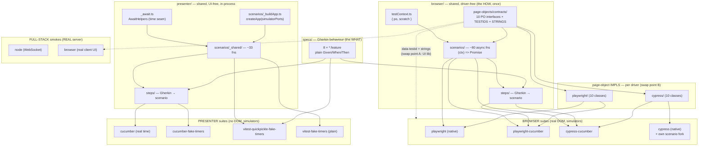

# E2E test strategy — sharing, trade-offs, and migration

This is the **decision and migration companion** to [`README.md`](./README.md).
`README.md` tells you *how to run* the suites (scripts, reports, orchestration,
the Cypress arm64 known-issue). This document explains *why there are so many*,
*what they share*, and — most importantly — **which one to keep when this
becomes a real production project, and how to migrate when the UI library or the
test framework is replaced.**

It is the e2e analogue of
[`packages/client/tests/ui/visual/README.md`](../packages/client/tests/ui/visual/README.md):
same shape (diagram, sharing table, pros/cons, porting guide), but the e2e world
has **two migration axes** instead of one, so the porting section is the centre
of gravity here.

> This repo is a **conceptual reference**: it deliberately ships *every* viable
> e2e approach side by side so we can compare them honestly. A concrete product
> would pick **one** lane per need — see [§7 Decision guide](#7-decision-guide-picking-one-for-production).

---

## 1. How deep each family reaches (the dependency ladder)

The visual tier's defining sentence is *"the dependency graph stops at
`HooksProvider`."* The e2e suites are defined the same way — by **how far down
the real stack each one drives.** There are three families, reaching three
different depths:

```
                         browser   →  React DOM  →  presenters  →  ports  →  domain  →  wire  →  server
 ──────────────────────────────────────────────────────────────────────────────────────────────────────
 Browser   (4 suites)       ●━━━━━━━━━━━━●━━━━━━━━━━━━━━●━━━━━━━━━━━━●━━━━━━━━━●                        [ports = simulators]
 Presenter (4 suites)                                   ●━━━━━━━━━━━━●━━━━━━━━━●                        [ports = simulators]
 Full-stack node                                                     ●━━━━━━━━━●━━━━━━━━━━●━━━━━━━━●    [REAL server]
 Full-stack browser         ●━━━━━━━━━━━━●━━━━━━━━━━━━━━●━━━━━━━━━━━━●━━━━━━━━━●━━━━━━━━━━●━━━━━━━━●    [REAL server]
```

- **Browser** suites drive the real DOM in a real browser, but the client's
  composition root is wired to **in-process simulators** (no server, no wire).
  They answer *"does the whole client behave, pixels-to-presenters?"*
- **Presenter** suites skip the browser/React entirely and drive
  `createApp(createSimulatorPorts())` — the RxJS presenter layer — in plain
  Node. They answer *"does the application layer behave?"* — fast, and with
  optional **virtual time**.
- **Full-stack** smokes are the only tests that cross the wire to the **real
  server**: `node` drives it over a raw WebSocket (no browser); `browser` drives
  it through the real client UI. They answer *"do the real adapters, wire, and
  server actually talk?"*

(Code-coverage is **not** produced here — these suites run the app in a separate
process from the runner. Coverage lives in the in-process tiers; see
`README.md` → "Reports".)

---

## 2. The suite map: 10 suites, 3 families, 2 variation axes

```
FAMILY        SUITE                                          varies by…
────────────  ─────────────────────────────────────────────  ─────────────────────────────────────────────
Browser       test:browser:playwright                        driver=Playwright       style=native
(4)           test:browser:cypress                           driver=Cypress          style=native
              test:browser:playwright-cucumber               driver=Playwright       style=Gherkin
              test:browser:cypress-cucumber                  driver=Cypress          style=Gherkin

Presenter     test:presenter:cucumber                        runner=cucumber         time=REAL (reference)
(4)           test:presenter:cucumber-fake-timers            runner=cucumber         time=virtual
              test:presenter:vitest-quickpickle-fake-timers  runner=vitest(Gherkin)  time=virtual
              test:presenter:vitest-fake-timers              runner=vitest(plain it) time=virtual

Full-stack    test:fullstack:node                            transport=WebSocket,    no browser
(2)           test:fullstack:browser                         transport=real          client UI
```

The two families that *intentionally over-cover* (browser ×4, presenter ×4) each
vary along **two axes**:

- **Browser** = `{Playwright, Cypress}` (the **driver**) × `{native, Gherkin}`
  (the **authoring style**).
- **Presenter** = `{cucumber-js, vitest}` (the **runner**) ×
  `{real, virtual}` (the **time model**).

This 2×2-per-family shape is exactly what makes the migration story rich: each
axis is a *different seam*, and a real migration moves along *one* axis at a
time. Keep that in mind — it is the whole reason the porting section ([§6](#6-migration-the-two-axes-you-asked-about))
splits into two independent halves.

---

## 3. Do the suites share tests?

**Partly — and, exactly as in the visual tier, knowing *which layer* is shared
is the whole mental model.** Sharing happens at the spec/scenario/contract
layers, never at the driver-glue layer. The two families have their own sharing
tables.

### 3.1 Browser family

| Layer | Path | Shared across the 4 browser suites? |
|---|---|---|
| **Behaviour specs** (Gherkin) | `specs/*.feature` (8 files) | ⚠️ **2 of 4** — the two `-cucumber` suites only; native suites mirror them in code |
| **Page-object contracts** + `TESTIDS` + `STRINGS` | `browser/page-objects/contracts/` (10 + 2) | ✅ **Yes — one source of truth** |
| **Scenario layer** (async, `Promise`-shaped) | `browser/scenarios/` (~80 fns) | ⚠️ **3 of 4** — native Playwright + **both** cucumber suites. **Not** native Cypress |
| **Cypress scenario fork** (queue-aware) | `browser/cypress/scenarios/` | ❌ native Cypress **only** |
| **Step definitions** (Gherkin → scenario) | `browser/steps/` | ⚠️ **2 of 4** — both `-cucumber` suites |
| **Test context** `{ po, scratch }` | `browser/testContext.ts` | ✅ **Yes — all 4** |
| **Page-object impls** (driver code) | `browser/page-objects/{playwright,cypress}/` | ❌ per-driver (10 classes + factory each) |
| **Runner glue** (config, world/hooks, fixture) | each suite's own folder | ❌ per-suite |

The **load-bearing fact**: native Cypress is the one suite that *can't* reuse the
shared async scenarios. Cypress's command-queue model and `Chainable`-vs-`Promise`
thenable semantics make the `Promise`-shaped scenario contract unusable in a raw
`it()` body (four combinations were tried and rejected — see `architecture.md`
§9.5 and the `feedback_cypress_async_incompat` history). So it carries a **forked
scenario layer** that mirrors the shared one fn-for-fn but uses `cy` queue
idioms (`_chainable.ts` casts a Chainable to the contract's `Promise<T>`). That
fork is the price tag that proves the boundary of the async-scenario contract —
remember it for the driver-swap section.

### 3.2 Presenter family

| Layer | Path | Shared across the 4 presenter suites? |
|---|---|---|
| **Behaviour specs** (Gherkin) | `specs/*.feature` | ⚠️ **3 of 4** — the 3 Gherkin runners; the plain-vitest peer hand-writes `it()` blocks |
| **Scenario layer** (in-process, RxJS) | `presenter/scenarios/_shared/` (~33 fns) | ✅ **Yes — all 4** |
| **App-build seam** | `presenter/scenarios/_buildApp.ts` | ✅ **Yes — all 4** (`createApp(simulatorPorts)`) |
| **Time-model seam** (`AwaitHelpers` interface) | `presenter/scenarios/_await.ts` | ✅ interface shared by all 4; **impl differs** (real vs virtual) |
| **Step definitions** | `presenter/steps/` | ⚠️ **2 of 4** — the two cucumber peers |
| **World + hooks + config** | each peer's own folder | ❌ per-peer |

The presenter family's clever seam is `_await.ts`: scenarios never call
`setTimeout` or `vi.advanceTimers` directly — they call `world.awaitFirstWithin`
/ `world.waitSeconds`. Each peer's **world** supplies the implementation:
`RealAwaitHelpers` (wall clock), `@sinonjs/fake-timers` `clock.tickAsync`, or
`vi.advanceTimersByTimeAsync`. **Same scenario body, three time engines.** That
is why the same 20 `@presenter` scenarios run at ~18.6s (real) and ~1s (virtual)
with zero scenario edits.

### 3.3 The one-line summary

> **Shared = the behaviour (specs) and the intent (scenarios + PO contracts).
> Not shared = the driver code and the runner glue.** A new suite is "the shared
> layers + a thin per-driver/per-runner adapter." The thinner that adapter, the
> cheaper the suite — and the cheaper the eventual migration.

---

## 4. Architecture at a glance



The two dotted edges are the **two migration seams** the rest of this doc is
about: **A** = the production `data-testid`/`STRINGS` contract (crossed by a
UI-library swap), **B** = the page-object impls (crossed by a driver swap).

---

## 5. How they differ, and the trade-offs

### 5.1 Browser suites (driver × style)

| | **native Playwright** | **Playwright + cucumber** | **native Cypress** | **Cypress + cucumber** |
|---|---|---|---|---|
| **Authoring** | `test()` bodies calling `scenarios.fn()` | `.feature` + shared steps | `it()` bodies calling **forked** scenarios | `.feature` + shared steps |
| **Reuses shared scenarios?** | ✅ yes | ✅ yes | ❌ **fork** (queue tax) | ✅ yes |
| **Living docs (BDD)** | no | ✅ yes | no | ✅ yes |
| **Tooling** | **best** — `--ui`, traces, time-travel | `--headed` only | `cypress open` (interactive) | `cypress open` |
| **Driver-swap friction** | low (async-native) | low | n/a (Cypress-specific fork) | low |
| **arm64 dev container** | ✅ runs | ✅ runs | ❌ **hangs** (Electron) | ❌ **hangs** |
| **Strength** | cleanest, fastest to debug, most portable | specs as SOT + best driver | proves the contract survives a queue driver | specs as SOT under Cypress |
| **Weakness** | no BDD layer | Gherkin indirection | needs a parallel scenario fork | Electron hazard + needs a bundler-alias shim |

### 5.2 Presenter suites (runner × time)

| | **cucumber (real)** | **cucumber-fake-timers** | **vitest-quickpickle** | **vitest-fake-timers (plain)** |
|---|---|---|---|---|
| **Runner** | cucumber-js | cucumber-js | vitest + qpickle loader | vitest, raw `describe/it` |
| **Gherkin?** | ✅ | ✅ | ✅ | ❌ (hand-written) |
| **Time** | wall clock | `@sinonjs/fake-timers` | `vi` fake timers | `vi` fake timers |
| **Speed** | ~18.6s (reference) | ~1s | ~1.5s | ~1.5s |
| **Role** | the **truth** (real timers can't lie about ordering) | 19× speedup proof | runner-portability proof | plain-TS portability proof (no BDD needed) |

### 5.3 Full-stack smokes

| | **node** | **browser** |
|---|---|---|
| **Drives** | real server via raw `ws` | real server + real client UI via Playwright |
| **Proves** | client adapters ↔ wire ↔ server ↔ domain | the same, *through the real DOM* |
| **Cost** | tiny (bare `tsx` script, no framework) | boots server + Vite client + browser |

### 5.4 Why keep them all (in *this* repo)

Like the visual triangle, this is defence-in-depth + a portability proof, not
redundancy:

- The **browser ×4 matrix** proves the PO-contract seam is real: the *same*
  behaviour passes on two drivers and two authoring styles. The Cypress fork is
  the deliberate counter-example marking where the async contract ends.
- The **presenter ×4 peers** prove the `_shared`/`_await`/`_buildApp`
  abstractions aren't accidentally coupled to one runner or one time model —
  they survive cucumber *and* vitest, real *and* virtual time, Gherkin *and*
  plain TS.
- The **full-stack smokes** are the only wire-crossing tests; everything else
  mocks the server with simulators.

The cost of keeping all ten is the per-driver/per-runner glue and the Cypress
maintenance hazard — which is exactly why a **product** picks one lane ([§7](#7-decision-guide-picking-one-for-production)).

### 5.5 Measured durations (isolated, local)

The tables above rank suites qualitatively; here are real numbers. **Each suite
was run on its own, sequentially** (never in the `test:e2e` parallel fan-out — a
concurrent wall-clock is not a fair per-suite figure), so these are clean
isolated timings.

> **Bench box:** Apple M2 Max (12 cores), macOS (Darwin 25.5.0), Node 26.0.0,
> pnpm 11.7.0 · single run each · **2026-06-21** · all suites PASS. Wall-clock
> **includes** the per-suite dev-server / browser boot (a roughly fixed cost
> shared by every browser suite), so treat these as *indicative*, not a
> micro-benchmark — expect ±several seconds of run-to-run variance. Unlike the
> arm64 dev container, **Cypress runs fine here** (see `README.md` → "Known
> issue"), so all ten are measurable on this box.

| Suite | Scenarios | Duration | Notes |
|---|---:|---:|---|
| **Presenter** `vitest-fake-timers` | 20 | **1.3s** | fastest — plain Vitest, virtual time, no browser |
| **Presenter** `cucumber-fake-timers` | 20 | **1.5s** | virtual time under cucumber-js |
| **Presenter** `vitest-quickpickle-fake-timers` | 20 | **1.7s** | virtual time, Gherkin under Vitest |
| **Full-stack** `node` | 1 path | **3.1s** | boots the real server; raw WebSocket, no browser |
| **Full-stack** `browser` | 1 | **5.3s** | real server + Vite client + Playwright |
| **Presenter** `cucumber` (real timers) | 20 | **21.0s** | the reference — wall-clock waits are genuine |
| **Browser** `playwright-cucumber` | 48 | **50.7s** | real browser + dev server |
| **Browser** `playwright` (native) | 48 | **75.7s** | real browser + dev server |
| **Browser** `cypress` (native) | 48 | **91.3s** | real browser + dev server |
| **Browser** `cypress-cucumber` | 48 | **107.4s** | real browser + dev server |

What the numbers confirm:

- **Virtual time is the headline win.** The presenter behaviour set runs in
  **~1.5s** under fake timers vs **21.0s** with real timers — **~14× faster**
  for the *same 20 scenarios* (the doc elsewhere cites ~19× on another box; the
  ratio is machine-dependent, the order of magnitude is not). This is why the
  fast presenter peer is the recommended TDD inner loop.
- **Depth beats driver.** Any in-process **presenter** suite (1–21s) is one to
  two orders of magnitude faster than any **browser** suite (51–107s), because
  the dominant cost is booting a real browser + dev server, not the test logic.
- **Playwright < Cypress here** (51–76s vs 91–107s for the same 48 scenarios) —
  and Cypress additionally carries the arm64/Electron hazard. A second reason the
  decision guide defaults to Playwright.
- These are **single-run** figures: on this run `playwright-cucumber` came in
  *below* native Playwright despite identical coverage. Don't read fine-grained
  rankings into a few seconds of difference — the families separate cleanly, the
  members within a family don't.

To reproduce, run any single script from `README.md` → "Scripts" in isolation
(e.g. `pnpm --filter @rtc/tests test:browser:playwright`) and time it; the
visual tier has its own isolated table in
[`packages/client/tests/ui/visual/README.md`](../packages/client/tests/ui/visual/README.md).

---

## 6. Migration: the two axes you asked about

A real migration moves along **one axis at a time**. The seams are placed so the
two axes hit **different layers** — so the two migrations barely interact.

### Axis A — swap the UI library (React → SolidJS, or one not yet invented)

**What the e2e suites actually depend on from the UI:** only the production
`data-testid` attributes (`contracts/testids.ts`) and the user-visible text
(`contracts/strings.ts`). **No test file imports React.** Page objects address
the DOM by testid; scenarios address page objects; specs address scenarios.

So the impact is remarkably small:

| Suite family | Impact of React→Solid | Why |
|---|---|---|
| **Presenter (×4)** | **zero** | never render UI — drive `createApp` presenters (domain + RxJS). A UI swap is invisible |
| **Full-stack node** | **zero** | no browser at all |
| **Browser (×4)** | **zero test-code changes**¹ | POs select by `data-testid`; the driver doesn't know React from Solid |
| **Full-stack browser** | **zero test-code changes**¹ | same testid contract |

¹ **Provided the new UI emits the same `data-testid`s and the same `STRINGS`
text.** That is the entire contract. Keep page objects **testid-first**; any PO
that leans on React-specific DOM structure (role/text/CSS) is the only thing
that would need a touch-up — so audit `page-objects/*/` for non-testid selectors
*before* the port and push them down to testids.

**The headline:** browser e2e is a *stronger* UI-portability contract than the
visual goldens — because it is **behavioural, not pixel-based**, there are **no
per-arch golden sets to regenerate** (contrast the visual tier's CI-`react/` +
`react-local/<arch>/` dance). The e2e suite becomes the **oracle** that proves
the Solid port is behaviour-equivalent to React.

**Steps for a React → Solid migration:**

1. **Freeze the contract.** Confirm `testids.ts` + `strings.ts` are the only UI
   coupling (grep gates already forbid `ctx.po.*`/`page.*` leaking into specs).
2. **Audit page-object selectors** for any non-testid selector; convert to
   testids (a pure-attribute production change — already an accepted pattern in
   the visual tier).
3. **Port the production components** to Solid, re-emitting the same
   `data-testid`s and the same visible strings.
4. **Run the e2e suites unchanged.** Red → the port changed behaviour; green →
   it's equivalent. **No test edits.**
5. (Visual goldens are the separate pixel contract and *do* get regenerated —
   see the visual README. e2e does not.)

### Axis B — swap the test framework / driver (Playwright → something new)

Here the seam is the **page-object impls** (browser) or the **world/runner glue**
(presenter). The behaviour (specs), the intent (scenarios), and the contracts
survive.

**Browser driver swap** — implement, for the new driver `X`:

- `page-objects/X/` — 10 classes implementing the **same** `contracts/`
  interfaces + a `factory.ts` (`buildXPageObjects()`).
- one of: a fixture (`browser/X/_context.ts`, native style) and/or a
  `world.ts` + `hooks.ts` (Gherkin style).
- a runner config + `package.json` scripts.

Survives **verbatim**: `specs/`, `browser/scenarios/`, `browser/steps/`,
`testContext.ts`, `contracts/` (incl. `testids`/`strings`).

> ⚠️ **The Cypress lesson is the design rule.** The shared scenario layer
> assumes **`Promise`-returning** PO methods (async/await). A driver that is
> async-native (Playwright, WebdriverIO async, Puppeteer, a hypothetical new
> one) reuses the scenarios as-is. A driver with a **command-queue / chainable**
> model (like Cypress) **cannot** — it needs a forked scenario layer, as Cypress
> has. **When evaluating a new driver, the first question is: are its actions
> plain Promises?** If yes, the port is cheap; if no, budget for a scenario fork.

Per-suite effort for a driver swap:

| Suite | What you re-author | Survives | Effort |
|---|---|---|---|
| native Playwright→X | `page-objects/X/` (10) + factory + `_context.ts` + config + scripts | specs n/a, scenarios, contracts, testContext | **low** (async driver) |
| Playwright-cucumber→X | `page-objects/X/` + `world.ts`/`hooks.ts` + config | specs, steps, scenarios, contracts | **low** |
| Cypress→X | — (you'd be *removing* the fork) | — | n/a |
| (queue-style new driver) | impls **+ a scenario fork** like `cypress/scenarios/` | specs, steps, contracts | **high** |

**Presenter runner swap** (e.g. cucumber-js → a new runner) — the "driver" is
the runner + time engine:

- new `world` implementing the `AwaitHelpers` interface (`_await.ts`) + hooks +
  config; optionally a steps mirror (only if the new runner needs a different
  step-callback shape, as quickpickle did).
- Survives verbatim: `specs/`, `presenter/scenarios/_shared/`, `_buildApp.ts`,
  the `AwaitHelpers` *interface*.
- This is **already demonstrated four times** (cucumber, cucumber+sinon,
  vitest+qpickle, vitest+plain) — the proof that the presenter abstractions are
  runner-portable.

### Axis interaction

The two axes are nearly orthogonal: a UI swap touches production
testids/strings (Axis A) and **no** test code; a driver swap touches page-object
impls / runner glue (Axis B) and **no** specs/scenarios. You can do them
independently and in either order. The only shared touch-point is
`page-objects/*/` — testid-first POs keep even that minimal.

---

## 7. Decision guide: picking ONE for production

This repo runs all ten because it is a comparison artifact. A product keeps a
small, intentional subset. Recommendations by goal:

| Goal | Keep | Why |
|---|---|---|
| **Default single browser e2e stack** | **native Playwright** | async-native (reuses scenarios), best tooling (`--ui`, traces), no Electron/arm64 hazard, lowest driver-swap friction. No BDD overhead |
| **Stakeholders need living documentation (BDD)** | **Playwright + cucumber** | `.feature` specs as the single source of truth, on the strongest driver |
| **Fast behavioural inner loop / TDD** | **presenter vitest-fake-timers** | no browser, virtual time (~1.5s), plain TS — keep as permanent "behavioural insurance" even in prod |
| **Release gate against the real backend** | **one full-stack smoke** (`node` if headless-cheap is enough; `browser` for the faithful path) | the only wire-crossing coverage |

**A sensible production set:** native Playwright (one browser stack) + presenter
vitest-fake-timers (fast insurance) + one full-stack smoke. Three lanes, three
distinct jobs, no overlap.

**What to drop in production, and why:**

- **Both drivers at once (Playwright *and* Cypress).** The dual-driver matrix is
  a portability *proof*, not a product need. Pick one. If you pick Cypress, you
  inherit the queue-fork tax and the arm64/Electron hazard (`README.md` →
  "Known issue").
- **Redundant presenter peers.** Keep *one* fast peer (plain vitest) plus,
  optionally, the real-timer cucumber peer as the ordering oracle. Three of the
  four exist to prove portability, not to gate releases.
- **The Gherkin layer**, unless BDD/living-docs is a real stakeholder
  requirement — it adds a step-tree to maintain for no behavioural gain over
  native specs.

**Keep regardless of which lane you choose:** `specs/` (if BDD),
`contracts/` (testids + strings — the UI-portability contract), the
`scenarios/` layer, and `testContext.ts` / `_await.ts`. These are the
*deliverable*; the per-suite folders are just adapters onto them.

---

## 8. See also

- [`README.md`](./README.md) — scripts, reports, orchestration, the Cypress
  arm64 known-issue, caching/freshness.
- [`../docs/architecture.md`](../docs/architecture.md) §9 "Test Strategy" — the
  authoritative layer model, the eight-runner stack, the bundler-alias seam, and
  the port-contract test layer.
- [`packages/client/tests/ui/visual/README.md`](../packages/client/tests/ui/visual/README.md)
  — the visual-tier sibling of this document (one axis; pixel goldens).
